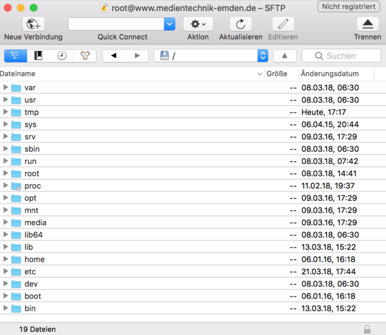

# 1.3 Basiswissen SSH und SFTP

Um eine Verbindung zwischen einem Client-Rechner und einem Server herzustellen, benötigen Sie unterschiedliche Protokolle und Tools.

Wenn Sie Kommandos auf einem Server ausführen möchten, dann müssen Sie sich auf dem Server einloggen. So können Sie beispielsweise die Linux-Kommandos aus dem letzten Unterkapitel ausführen.

## SSH

Mit SSH (= Secure Shell) können Sie sich auf dem Server einloggen und Kommandos ausführen. Eine SSH-Verbindung kann direkt aus dem Terminal aufgebaut werden, beispielsweise mithilfe des Befehls: `ssh root@www.DOMAIN.de -p SSHPORT`.

!!! tip "Hinweis"
    Oftmals ist es sinnvoll, mehrere Verbindungen zum Server aufzubauen. Beispielsweise könnten Sie eine Verbindung nutzen, um damit die Konfigurationsdateien des Webservers zu editieren, und eine andere SSH-Verbindung, um darin den Webserver nach einer Anpassung der Konfiguration neu zu starten. Gerade, wenn Sie auf dem Server irgendeine Datei editieren, ist eine zweite Terminalverbindung immer nützlich.

## SFTP

Mit SFTP (= Secure File Transfer Protocol) können Sie Dateien vom Client-Rechner auf den Server stellen oder umgekehrt. So können also Dateien zwischen verschiedenen Rechnern transportiert werden.

Es gibt eine Reihe von Tools, die Ihnen diese Arbeit erleichtern, beispielsweise das Programm WinSCP für Microsoft Windows oder Cyberduck für Mac-Rechner.

## Client für Upload/Download

**CyberDuck (Mac)**: kostenloser Client, der unter anderem via SSH/SFTP eine Verbindung zu Webservern herstellen kann: [https://cyberduck.io/](https://cyberduck.io/).

  - einfacher Upload von Dateien auf euren Webserver via Drag&Drop
  - schnelles Erstellen neuer Dateien und Ordner
  - direkter Download von Dateien des Webservers auf die Festplatte

**WinSCP (Windows)**: kostenloser Client, der Verbindungen über SFTP und FTP aufbaut: [https://winscp.net/eng/download.php](https://winscp.net/eng/download.php).

  - Kopieren von Dateien zwischen lokalem Computer und eurem Server
  - integrierter Editor
  - Synchronisieren von Verzeichnissen

