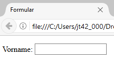

# 1.5 HTML-Formulare

Formulare sind eine der Stärken von PHP, da mithilfe von PHP Formulare erstellt und ausgewertet werden können. 

!!! info "Formulare definieren"
    Formulare haben meist einen gleichen Grundaufbau: es gibt Eingabefelder, Felder für mehrzeiligen Text, Listen zum Auswählen und natürlich immer einen Button zum Absenden der Daten. Ein Formular wird generell eingeleitet mit `<form>(...)</form>`, dazwischen stehen alle HTML-Elemente, die zum Formular gehören. Allerdings sind hier auch Elemente wie Überschriften oder Textabsätze erlaubt.

    ```html
    <form action="datenverarbeitung.php" method="get">
       - hier stehen die Elemente des Formulars -
    </form>
    ```

Das Attribut `action` im `<form>`-Tag gibt an, wohin die Daten nach dem Absenden übertragen werden sollen (dazu später mehr). Das zweite Attribut `method` beschreibt die Art der HTTP-Methode, mit der die Daten zwischen Client und Web-Server übertragen werden. Wird dort der Wert `get` eingesetzt, hängt der Browser die Daten als Parameter an die Zieladresse, beim Wert `post` werden die Daten im HTTP-Body verschickt.

!!! example "Eingabefelder erzeugen"
    Das HTML-Element `<input>` definiert Eingabefelder. Hier sehen wir ein einfaches Texteingabefeld.

    

    ```html
    <form action="datenverarbeitung.php" method="get">
      <p>
        <label for="prename">Vorname:</label>
        <input type="text" name="prename" id="prename">
      </p>
    </form>
    ```

Es gibt immer einen Text vor dem Eingabefeld. Hier lautet der Text 'Vorname:'. Dieser zum Eingabefeld dazugehörige Text wird mit dem Element `<label>` gekennzeichnet. Das `for`-Attribut von `<label>` muss mit dem `id`-Attribut von `<input>` übereinstimmen. Somit ist semantisch klar, dass `<label>` und `<input>` zusammen gehören.

Der Wert im `name`-Attribut von `<input>` wird später bei der Übertragung zum Webserver via HTTP zu einem Parameter. Wir wissen damit, dass es einen Parameter `prename` geben wird, der als Wert den vom User in das Feld eingegebenen Inhalt enthält.

Das Element `<input>` kann unterschiedliche Typen von Eingabefeldern erstellen, die auf unterschiedlichen Geräten mit unterschiedlichen Browsern teilweise sehr unterschiedlich dargestellt werden. Hier werden nur einige von vielen Möglichkeiten aufgeführt.

## Formular-Elemente

Verschiedene Typen von Eingabefeldern, die durch das Attribut `type` definiert werden, inklusive einer kurzen Beschreibung ihrer Funktion.

| Basiswerte für das Attribut `type=...` | Beschreibung |
|---------------------|--------------|
| `text`              | Normales Eingabefeld für einzeiligen Text. |
| `radio`             | Radiobuttons für die Auswahl **einer Option** aus mehreren Möglichkeiten. |
| `checkbox`          | Checkbox für **eine oder mehrere Optionen**. |
| `password`          | Feld für Passworteingaben; Eingaben werden als Punkte oder Sternchen dargestellt, aber nicht verschlüsselt übermittelt, sondern nur die Darstellung während der Eingabe ist "maskiert". |
| `email`             | Feld für E-Mail-Adressen; spezielle E-Mail-Tastatur auf mobilen Geräten. |
| `number`            | Feld für die Eingabe einer Zahl. |
| `date`              | Feld zur Auswahl eines Datums. |
| `range`             | Schieberegler zur Auswahl eines Wertes aus einem Bereich. |
| `file`              | Ermöglicht dem Nutzer das Hochladen einer Datei. |
| `url`               | Feld für die Eingabe von URLs. |
| `search`            | Feld für Suchanfragen. |
| `submit`            | Ein Button zum Absenden des Formulars. |
| `reset`             | Ein Button zum Zurücksetzen des Formulars auf den ursprünglichen Zustand. |

| Weitere Werte für das Attribut `type=...` | Beschreibung |
|---------------------|--------------|
| `datalist`          | Bietet eine Autovervollständigungsfunktion für das Eingabefeld an. |
| `time`              | Feld zur Auswahl einer Uhrzeit. |
| `color`             | Feld zur Auswahl einer Farbe. |
| `hidden`            | Unsichtbares Eingabefeld, sollte heutzutage nicht mehr genutzt werden (also echt "verboten" und deutet auf eine sehr schlechte Programmierung hin).  |


Diese Elemente ermöglichen eine Vielzahl von Interaktionen und Dateneingaben in Webformularen.

## Attribute für das input-Element

- `name="..."` ist ein notwendiges Attribut und muss einen eindeutigen Namen haben. Der Wert im `name`-Attribut wird bei der Übertragung zum Webserver via HTTP zu einem Parameter. Dieser Parameter kann in PHP ausgelesen werden und enthält als Wert die Nutzereingabe in das Formularfeld.

- `value="..."` schreibt in das Formularfeld etwas hinein. In der PHP-Programmierung kann das `value`-Attribut dynamisch Inhalte aus der Datenbank erhalten, was ein Formular von der Datenbank vorausgefüllt erscheinen lässt, z.B. wenn sich der Nutzer eingeloggt hat und seine Daten ändern möchte.

- `readonly` sorgt dafür, dass der Text im Formularfeld nicht überschrieben werden kann. Dies ist nur in Kombination mit `value` sinnvoll und kann nützlich sein, damit der Nutzer wichtige Eingaben nicht so einfach überschreibt. Eine Änderung der Daten wäre dann über eine JavaScript-Funktion durchführbar.

- `size="..."` gibt die Länge des Feldes an. Dies kann genutzt werden, um das Layout des Formulars besser zu kontrollieren.

- `maxlength="..."` gibt die maximale Anzahl der einzugebenden Zeichen an. Dies hilft, die Eingabe auf die erforderliche Länge zu beschränken und verhindert, dass Benutzer ungewollt zu viel Text eingeben.

!!! info "Neuere Attribute in HTML5"
    HTML5 führt weitere nützliche Attribute für `<input>`-Elemente ein, die die Benutzerfreundlichkeit und Validierung von Formularen verbessern:

    - `placeholder="..."` zeigt einen Hinweistext im Eingabefeld an, bis der Benutzer beginnt, etwas einzugeben.
    
    - `required` kennzeichnet ein Feld als obligatorisch, sodass das Formular nicht abgesendet werden kann, ohne dass dieses Feld ausgefüllt wurde.
    
    - `pattern="..."` erlaubt die Angabe eines regulären Ausdrucks, gegen den der Eingabewert validiert wird. Für ein Postleitzahl-Feld kann dieser Ausdruck verwendet werden: pattern="^[0-9]{5}$"
    
    - `autocomplete="on|off"` ermöglicht oder verhindert die Autovervollständigung des Eingabefelds.
    
    - `autofocus` legt fest, dass ein spezifisches Eingabefeld automatisch den Fokus erhält, sobald die Seite geladen wird.
    
    - `min="..."` und `max="..."` definieren den minimalen bzw. maximalen Wert für Eingaben vom Typ `number`, `range`, `date` etc.
    
    - `step="..."` definiert die Schritte, in denen ein Wert bei Typen wie `number` oder `range` verändert werden kann.

## Aufgaben zum Abschnitt Formulare

!!! question "Aufgabe 1"
    Erstellen Sie ein einfaches HTML-Formular für eine Kontaktseite mit den Feldern Name und E-Mail, Betreff und Nachricht. Das Formular soll die Daten mittels der `POST`-Methode an `submit_contact.php` senden.

??? example "Lösung zu Aufgabe 1"
    ```html
    <form action="submit_contact.php" method="post">
      <label for="name">Name:</label>
      <input type="text" name="name" id="name">
      
      <label for="email">E-Mail:</label>
      <input type="email" name="email" id="email">
      
      <button type="submit">Senden</button>
    </form>
    ```

!!! question "Aufgabe 2"
    Erweitern Sie das Formular aus Aufgabe 1 um ein Eingabefeld für eine fünfstellige Postleitzahl (PLZ). Nutzen Sie das `pattern`-Attribut, um sicherzustellen, dass nur Zahlen eingegeben werden können und das Feld exakt 5 Ziffern enthält.

??? example "Lösung zu Aufgabe 2"
    Ergänzen Sie das Formular aus Aufgabe 1 um das folgende Feld:

    ```html
    <label for="plz">Postleitzahl:</label>
    <input type="text" id="plz" name="plz" pattern="^[0-9]{5}$" title="Geben Sie eine 5-stellige PLZ ein.">
    ```
   


