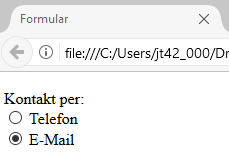
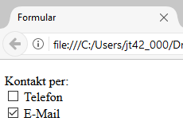

# 1.6 Radio-Buttons und Checkboxen

Radio-Buttons und Checkboxen ermöglichen es Benutzer:innen, aus einer Reihe von Optionen zu wählen. Radio-Buttons sind dabei für die Auswahl genau einer Option ausgelegt, während mit Checkboxen mehrere Optionen ausgewählt werden können.

## Radio-Buttons

Radio-Buttons sind beschriftete, runde „Knöpfe“ oder Auswahlfelder, von denen immer nur eines aktiviert werden kann. Sie sind Eingabefelder mit dem Typ `type="radio"`. Ein solcher Button benötigt ebenfalls einen Namen (`name`), aber auch einen Wert (`value`), da dieser beim Übertragen der Daten mitgeschickt wird.


!!! example "Beispiel für Radio-Buttons"

    Hier ein einfaches Beispiel (nicht optimal)
    Das `checked`-Attribut aktiviert einen Button als Defaulteinstellung.

    ```html linenums="1"
    <form action="datenverarbeitung.php" method="get">
      <p>
        <label>Kontakt per:<br>
          <input type="radio" name="contact" value="phone"> Telefon<br>
          <input type="radio" name="contact" value="mail" checked> E-Mail
        </label>
      </p>
    </form>
    ```

    Hier ein besseres Beispiel:
    der Einsatz von `fieldset` und `legend` verbessert die Struktur und Zugänglichkeit (Accessibility) des Formulars. Das `checked`-Attribut aktiviert einen Button als Defaulteinstellung.

    ```html linenums="1"
    <form action="datenverarbeitung.php" method="get">
      <fieldset>
        <legend>Kontakt per:</legend>
        <label>
          <input type="radio" name="contact" value="phone"> Telefon
        </label>
        <label>
          <input type="radio" name="contact" value="mail" checked> E-Mail
        </label>
      </fieldset>
    </form>
    ```

    

- Wenn Sie möchten, dass einer der Buttons bereits aktiviert ist, setzen Sie das weitere Attribut `checked`.
- Wenn das Element `<label>` einen Bereich umschließt, dann braucht kein `for`-Attribut und kein  `id`-Attribut verwendet werden.


## Checkboxen

Checkboxen sind kleine Quadrate, die ankreuzbar sind. Oftmals haben die Benutzer:innen  mehrere Ankreuz-Möglichkeiten zur Auswahl. Eine Checkbox wird mit `<input type="checkbox">` deklariert, auch sie benötigt die Attribute `name`und `value`.   


!!! example "Einfaches Beispiel für Checkboxen (nicht optimal)"

    Das `checked`-Attribut aktiviert eine Box als Defaulteinstellung.

    ```html linenums="1"
    <form action="datenverarbeitung.php" method="get">
      <p>
        <label>Kontakt per:<br>
          <input type="checkbox" name="phone" value="phone"> Telefon<br>
          <input type="checkbox" name="mail" value="mail" checked> E-Mail
        </label>
      </p>
    </form>
    ```

    Hier ein besseres Beispiel: 
    der Einsatz von `fieldset` und `legend` verbessert die Struktur und Zugänglichkeit (Accessibility) des Formulars. Das `checked`-Attribut aktiviert einen Button als Defaulteinstellung.

    ```html linenums="1"
    <form action="datenverarbeitung.php" method="get">
      <fieldset>
        <legend>Kontakt per:</legend>
        <label>
          <input type="checkbox" name="phone" value="phone"> Telefon
        </label>
        <label>
          <input type="checkbox" name="mail" value="mail" checked> E-Mail
        </label>
      </fieldset>
    </form>
    ```

    


Die Verwendung von `fieldset` und `legend` trägt auch hier zur besseren zur Strukturierung des Formulars bei und macht den Zweck der Checkbox-Gruppe deutlich. 


- Wenn Sie eine Checkbox als selektiert markiert haben möchten, müssen Sie, wie auch bei den Radio-Buttons, noch das `checked` hinzufügen. Hier können jedoch auch mehrere Checkboxen vorselektiert werden.
- Im Beispiel zuvor haben wir für jede Checkbox einen neuen Namen vergeben. Bei vielen Checkboxen kann dies leicht unübersichtlich werden. Eine Alternative ist die Eingabe eines Arrays (gekennzeichnet durch die eckigen Klammern). Dieses Array können wir später in der PHP-Programmierung ebenfalls gut auslesen.

```html linenums="1"
<form action="datenverarbeitung.php" method="get">
  <fieldset>
    <legend>Kontakt per:</legend>
    <label>
      <input type="checkbox" name="kontakt[]" value="phone"> Telefon
    </label>
    <label>
      <input type="checkbox" name="kontakt[]" value="mail" checked> E-Mail
    </label>
  </fieldset>
</form>      
```

## Best Practices für die Formulargestaltung

- **Mehrere Radio-Buttons zur Auswahl anbieten:** Während Checkboxen auch einzeln verwendet werden können, müssen bei Radio-Buttons immer mehrere Alternativen zur Auswahl stehen und alle Benutzer:innen benötigen eine passende Auswahlmöglichkeit (ansonsten verlassen sie aufgrund von "Frust" oftmals die Seite). 

- **Zugänglichkeit (Accessibility):** Jedes Formularelement sollte eindeutig mit einem `label`-Element verknüpft sein. Dies verbessert die Usability und unterstützt Technologien von Screen-Readern.

- **Klare Beschriftung:** Jede Checkbox und jeder Radio-Button sollte eindeutig mit `legend`- und `label`-Elementen beschriftet sein, sodass Zweck und Inhalt der Optionen klar beschrieben sind.

- **Gruppierung verwandter Optionen:** Verwenden Sie `fieldset` und `legend`, um verwandte Checkboxen zu gruppieren und den Kontext der Auswahlmöglichkeiten zu vermitteln.

- **Verbesserte Usability:** Überlegen Sie, wie Sie Formulare so strukturieren und gestalten können, dass man diese intuitiv und effizient ausfüllen kann. Dazu gehören klare Anweisungen, logische Gruppierung von Elementen und die Vermeidung unnötiger Felder.

- **Vorauswahl mit Bedacht:** Setzen Sie das `checked`-Attribut gezielt ein, um Nutzer:innen auf bevorzugte oder häufig gewählte Optionen hinzuweisen. Seien Sie jedoch vorsichtig, um keine unerwünschten Optionen vorab auszuwählen.

- **Validierung:** Nutzen Sie HTML5-Validierungsattribute wie `required` für Radio-Buttons und Checkboxen, um sicherzustellen, dass alle notwendigen Informationen angeben wurden, bevor das Formular abgesendet wird.

Durch die Beachtung dieser Richtlinien können Sie sicherstellen, dass Ihre Formulare nicht nur funktional, sondern auch gut benutzbar und zugänglich sind.

## Aufgabe 

!!! question "Aufgabe: Formular für Veranstaltungsanmeldung"
    Erstellen Sie ein HTML-Formular für die Anmeldung zu einer Veranstaltung. Das Formular soll folgende Elemente enthalten:
    - Ein Feld für den Namen des Teilnehmers (Textfeld).
    - Radio-Buttons für die Auswahl der Veranstaltungsart: Vortrag oder Workshop.
    - Checkboxen für zusätzliche Optionen: Teilnahmebescheinigung und Newsletter-Abonnement.
    - Ein Submit-Button, um das Formular abzusenden.
    
    Achten Sie darauf, dass der Teilnehmer eine Veranstaltungsart auswählen muss und seinen Namen angibt.

??? example "Lösung"
    ```html
    <form action="submit_event.php" method="post">
      <label for="name">Name:</label>
      <input type="text" id="name" name="name" required>
      
      <fieldset>
        <legend>Veranstaltungsart:</legend>
        <label><input type="radio" name="event_type" value="lecture" required> Vortrag</label>
        <label><input type="radio" name="event_type" value="workshop"> Workshop</label>
      </fieldset>
      
      <label><input type="checkbox" name="certificate"> Teilnahmebescheinigung</label>
      <label><input type="checkbox" name="newsletter"> Newsletter-Abonnement</label>
      
      <button type="submit">Anmelden</button>
    </form>
    ```
