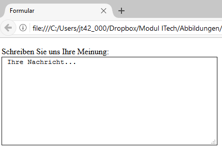

# 1.7 Eingabebereiche (textarea)

Ein mehrzeiliges Eingabefeld für Text wird durch das HTML-Element `<textarea>` beschrieben.

!!! example "Beispiel"
    Ein Formular für Nutzerfeedback mit einem `textarea`-Feld könnte folgendermaßen aussehen:

    ```html linenums="1"
    <form action="datenverarbeitung.php" method="post">
      <label for="feedback">Schreiben Sie uns Ihre Meinung:<br>
        <textarea name="feedback" cols="50" rows="10" id="feedback">
          Ihre Nachricht...
        </textarea>
      </label>
    </form>
    ```

    

Zum Element `<textarea>` werden normalerweise die Zeilen- und Spaltenanzahl über die Attribute `rows` und `cols` angegeben. Auch der Eingabebereich kann mit Text gefüllt werden, dazu können Sie zwischen das Anfangs- und End-Tag einen Text schreiben. Geben Sie jedoch keine dieser Eigenschaften an, so erhalten Sie ein leeres, zweizeiliges Textfeld.

## Best Practices

Beim Einsatz von `<textarea>` in Ihren Formularen sollten Sie folgende Best Practices beachten:

- **Platzhaltertext verwenden**: Das `placeholder`-Attribut bietet einen Hinweistext, der verschwindet, sobald der Nutzer mit der Eingabe beginnt. Dies kann besonders nützlich sein, um Beispiele oder Erwartungen an die Eingabe zu kommunizieren. Beispiel: `placeholder="Ihre Nachricht..."`.

2. **Autofokus**: Das `autofocus`-Attribut setzt beim Laden der Seite automatisch den Fokus auf das `<textarea>`-Element. Dies verbessert die Usability, indem es die Interaktion mit dem Formular erleichtert.

3. **Zugänglichkeit durch Label**: Jede `<textarea>` sollte eindeutig mit einem `<label>` verknüpft sein, wobei die `for`- und `id`-Attribute zur Verknüpfung verwendet werden. Dies erleichtert die Navigation für Nutzer:innen mit Screenreadern und verbessert die allgemeine Zugänglichkeit (Accessibility) des Formulars.

5. **Erforderliche Eingaben markieren**: Das `required`-Attribut stellt sicher, dass das Formular nicht abgesendet werden kann, ohne dass dieses Feld ausgefüllt wurde. Dies trägt dazu bei, dass alle notwendigen Informationen gesammelt werden, bevor das Formular verarbeitet wird.


## Aufgabe: Erstellung eines verbesserten Feedback-Formulars

!!! question "Aufgabe"
    Erstellen Sie unter Verwendung der oben genannten Best Practices ein HTML-Formular mit einem `textarea`-Feld für Feedback. Das Formular soll zudem ein Feld für den Namen des Nutzers und einen Absenden-Button enthalten.

??? example "Lösung"
    ```html linenums="1"
    <form action="submit_feedback.php" method="post">
      <label for="name">Name:</label><br>
      <input type="text" id="name" name="name" required><br>
      <label for="feedback">Feedback:</label><br>
      <textarea id="feedback" name="feedback" rows="10" cols="50" placeholder="Teilen Sie uns Ihre Gedanken mit..." autofocus required></textarea><br>
      <input type="submit" value="Absenden">
    </form>
    ```