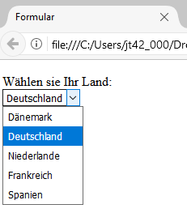

# 1.8 Auswahllisten (select)

Neben Eingabefeldern sind Auswahllisten in Formularen ebenfalls von Bedeutung. Diese ermöglichen eine Auswahl aus festgelegten Begriffen, wodurch Tippfehler vermieden werden, da nur festgelegte Begriffe ausgewählt werden können. 

!!! example "Beispiel"
    ```html linenums="1"
    <form action="datenverarbeitung.php" method="get">
      <p><label for="country">Wählen Sie Ihr Land:<br>
        <select name="countryselection" id="country">
          <option value="dk">Dänemark</option>
          <option value="de" selected>Deutschland</option>
          <option value="nl">Niederlande</option>
          <option value="fr">Frankreich</option>
          <option value="es">Spanien</option>
        </select>
      </label></p>
    </form>
    ```

    

Auswahllisten in HTML-Formularen werden mit dem `<select>`-Element erstellt. Das `name`-Attribut ist dabei essenziell, da es den Namen der Variablen definiert, die beim Absenden des Formulars an den Server übertragen wird. Wählen Nutzer:innen beispielsweise "Deutschland" aus der Liste, so wird der Wert "de" (definiert im `value`-Attribut der entsprechenden `<option>`) zusammen mit dem Namen der Variablen, hier `countryselection`, als Teil der HTTP-Anfrage gesendet. In diesem Fall würde also `countryselection=de` an den Server übermittelt. Weitere Details hierzu finden Sie im Kapitel über HTTP.

## Weitere Attribute für `<select>`:

- `size`: Legt die Anzahl der sichtbaren Optionen fest. Der Standardwert `size="1"` erzeugt eine Dropdown-Liste.
- `selected`: Durch Hinzufügen dieses Attributs zu einem `<option>`-Element wird der entsprechende Eintrag standardmäßig ausgewählt.
- `multiple`: Ermöglicht es, mehrere Optionen gleichzeitig auszuwählen. Diese Option sollte nur verwendet werden, wenn eine Mehrfachauswahl sinnvoll ist. Es ist wichtig, den Nutzer:innen dann deutlich zu schreiben, dass eine Mehrfachauswahl möglich ist und wie diese vorgenommen werden kann.


## Aufgabe

!!! question "Aufgabe"
    Erstellen Sie ein Formular mit einer Auswahlliste mit einer Mehrfachauswahl unter Verwendung der Option `multiple`. Hier eine Hilfestellung: `<select name="countries[]" multiple id="country">`.

    Schauen Sie nach, wie die Mehrfachdaten im Client Request per HTTP an den Server übertragen werden.
    Im Kapitel HTTP wird gezeigt, wie die Datenübertragung im Client Request sichtbar gemacht werden kann, am Beispiel der "Browser Werkzeuge" im "Firefox-Browser". Tipp: wenn Sie als HTTP-Methode `get` verwenden, dann können Sie die Übertragung sehr einfach in der URL sehen.

??? example "Lösung"
    ```html linenums="1"
    <form action="datenverarbeitung.php" method="get">
      <p><label for="country">Wählen Sie Ihr Land:<br>
        <select name="countries[]" multiple id="country">
          <option value="dk">Dänemark</option>
          <option value="de">Deutschland</option>
          <option value="nl">Niederlande</option>
          <option value="fr">Frankreich</option>
          <option value="es">Spanien</option>
        </select>
      </label></p>
    </form>
    ```

    Angenommen, das `<select>`-Element hat das `name`-Attribut `countries` und jemand wählt "Deutschland" und "Niederlande" aus, wobei die `value`-Attribute dieser Optionen entsprechend dem Sourcecode-Beispiel `de` für Deutschland und `nl` für Niederlande sind. Dann werden die Daten in der HTTP-Anfrage wie folgt übermittelt: `countries=de&countries=nl`
