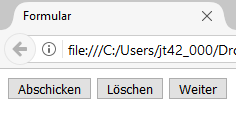

# 1.9 Buttons und Absenden von Formularen

Sobald das Formular ausgefüllt wurde, sollen die Daten an den Webserver übermittelt werden. 

## Einfache Buttons
Um den Benutzer:innen die Möglichkeit zu geben, das Formular abzuschicken, stellt HTML einen speziellen Typ eines `<input>`-Elements bereit: `type="submit"`. Dieser Button sendet alle Daten an die festgelegte Adresse. Dem Button kann über das Attribut `value` ein Text zugewiesen werden, der dann im Browser auf dem Button angezeigt wird.

```html 
<input type="submit" value="Abschicken">
```

Für die Funktion, Daten des Formulars zu löschen, ändern Sie den Typ zu `type="reset"`, um einen Button zu erstellen, der alle Eingaben des Formulars zurücksetzt. Auch hier kann ein Textwert über das `value`-Attribut definiert werden.

```html
<input type="reset" value="Löschen">
```

Häufig findet der Button ohne Standardfunktion Anwendung, bei dem die Funktionalität durch JavaScript implementiert wird.

```html
<input type="button" value="Weiter" onclick="javaScript_methode_tu_was()">
```



!!! tip "Hinweis"
    Ein verbreiteter Fehler beim Erstellen einfacher Formulare mit Buttons ist, das Formular vor dem Button zu schließen. Die korrekte Reihenfolge sieht vor, dass das Formular geöffnet, die `input`-Elemente wie Textfeld und Button definiert und erst dann das Formular mit dem `</form>`-Tag geschlossen wird.


## Bilder als Buttons verwenden

Das Element `<input type="image">` funktioniert ähnlich wie `<input type="submit">` und sendet die Formulardaten mittels der in `<form>` spezifizierten Methode an den Webserver.

```html
<input type="image" src="abschicken.jpg" alt="Abschicken">
```

## `<button>`-Element

Alles, was bisher mit `<input type="submit">`, `<input type="reset">`, `<input type="button">` oder `<input type="image">` erreicht wurde, kann auch mit dem `<button>`-Element realisiert werden. Der große Vorteil des `<button>`-Elements liegt darin, dass zwischen dem öffnenden und schließenden Tag andere HTML-Elemente oder Texte platziert werden können. So kann der Button mittels CSS gestaltet oder ein Bild eingefügt werden.

```html linenums="1"
<button type="submit" name="page1" id="page1">
  <span>Abschicken</span>
</button>
```

## Best Practices

- Verwenden Sie `<button type="submit">` für Absendebuttons, um das Aussehen des Buttons einfacher zu gestalten.
- Nutzen Sie `type="reset"` mit Bedacht, denn wenn man versehentlich darauf klickt, sind die zuvor getätigten Eingaben verloren. Oftmals können Sie auf einen Reset-Button verzichten.
- Setzen Sie `<input type="image">` ein, wenn der Button mit einem spezifischen Bild gestaltet werden soll, aber achten Sie darauf, einen alternativen Text anzugeben.
