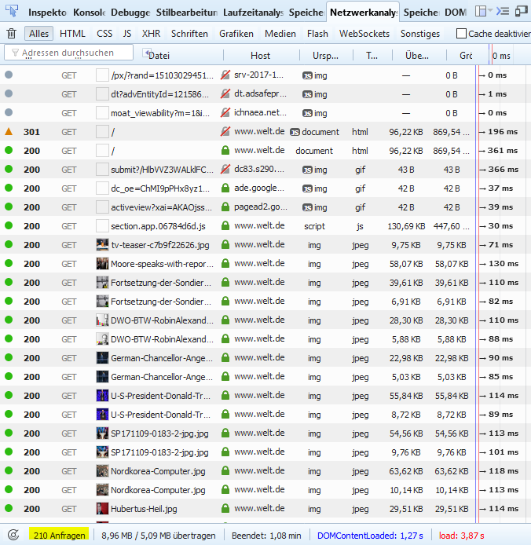

# 2.1.1 Sinn und Zweck von HTTP

Ganz zu Anfang (also bei HTTP/0.9 in 1991) wurde auf **eine HTTP-Anfrage** genau **eine HTTP-Antwort** mit einem HTML-Dokument (ohne Bilder, JavaScript, CSS) geschickt. Heutzutage erfolgt auf eine Anfrage eine ganze Reihe von Antworten, damit die in einer Webseite eingebundenen Elemente, die normalerweise sogar von unterschiedlichen Servern stammen, alle übertragen werden.

Um diese Vielzahl von Antworten sichtbar zu machen, gibt es für die Browser entsprechende Add-ons oder Plugins. Einige Browser, wie Firefox, haben entsprechende Tools bereits vorinstalliert. Bei Firefox sind es die "Web-Entwickler"-Tools, zu finden unter "Extras" | "Web-Entwickler" | "Netzwerkanalyse" (oder einfach F12). Dieses Tool benötigen wir in diesem Kapitel später auch zur Analyse der einzelnen Zeilen des HTTP-Headers.

HTTP/1.1 ist das Protokoll, mit dem alle Anfragen bearbeitet werden. Dies geschieht wie folgt:

- Es erfolgt eine Anfrage an den Webserver (Client-Request).
- Der Webserver schickt das angefragte Dokument (normalerweise eine HTML-Datei) an den Client (Server-Response).
- Der Client analysiert die HTML-Datei und stellt für jedes darin enthaltene Element eine Anfrage an den entsprechenden Server.
- Alle Server schicken dem Client das jeweils angefragte Dokument.

**Warum sind es so viele Anfragen?**

Wie viele unterschiedliche Medien übertragen werden, lässt sich ebenfalls mit dem Web-Entwickler-Tool ermitteln, indem man auf die unterschiedlichen "Reiter" in der oberen Navigation des Web-Entwickler-Tools klickt. Bei Nachrichtenportalen gibt es natürlich viele Bilder und viele Einbindungen von Werbe-Servern (=Ad-Server).

Um die Vielfalt der Technologien zu verstehen, die Firmen zur Nutzerverfolgung einsetzen, lohnt sich ein Blick auf die ["Marketing Technology Landscape Supergraphic"](https://chiefmartec.com/?s=landscape) von Scott Brinker. Diese Grafiken zeigen tausende Lösungen im digitalen Marketing. Sie deckt Bereiche wie Tracking, Analyse und Werbung ab. Die Supergraphic bietet einen guten Überblick über die Technologien, die Unternehmen nutzen, um möglichst viel über potentielle Nutzer:innen zu erfahren.

!!! question "Aufgabe"
    Analysieren Sie 5 Internetauftritte Ihrer Wahl.
