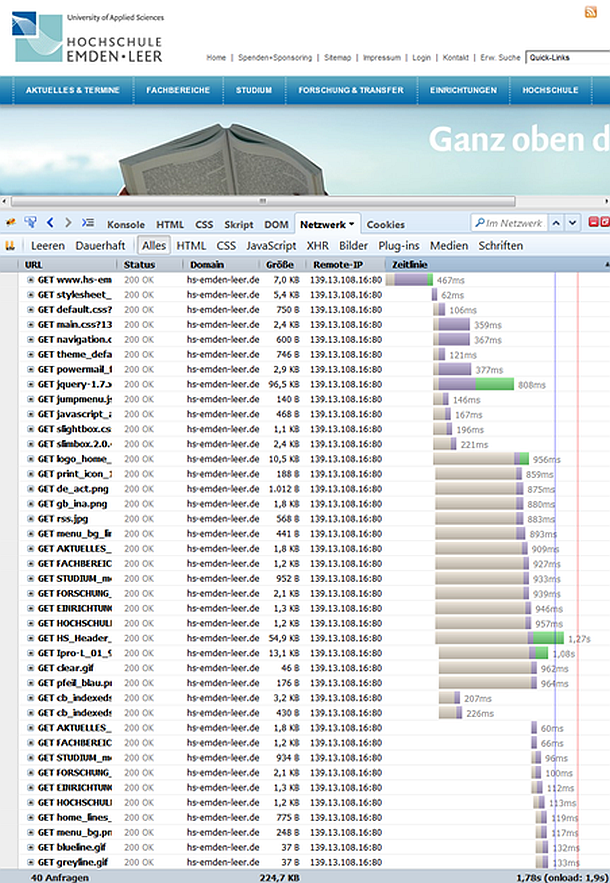

# 2.1.3 HTTP 1.1 gleichzeitige Anfragen

Eine Webseite besteht also aus vielen Elementen, die alle vom Server geladen werden müssen. In der Grafik kann sehr gut erkannt werden, was der Aufruf einer Internetseite bewirkt.

- Zuerst wird das angeforderte (HTML-)Dokument übertragen (1. Zeile; 467 ms).
- Erst nach der Übertragung der ersten Seite kann der Browser die in der Seite enthaltenen URLs auswerten und anfordern (CSS-Dateien, JS-Dateien, Abbildungen).
- Anschließend wird die Stylesheet-Datei angefordert (2. Zeile 62 ms), da dies die erste URL auf der Webseite ist.
- Anschließend werden **sechs Verbindungen geöffnet** und die Dateien der Zeilen 3 - 8 geladen. Immer wenn von diesen 6 Verbindungen zum Server eine Verbindung das Element ausgeliefert hat, wird direkt das nächste Element angefordert (nachdem Zeile 3 (106 ms) fertig ist, beginnt beispielsweise die Anfrage in Zeile 9 (146 ms)).

Ein Browser kann (je nach Betriebssystem und Browser) einige gleichzeitige Verbindungen zu einer Domain öffnen. Im oben gezeigten Beispiel sind dies 6 Verbindungen, die persistent aufrecht erhalten werden, bis alle Abfragen von dem Server geladen sind. Daher hat es sich bei HTTP/1.1 bewährt, dass Bilder auf einer anderen (Sub-)Domain gespeichert werden, sodass 6 Verbindungen zu der eigentlichen Domain (z.B. www.thomaschewski.de) und 6 Verbindungen zu der "Bilddomain" (z.B. pics.thomaschewski.de) geöffnet werden und die Übertragungszeit hierdurch verringert wird. Dieses "Verfahren" wird auch als **Sharding** bezeichnet.

!!! tip "Hinweis"
    Auch im Jahr 2024 setzen viele Webserver weiterhin auf HTTP/1.1. Die Ausführungen behalten daher ihre Gültigkeit, besonders unter Bedingungen, unter denen Server einer Vielzahl von Anfragen ausgesetzt sind und zahlreiche Elemente, wie beispielsweise Bilder oder Videos, in HTML-Dokumenten eingebunden sind. Dies kann Server an ihre Belastungsgrenzen bringen. Ein Wechsel zu HTTP/2 oder HTTP/3 bietet in diesen Fällen echte Vorteile, da bei Hochlastsystemen die Effizienz und die Performance merklich verbessert werden.

## HTTP/2 und HTTP/3
Wir werden in den Kapiteln zu HTTP/2 sehen, dass HTTP/2 anders arbeitet.

Seit der Einführung von HTTP/1.1 im Jahr 1997 hat sich die Internetnutzung stark weiterentwickelt. HTTP/1.1 ermöglichte zwar eine effizientere Webkommunikation als seine Vorgänger, offenbarte jedoch Grenzen in der Effizienz der Seitenladung aufgrund des oben beschriebenen sequenziellen Nachladens aller Elemente einer Webseite. HTTP/2, eingeführt im Jahr 2015, verbesserte dies durch die Einführung von „simultanen“ Anfragen über eine einzige TCP-Verbindung, was zu einer deutlichen Verbesserung der Ladegeschwindigkeiten führte. Zusätzlich implementierte es weitere Mechanismen, auf die in den Kapiteln zu HTTP/2 eingegangen wird.

HTTP/3 erweitert die Verbesserungen noch einmal durch die Adoption von QUIC, einem von Google initiierten Transportprotokoll, das auf die Minimierung von Latenzzeiten und die Erhöhung der Übertragungszuverlässigkeit abzielt, insbesondere unter Bedingungen instabiler Netzwerkverbindungen.