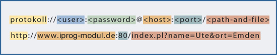
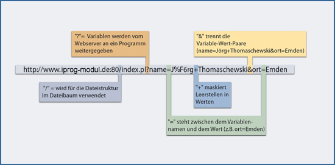
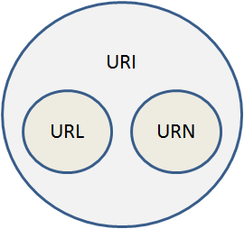

# 2.1.4 Aufbau einer URL

**URL = Uniform Resource Locator** spezifiziert **Protokoll**, **Ort**, **Port**, **Datei** und **weitere Zugriffsarten**, damit ein Internetdienst angefragt werden kann.

Die Abbildung zeigt den prinzipiellen Aufbau einer URL und ein typisches Beispiel.

Beispiele für Protokolle sind: http, ftp, sftp etc.
Der `<host>` kann in Form einer IP-Adresse oder als Full Qualified Domain Name (FQDN) angegeben werden.

## Spezielle Zeichen in einer URL

Bedeutung wichtiger spezieller Zeichen in einer URL

- Das Zeichen "/" wird für die Dateistruktur im Dateibaum verwendet.
- Das Zeichen "?" bedeutet, dass Variablen vom Webserver an ein Programm weitergegeben werden.
- Das Zeichen "=" steht zwischen dem Variablennamen und dem Wert (*name=Ute*).
- Das Zeichen "&" trennt die Variable-Wert-Paare (*name=Ute&ort=Leer*).
- Das Zeichen "+" maskiert Leerstellen in Werten.
- Das Zeichen "%" ist ein weiteres reserviertes Zeichen, da hierdurch ein kodiertes Sonderzeichen eingeleitet wird.

!!! tip "Hinweis"
    **Sicherheitshinweis**: Unicode kann in URLs aus Sicherheitsgründen nicht verwendet werden (siehe: [Blog von Bruce Schneier](https://www.schneier.com/blog/archives/2005/02/unicode_url_hac_1.html)).
    
    Es gilt: A system that internally provides identifiers in the form of a different character encoding, such as EBCDIC, will generally perform character translation of textual identifiers to UTF-8 [STD63] (oder some other superset of the US-ASCII character encoding) at an internal interface, thereby providing more meaningful identifiers than those resulting from simply percent-encoding the original octets. (aus: [RFC 3986](https://tools.ietf.org/html/rfc3986)).

## Sonderzeichen und Codierung

**UTF-8** ist der Standard für die Codierung von Text und URLs im Internet und ermöglicht eine präzise und umfassende Darstellung von Schriftzeichen aus nahezu allen Sprachen der Welt. Im Gegensatz zum älteren ASCII-7-Zeichensatz, der lediglich 128 Zeichen (hauptsächlich die Buchstaben des lateinischen Alphabets, Ziffern und einige Sonderzeichen) umfasst, kann UTF-8 über eine Million unterschiedliche Zeichen abbilden. Dies wird erreicht, indem zwischen einem und vier Bytes für jedes Zeichen verwendet werden, was eine flexible und effiziente Textdarstellung ermöglicht.

URLs sind im Grunde genommen auf den ASCII-7-Zeichensatz beschränkt, was bedeutet, dass Zeichen, die nicht in diesem engen Rahmen liegen, für die Übertragung speziell kodiert werden müssen. Dies geschieht durch die sogenannte **Prozentkodierung** (**ö** wird codiert durch **%C3%B6**), bei der nicht-ASCII-Zeichen durch ASCII-Zeichenfolgen repräsentiert werden. Diese Kodierung stellt sicher, dass URLs über verschiedene Systeme und Anwendungen hinweg einheitlich interpretiert werden können.

Moderne Browser wandeln URLs mit UTF-8-kodierten Zeichen in eine lesbare Form um und kodieren sie bei Bedarf automatisch zurück. Dies erleichtert die Nutzung, während die technischen Anforderungen für die korrekte Übermittlung gewahrt bleiben.

Das Verständnis dieser Kodierungspraxis ist besonders relevant, da **Webserver in ihren Logdateien Einträge oft in kodierter Form speichern**. Viele dieser Einträge enthalten Prozentzeichen (%), die eine Kodierung darstellen. Die Fähigkeit, diese Kodierungen zu erkennen und zu interpretieren, ist entscheidend für die effektive Analyse und das Verständnis von Webserver-Aktivitäten.

Beispielsweise werden Nicht-ASCII-Zeichen in UTF-8 wie folgt kodiert:

- **ß** (Dezimalwert 223) wird durch **%C3%9F** codiert.
- **ö** (Dezimalwert 246) wird durch **%C3%B6** codiert.

Diese Codierungsweise ermöglicht eine flexible Darstellung von Texten und wird daher für die Codierung aller Arten von Inhalten im Web verwendet.

!!! tip "Hinweis"
    Mittels Unicode oder UTF-8 werden auch die Zeichen codiert, die beispielsweise in ein HTML-Formular eingegeben wurden. Die universelle Verwendung von UTF-8 im Web trägt zur Vereinfachung der Textverarbeitung und -darstellung bei.

!!! info "ISO 8859-1"
    ISO 8859-1, eine Erweiterung von ASCII um westeuropäische Zeichen, wurde in der Vergangenheit verwendet, um Zeichen mit den Zeichencodes 128 bis 255 durch eine Hexadezimal-Zeichenfolge darzustellen. Heutzutage spielt diese Codierung aufgrund der umfassenderen und flexibleren Möglichkeiten von UTF-8 nur noch eine untergeordnete Rolle.

# URL, URI, URN

Neben der bekannten URL gibt es noch die Abkürzungen URI und URN:

- **URL** = Uniform Resource Locator (**Ort einer eindeutigen Ressource**)  
  Eine URL beschreibt den Ort (Location) einer Ressource.
  > RFC 1738 (Uniform Resource Locators (URL)): Obwohl älter, legt dieser RFC die ursprüngliche Syntax für URLs fest und könnte für historischen Kontext nützlich sein.  
- **URI** = Uniform Resource Identifier (**eindeutige Ressource** identifizieren)  
  Eine Ressource URI kann dabei alles sein, was sich eindeutig beschreiben lässt.
  > RFC 3986 (Uniform Resource Identifier (URI): Generic Syntax): Dies ist der grundlegende Standard, der URIs definiert  und ihre Syntax beschreibt.

- **URN** = Uniform Resource Name (**Name einer eindeutigen Ressource**)  
  Mit einer URN kann man einer Ressource einen eindeutigen und dauerhaften Namen zuweisen, der die Ressource damit eindeutig identifizierbar macht. Eine Ressource kann dabei alles sein, was sich eindeutig beschreiben lässt.
  > RFC 8141 (Uniform Resource Names (URNs)): Dieser RFC aktualisiert und klärt die Verwendung von URNs.

Dabei sind URL und URN echte Teilmengen von URI. Eine URL zeigt an, wo etwas ist (und wie man dorthin kommt) und eine URN zeigt an, was es ist. Somit gilt: Eine URL oder URN ist zwar immer auch ein URI, aber ein URI ist keine URL oder URN.

!!! example "Beispiel"
       
    - *iprog-modul.de* – URI:  Dies ist ein Beispiel für einen URI (Uniform Resource Identifier), da es eine Ressource im Internet eindeutig identifiziert. Es gibt jedoch nicht explizit an, wie auf die Ressource zugegriffen werden soll (z.B. über welches Protokoll), was es allgemeiner als eine URL macht.
    - *http://iprog-modul.de/index.html* – URL: Dies ist ein klassisches Beispiel für eine URL (Uniform Resource Locator), die den Zugriffspfad zu einer bestimmten Ressource auf einem Server angibt. Hier wird das HTTP-Protokoll verwendet, um auf die Ressource zuzugreifen, was durch das Präfix http:// angezeigt wird. Somit ist der Weg zur Ressource eindeutig gegeben.
    - *ftp://iprog-modul.de/index.html* – URL: Auch dies ist eine URL, die jedoch das FTP-Protokoll (File Transfer Protocol) für den Zugriff verwendet. Dies zeigt, dass URLs unterschiedliche Protokolle für den Zugriff auf die Ressource spezifizieren können. Auch hier ist der Weg zur Ressource eindeutig gegeben.
    - *ISBN:3827370191* – URN: Hierbei handelt es sich um einen URN (Uniform Resource Name), der eine Ressource durch einen eindeutigen Namen identifiziert. Im Gegensatz zu URLs geben URNs nicht an, wo oder wie auf eine Ressource zugegriffen wird, sondern identifizieren sie nur eindeutig. In diesem Fall wird eine spezifische Ausgabe des Buches „Moderne Betriebssysteme“ von Andrew S. Tanenbaum durch eine internationale Standardbuchnummer (ISBN) identifiziert.