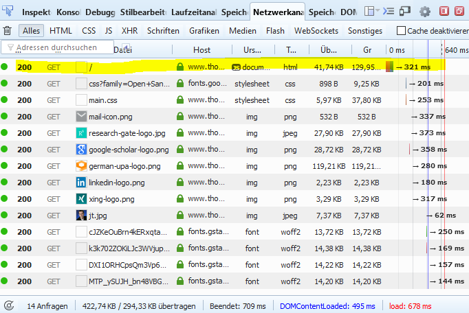
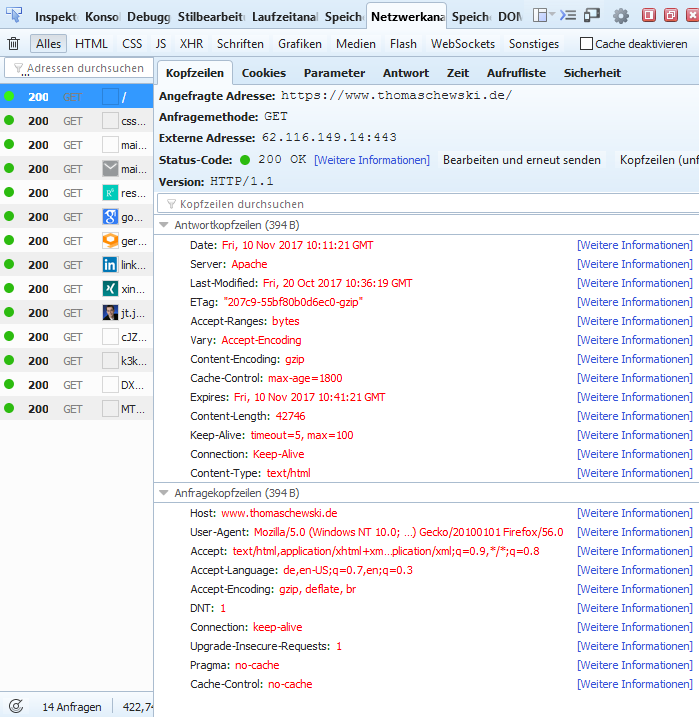
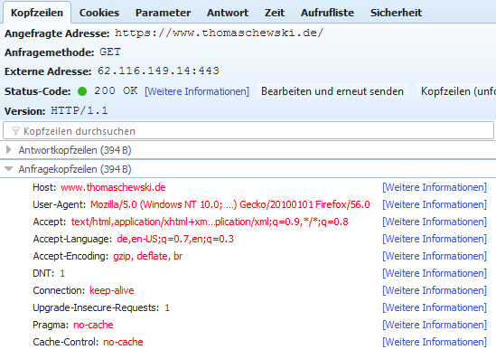
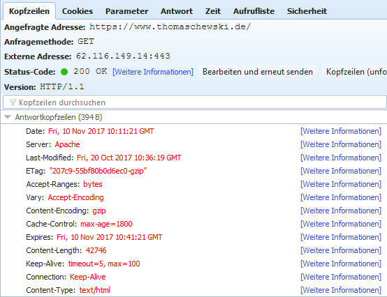

# 2.2.1 HTTP-Request und HTTP-Response

Was passiert beim Abschicken einer Anfrage vom Browser an den Webserver?

- Aufbau der TCP/IP-Verbindungen
- Übertragen der HTTP-Anforderung (Client-Request) vom Client an den Server
- Übertragen der Antworten (Server-Response) vom Server an den Client
- Schließen der TCP/IP-Verbindungen

  <video controls>
    <source src="../media/2-http-Aufbau.mp4" type="video/mp4">
    Ihr Browser unterstützt das Video-Tag nicht.
  </video>
  
<em>Prinzipieller Aufbau von HTTP.</em>

## Beispiel für Client-Request und Server-Response
Schauen wir uns nun einen Client-Request am Beispiel der Seite [thomaschewski.de](https://www.thomaschewski.de) an. Hierzu nehmen wir aus den gesamten 14 Anfragen die erste Anfrage und analysieren die Zeilen des HTTP-Headers.

Durch einen **Klick auf die erste Zeile** öffnet sich ein Fenster, in dem die "Antwort-Kopfzeilen" und die "Anfrage-Kopfzeilen" sichtbar werden.

## Client-Request

Für den Client-Request interessieren uns die "**Anfrage**kopfzeilen". Schalten Sie zunächst den Button rechts auf "Unformatiert", denn nur dann erkennt man die sehr wichtige **1. Zeile des Client-Request, genannt Request Line** `GET / HTTP/1.1`.

- Host: Hier wird die Domain der Anfrage angegeben
- User-Agent: Das Betriebssystem und der Browser werden übermittelt
- Accept, Accept-Language, Accept-Encoding: teilt dem Server mit, was der Browser unterstützt
- ... Sie können im Web-Entwickler-Tool auf "Weitere Informationen" klicken und kommen direkt zu einer Mozilla-Seite mit den entsprechenden Erklärungen

## Server-Response

Für den Server-Response interessieren uns die "**Antwort**kopfzeilen". Schalten Sie zunächst wieder den Button rechts auf "Unformatiert", denn nur dann erkennt man die sehr wichtige **1. Zeile des Server-Response, genannt Status Line**  `HTTP/1.1 200 OK`.

## HTTP-Parameter

Es gibt insgesamt sehr viele [HTTP-Parameter](https://www.iana.org/assignments/message-headers/message-headers.xhtml). Wichtig ist zu wissen, dass es HTTP-Parameter gibt, die nur im Client-Request oder im Server-Response vorkommen. Aber es gibt auch HTTP-Parameter, die sich auf den Content beziehen und daher sowohl im Client-Request, als auch im Server-Response vorkommen, beispielsweise `Content-Length`.

- Liste der im RFC spezifizierten [Parameter des Client-Request](https://en.wikipedia.org/wiki/List_of_HTTP_header_fields#Request_fields)
- Liste der im RFC spezifizierten [Parameter des Server-Response](https://en.wikipedia.org/wiki/List_of_HTTP_header_fields#Response_fields)

Im nächsten Abschnitt kümmern wir uns ausführlich um den Client-Request.