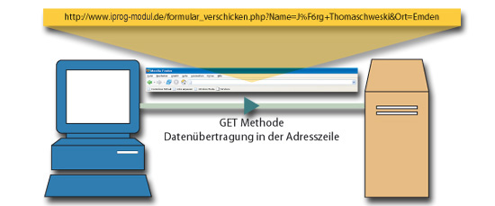
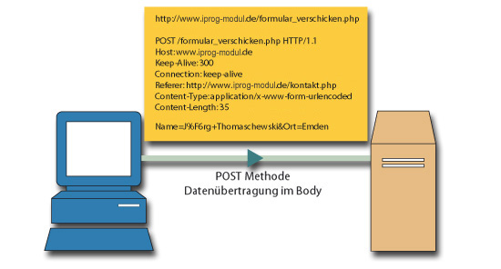

# 2.2.2 HTTP-Request: Methoden und Request-Line

Die wichtigsten HTTP-Methoden sind **GET**, **POST**, **PUT** und **DELETE**, mit denen wir uns im Rahmen dieses Kapitels beschäftigen. Eine Übersicht und einfache Erklärung aller Methoden finden Sie bei [Wikipedia](https://de.wikipedia.org/wiki/Hypertext_Transfer_Protocol#HTTP-Anfragemethoden). Sowohl mit GET, als auch mit POST, können Daten (z.B. aus Webformularen) an den Server mitgeschickt werden.

Hier ein kurzes Video, das den Unterschied zwischen GET und POST erklärt. Im Video wird dargestellt, dass die Übermittlung der Daten in POST nicht sicherer als mit GET ist.

  <video controls>
    <source src="../media/3-GET-POST.mp4" type="video/mp4">
    Ihr Browser unterstützt das Video-Tag nicht.
  </video>
  
<em>Anfragen an einen Webserver: Dieses Video zeigt, wie Webanfragen funktionieren und wie der Datenverkehr zwischen einem Client und einem Server abläuft.</em>

## GET

Bei GET werden Formulardaten in der Request-Line übertragen.

- Angehängte HTML-Parameter (aus HTML-Formularen) werden zum Bestandteil der [URL](2.1.4AufbauEinerURL.md).
- Die Kodierung erfolgt wie im Abschnitt [Sonderzeichen und Codierung](2.1.4AufbauEinerURL.md) dargestellt.
- Die Länge der erlaubten URL kann im Apache-Parameter `LimitRequestLine` festgelegt werden (Default ist 8190).
- Wenn die Länge der URL überschritten wird, erscheint der Fehler-Statuscode 414.

## POST

Bei POST werden Formulardaten im HTTP-Body übertragen. Die Methode POST setzt man sinnvoll nur ein, wenn wirklich Daten übertragen werden (Formulardaten, Dateiupload). Ansonsten wird GET verwendet.

- HTML-Parameter (aus HTML-Formularen) werden im HTTP-Body übermittelt.
- Die Größe des zulässigen Body kann mit dem Apache-Parameter `LimitRequestBody` festgelegt werden.
- Die Kodierung erfolgt wie im Abschnitt [Sonderzeichen und Codierung](2.1.4AufbauEinerURL.md) dargestellt.
- In den HTML-Formularen steht normalerweise kein `enctype=...`. Dann wird immer angenommen: `enctype=application/x-www-form-urlencoded`.
- Bei Dateiupload muss in HTML angegeben werden: `enctype=multipart/form-data`.

## PUT

Die Methode PUT wird verwendet, um Ressourcen (dabei kann es sich um eine Datei, oder aber schlicht um Daten handeln) an den Server zu schicken. PUT wird heutzutage oft im Zusammenhang mit RESTful bzw. Ajax-Daten verwendet.

## DELETE

Die Methode DELETE löscht die in der URL angegebene Ressource (dabei kann es sich ebenfalls um eine Datei, oder aber schlicht um Daten handeln) auf dem Server. DELETE wird ebenfalls oft im Zusammenhang mit RESTful bzw. Ajax-Daten verwendet.
