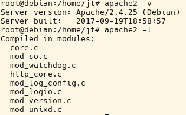

# 3.2.1 Direkte Programmoptionen für apache2

Der Webserver wird normalerweise über das Startskript (also `systemctl start apache2`) gestartet. Im Startskript selbst steht selbstverständlich der Aufruf des Webserver-Programms `apache2`. Das Webserver-Programm kennt verschiedene Optionen.

Hilfe zu den möglichen Programmoptionen erhält man mit `apache2 –h` oder `man apache2`.

| Optionen          | Bedeutung                                              |
|-------------------|--------------------------------------------------------|
| `-D name`         | define a name for use in `<IfDefine name>` directives |
| `-d directory`    | specify an alternate initial ServerRoot                |
| **`-f file`**        | specify an alternate ServerConfigFile                 |
| `-C directive`    | process directive before reading config files          |
| `-c directive`    | process directive after reading config files           |
| `-e level`        | show startup errors of level (see LogLevel)            |
| `-E file`         | log startup errors to file                             |
|**`-v`**             | show version number                                    |
| `-V`              | show compile settings                                  |
| `-h`              | list available command line options (this page)        |
|**`-l`**            | Compiled-in modules                                    |
| `-L`              | list available configuration directives                |
| `-S`              | show parsed settings (currently only vhost settings)   |
| `-t`              | run syntax check for config files (with docroot check) |

Wichtig ist die Ermittlung der Serverversion, damit Module und andere Ergänzungen auch zu der entsprechenden Serversoftware passen. Die Serverversion lässt sich demnach ermitteln mit: `/usr/sbin/apache2 -v`

Tipp: Falls die Daten nicht in den gezeigten Verzeichnissen vorhanden sind, können Sie mit dem Linux-Befehl "whereis apache2" suchen.

!!! question "Übung"
    Ermitteln Sie die Server-Version, sowie die fest eincompilierten Module, und notieren Sie das Ergebnis.

??? example "Lösung"
    Das Ergebnis könnte wie folgt aussehen
    
