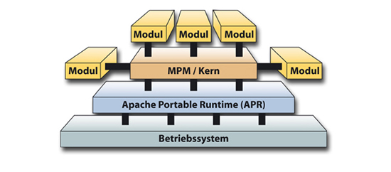

# 3.2.2 Modularer Aufbau des Apache

Bevor wir uns die Konfigurationsdateien ansehen, schauen wir uns hier das generelle Modulkonzept des Apache-Webservers an.

Um den Apache auf unterschiedlichen Plattformen anzubieten, wurde eine "Apache Portable Runtime (APR)" entwickelt, die direkt an die unterschiedlichen Betriebssysteme angepasst ist. Je nach Betriebssystem gibt es also eine spezielle APR. Über die APR hat der Kern somit Zugriff auf einige grundlegende Funktionen des Betriebssystems. Dazu gehören:

- Ein- und Ausgabe von Dateien
- Netzwerkfunktionen
- Thread- und Prozessverwaltung
- Speicherverwaltung
- Laden dynamischen Codes

Die APR ist ein eigenständiges Projekt und lässt sich als Bibliothek unter der Apache-Lizenz auch für andere Anwendungen einsetzen.

Auf der APR kommt in der nächsten Schicht ein [Multi-Processing-Modul (MPM)](http://httpd.apache.org/docs/2.4/en/mpm.html). Es stehen unterschiedlich arbeitende MPMs für unterschiedliche Einsatzzwecke zur Verfügung. Für Linux gibt es beispielsweise die MPMs ["Event"](http://httpd.apache.org/docs/2.4/en/mod/event.html), ["Worker"](http://httpd.apache.org/docs/2.4/en/mod/worker.html) und ["Prefork"](http://httpd.apache.org/docs/2.4/en/mod/prefork.html). Bei den meisten Linux-Distributionen ist das MPM "Prefork" voreingestellt. Hierbei handelt es sich um einen im Voraus "forkenden" Webserver ohne Thread-Unterstützung, der auch hier in allen Beispielen verwendet wird.

Wichtig ist, dass an dem MPM sehr viele Module angeschlossen werden können, z.B. ein PHP-Modul zur Ausführung von PHP-Code.

Es gibt also beim Apache Module auf unterschiedlichen Ebenen. Die mit **`apache2 -l`** ermittelten Module befinden sich demnach auf unterschiedlichen "Ebenen". So sind **`core.c`** und **`http_core.c`** Module für die "Apache Portable Runtime (APR)".

Das Modul **`mod_so.c`** hat eine Sonderstellung, denn es ermöglicht, andere Module als "Shared Object" dynamisch einzubinden. Hierzu genügt es, dass die entsprechenden Module in der Konfigurationsdatei aufgerufen werden.
