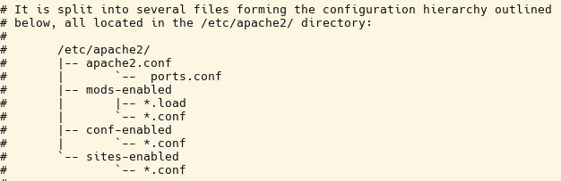
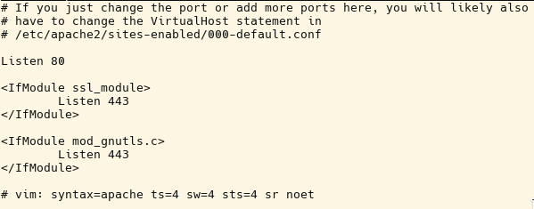
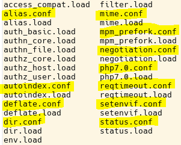
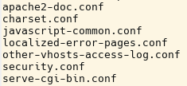

# 3.2.4 Die Verzeichnisstruktur des Apache2

Die Verzeichnisstruktur ist auf jedem Betriebssystem etwas anders, jedoch ist der prinzipielle Aufbau gleich.

Die Hauptkonfigurationsdatei befindet sich in Linux-Systemen im Verzeichnis `/etc/apache2` und heißt oftmals `apache2.conf`.
In dieser Datei kann man normalerweise auch erkennen, wo sich die weiteren Konfigurationsdateien befinden (siehe Abbildung). Die Struktur ist für erfahrene Betreiber von Webservern gut, für "Anfänger" jedoch unübersichtlich. Dabei gibt es zwei Probleme:

- Durch die Unübersichtlichkeit entstehen oft Sicherheitslücken, da unbedacht zu viele Module und deren Konfigurationen eingebunden werden.
- Konfigurationsanweisungen können sich gegenseitig überschreiben. In der Regel gilt die zuletzt geladene Anweisung (Direktive). Dies kann jedoch eine Direktive sein, die irgendwo in irgendeiner Konfigurationsdatei steht. Daher sollten die Konfigurationen der Module in eigenen Dateien erfolgen, um zumindest ansatzweise eine Struktur abzubilden.

Die Aufgabe ist also, dass man möglichst viele Module ausschaltet und die zugehörigen Konfigurationsdateien genau analysiert.

##`/etc/apache2`

Im Verzeichnis **`/etc/apache2`** gibt es die Hauptkonfigurationsdatei **`apache2.conf`** und eine Datei **`ports.conf`**, in der die Standardports festgelegt werden. Dies sind Port 80 für HTTP und Port 443 für die gesicherte Verbindung HTTPS. In der Abbildung sieht man eine kleine Konfigurationsdatei.

##`mods-enabled`

Es gibt ein Unterverzeichnis **`mods-enabled`**, in dem alle eingeschalteten Module mit ihren Konfigurationsdateien vorhanden sind. Die Module selbst werden über die **`.load`**-Dateien geladen. Zu vielen Modulen gibt es entsprechende Konfigurationsdateien **`.conf`**.
Nun sollte man für jedes Modul prüfen, ob dieses wirklich benötigt wird.

Das Modul [negotiation.conf](https://httpd.apache.org/docs/2.4/mod/mod_negotiation.html) wird beispielsweise nicht benötigt. Entsprechend können die Einträge `negotiation.load` und `negotiation.conf` gelöscht werden. Alle Einträge in dem Verzeichnis **`mods-enabled`** sind nur Verweise (Softlinks) auf die Dateien im Verzeichnis **`mods-available`**. Somit können die Links gefahrlos gelöscht und bei Bedarf wieder hergestellt werden.

!!! question "Aufgabe"
    Schauen Sie nach, wie viele Module im Verzeichnis `mods-available` auf Ihrem Server prinzipiell zur Verfügung stehen. Sie werden staunen, wie viele es sind.

##`conf-enabled`

Es gibt ein Unterverzeichnis `conf-enabled`, aus dem weitere Konfigurationsdateien geladen werden.

Hierin gibt es beispielsweise die Datei `security.conf`, die sehr sinnvoll ist, doch in den Default-Einstellungen die Sicherheit nahezu komplett ausgeschaltet hat.

!!! question "Aufgabe"
    Ändern Sie die Einstellungen in der Datei `security.conf` so, dass alle dort beschriebenen Einstellungen auf dem bestmöglichen, angegebenen Sicherheitsniveau stehen. Ihr Server wird danach trotzdem wie gewohnt laufen. Nach der Änderung in der Datei bitte nicht vergessen, den Server mit `systemctl reload apache2` neu zu starten.

## `sites-enabled`

Der Apache Webserver eignet sich sehr gut, um viele verschiedene Websites mit unterschiedlichen Anforderungen auf einem Webserver zu betreiben. Wenn man verschiedene Websites hat, dann ist es sinnvoll, die speziellen Konfigurationen im Unterverzeichnis `sites-enabled` abzulegen. In diesem Unterverzeichnis gibt es nur einen Link auf eine Datei in einem Verzeichnis `sites-available`. Wir werden an späterer Stelle auf diese Datei noch genauer eingehen, da wir hier nur mit einer Site arbeiten werden.

!!! important "Wichtig"
    Sicherheitshinweis: Man kann schnell einen Apache-Webserver zu Testzwecken in einem lokalen Netzwerk (ohne Verbindung nach außen) einrichten, da die Standardeinstellungen automatisch dafür sorgen, dass der Apache läuft.

    Einen Webserver sicher und sauber zu konfigurieren, bedarf der drei Faktoren **"Wissen"**, **"Planung"** und **"Zeit"**. Der Webserver ist schließlich immer ein potentielles Angriffsziel, da er eine Verbindung zu dem inneren Netzwerk herstellt. Dies gilt für alle Systeme, also auch für embedded computers, Router, NAS etc.
