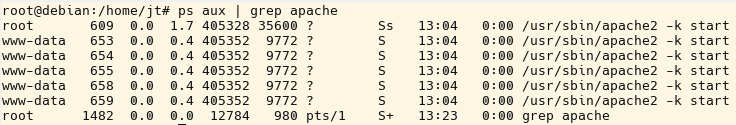

# 3.2 Der Apache Webserver

Gliederung

- [3.2.1 Direkte Programmoptionen für apache2](3.2.1DirekteProgrammoptionenfürapache2.md) 
- [3.2.2 Modularer Aufbau des Apache](3.2.2ModularerAufbaudesApache.md) 
- [3.2.3 Apache Module](3.2.3ApacheModule.md) 
- [3.2.4 Die Verzeichnisstruktur des apache2](3.2.4DieVerzeichnisstrukturdesapache2.md) 
- [3.2.5 Selbsttest zu Apache Grundlagen](3.2.5SelbsttestzuApacheGrundlagen.md) 

Der Apache ist noch immer der bekannteste Webserver. Doch während er früher "immer und überall" eingesetzt wurde, werden heutzutage vermehrt nginx und node.js verwendet. Alle hier gezeigten Konfigurationsanweisungen beziehen sich auf ein Debian-System (also Linux) und den Apache 2.4.

!!! warning "Sicherheitshinweis"
    Bei jeder Linux-Distribution ist der Apache Webserver dabei und läuft selbstverständlich problemlos. Aber **die mitgelieferten Standard Apache-Konfigurationen dürfen nicht in produktiven Umgebungen eingesetzt werden!** Diese Standard-Konfigurationen sind so erstellt, dass die Webserver unter möglichst vielen Umständen laufen. Sie

    - sind nicht abgesichert,
        - haben zu viele Module eingeschaltet,
        - geben zu viele Informationen über sich bekannt,
    - sind nicht übersichtlich,
    - sind nicht performant.
    
    Daher ist es wichtig, dass Sie sich mit der Konfiguration des Apache-Webservers eingehend beschäftigen, bevor sie diesen produktiv einsetzen.

## Manager- und Bearbeiterprozesse (=Workerprozesse)

Ob der Apache läuft, kann mit `ps aux | grep apache2` ermittelt werden. In der Abbildung sehen wir sechs Prozesse.

- Der oberste Prozess läuft unter `root` und ist der Managerprozess. Die Aufgabe des Managerprozesses ist die Bereitstellung von so vielen Bearbeiterprozessen, wie in der Konfigurationsdatei angegeben sind.
- Die anderen fünf Prozesse laufen in diesem Beispiel unter dem Nutzer `www-data`. Dabei handelt es sich um einen nicht-privilegierten Nutzer, der automatisch vom Webserver eingerichtet wurde. Diese fünf Prozesse können Anfragen (Client-Requests) entgegennehmen und bearbeiten.

!!! warning "Sicherheitshinweis"
    Bearbeiterprozesse müssen immer einem nicht-privilegierten Benutzer gehören, der keine anderen Rechte hat, als die Webdokumente auszuliefern.

Der Managerprozess steht also an oberster Position und sollte normalerweise vom User "root" gestartet worden sein. Die Bearbeiterprozesse haben die Rechte eines Users "www-data" (auf die Bedeutung Rechte wird später eingegangen).

- Der Bearbeiterprozess bearbeitet die Anfrage und gibt die Rückmeldung zurück an den Client. Da es beim Apache-Webserver für jede Anfrage einen Bearbeiterprozess gibt, der zuvor gestartet wurde, nennt man diese Arbeitsweise auch "Prefork".
- Damit nicht mit jeder Anfrage extra ein neuer Bearbeiterprozess gestartet werden muss, wird mit einer Voreinstellung in der Apache-Konfiguration die Mindestanzahl der immer laufenden Prozesse vorgeben.
- Der Managerprozess startet bei Bedarf zusätzliche Bearbeiterprozesse.
- Damit bei einer großen Anzahl von Anfragen der Server nicht überlastet wird, sollte eine maximale Anzahl laufender Prozesse vorgegeben werden.

!!! note "Wichtig"
    Die Einstellung der aktiven und maximalen Bearbeiterprozesse gehört somit zu den notwendigen Grundeinstellungen, um den Webserver effizient und sicher zu betreiben.

## Starten und Stoppen des Apache (Linux)

Mit `systemctl stop apache2` und `systemctl start apache2` können Sie den Apache stoppen und starten. Beim Stoppen werden alle offenen Verbindungen (Client Requests) abgebrochen. Dies ist bei produktiven Systemen natürlich unerwünscht, sodass mit `systemctl reload apache2` die Prozesse ohne Unterbrechung neugestartet werden können.

!!! task "Aufgabe"
    Stoppen Sie den Webserver und schauen Sie mit `ps aux | grep apache` nach, ob dies erfolgreich war.

**Nach jeder Änderung an der Konfigurationsdatei des Webservers, muss der Webserver neugestartet werden.** Es ist ein sehr häufig auftretender (Anfänger-)Fehler, dass nach einer Konfigurationsänderung vergessen
