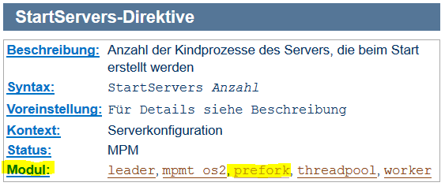
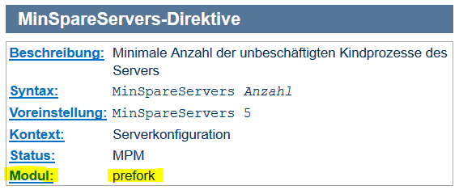
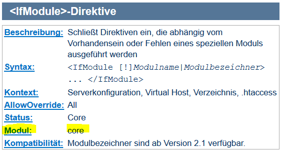

# 3.3.4 Direktiven und Modulzuordnung

Beim Modul `mpm-prefork` haben wir erkennen können, dass Direktiven immer einem oder mehreren Modulen zugeordnet sind. Die Zuordnung kann man der Apache-Dokumentation entnehmen. Soll eine Direktive in einer Konfigurationsdatei verwendet werden, so muss das dazugehörige Modul eingebunden (inkludiert) sein.

!!! example "Beispiel"
    Direktiven der Konfigdatei `mpm-prefork.conf`
    
    ```apache2.conf
    <IfModule mpm_prefork_module>
        StartServers              5
        MinSpareServers           5
        MaxSpareServers          10
        MaxRequestWorkers       150
        MaxConnectionsPerChild    0
    </IfModule>
    ```

Für die Direktive [StartServers](https://httpd.apache.org/docs/2.4/de/mod/mpm_common.html#startservers) gibt es in der Apache-Dokumentation nachfolgende Beschreibung:



Hieraus kann man erkennen, dass die Direktive *StartServers* in unterschiedlichen Modulen eingesetzt werden kann.

Für die Direktive [MinSpareServers](https://httpd.apache.org/docs/2.4/de/mod/prefork.html#minspareservers) gibt es in der Apache-Dokumentation nachfolgende Beschreibung:



Hieraus kann man erkennen, dass die Direktive *MinSpareServers* nur im Modul *prefork* eingesetzt werden kann.

Für die Direktive [`<IfModule ...> ... </IfModule>`](https://httpd.apache.org/docs/2.4/de/mod/core.html#ifmodule) gibt es in der Apache-Dokumentation nachfolgende Beschreibung:



Hieraus kann man erkennen, dass die Direktive `<IfModule ...> ... </IfModule>` zum *core*-Modul gehört.

- Man hat also die Möglichkeit über die [Liste der Direktiven](https://httpd.apache.org/docs/2.4/de/mod/directives.html) das zugehörige Modul zu ermitteln.
- Man kann auch über die [Liste der Module](https://httpd.apache.org/docs/2.4/de/mod/) die hierzu passenden Direktiven erfahren.

Beide Listen sind ein wichtiges Handwerkszeug für die Konfiguration des Apache Webservers.
