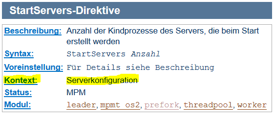
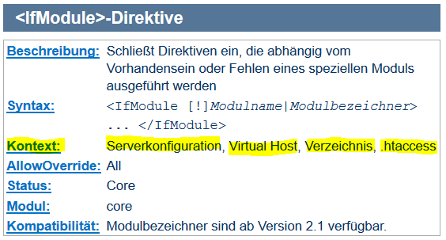

# 3.3.5 Direktiven und Kontextzuordnung

Nachdem die Zuordnung zwischen Direktiven und Modulen behandelt wurde, werden wir nun unterschiedliche Bereiche (= Kontexte) in der Konfigurationsdatei betrachten. 

Die Direktive [StartServers](https://httpd.apache.org/docs/2.4/de/mod/mpm_common.html#startservers) nennt die Anzahl der Bearbeiterprozesse des Servers, die beim Start erstellt werden. Diese Direktive ist also nur im Kontext der (globalen) Serverkonfiguration sinnvoll, wie auch in der Abbildung erkannt werden kann.



Für die Direktive [`<IfModule ...> ... </IfModule>`](https://httpd.apache.org/docs/2.4/de/mod/core.html#ifmodule) gibt es in der Apache-Dokumentation nachfolgende Abbildung:



Hieraus kann man erkennen, dass die Direktive `<IfModule ...> ... </IfModule>` in verschiedenen Kontexten verwendet werden kann.

Es gibt für die Apache-Konfiguration folgende unterschiedliche Kontexte:

- **server config (= Serverkonfiguration)** bedeutet, dass die Direktive in der globalen Konfiguration des Servers vorkommt.
- **virtual host (= Virtual Host)** bedeutet, dass die Direktive auf der Ebene der einzelnen Domain - also einer Website - verwendet werden kann. Die meisten Direktiven im Kontext `virtual host` sind auch im Kontext `server config` gültig. Umgekehrt gilt dies aber nicht.
- **directory (= Verzeichnis)** bedeutet, dass diese Direktiven zur Konfiguration in einzelnen Verzeichnissen (und deren Unterverzeichnissen) eingesetzt werden können. Beispielsweise könnte man PHP nur in bestimmten Verzeichnissen zulassen und das PHP-Modul im Kontext eines Verzeichnisses inkludieren.
- **.htaccess** ist eine Besonderheit. Eine [.htaccess-Datei](http://httpd.apache.org/docs/2.4/en/howto/htaccess.html) kann in Unterverzeichnissen vorkommen und Konfigurationsanweisungen enthalten. .htaccess-Dateien werden genutzt, um Usern Konfigurationsmöglichkeiten zu bieten, ohne, dass man über root-Rechte die Hauptkonfigurationsdateien bearbeiten können.

!!! note "Anmerkung"
    Wenn Sie bei einem Provider "Webspace" gemietet haben, dann haben Sie normalerweise einen Zugang via ftp, um auf Ihrem Webspace die entsprechenden Dateien ablegen zu können. Oftmals können Sie dann auch mit `.htaccess-Dateien` die Apache-Konfiguration beeinflussen. So können Sie beispielsweise sehr einfach Ordner bestimmen, die mit einem Passwortschutz versehen werden.

!!! warning "**Sicherheitshinweis**"
    Wenn Sie einen Webserver betreiben, sollten Sie .htaccess-Dateien möglichst nicht zulassen. Die .htaccess-Dateien verringern die Performance, und es wird auch aus [Sicherheitsgründen](http://httpd.apache.org/docs/2.4/en/misc/security_tips.html#systemsettings) von der Verwendung abgeraten. Mit den folgenden Direktiven wird vermieden, dass Anweisungen in .htaccess-Dateien ausgeführt werden. Die Direktiven sollten im Bereich `server config'` stehen, damit sie für den gesamten Server gelten.

    ```apache2.conf
    <Directory "/">
        AllowOverride None
    </Directory>
    ```


