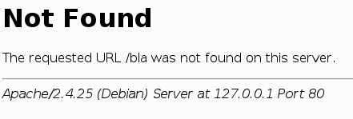

# 3.3.6 Beispiel ServerTokens und ServerSignature

Am Beispiel der Direktive **ServerTokens** kann das Zusammenspiel zwischen der Apache-Konfiguration und den Auswirkungen im HTTP-Header sehr gut nachvollzogen werden.

!!! example "Beispiel"
    Auf dem hier verwendeten Debian9-System befindet sich die Direktive **ServerTokens** in `/etc/apache2/conf-available/security.conf`.
    
Im HTTP-Response-Header werden normalerweise Informationen zum Server mitgeliefert. Über [ServerTokens](https://httpd.apache.org/docs/2.4/de/mod/core.html#servertokens) kann bestimmt werden, wie aussagekräftig diese Informationen sind. Diese Daten werden nur aus dem Grund gesendet, damit die Nutzungshäufigkeit des Apache-Webservers ermittelt werden kann.

**Empfehlung: ServerTokens Prod**

!!! question "Aufgabe"
    Stellen Sie **ServerTokens Full** ein und ermitteln Sie die Angaben im Server Response des HTTP-Headers. Sie können dann sehr gut erkennen, wie die Konfiguration des Webservers den HTTP-Header beeinflusst.

    Anschließend stellen Sie **ServerTokens Prod** ein und sollten einen deutlichen Unterschied erkennen können.

    Hinweis: Wenn kein Unterschied zu erkennen ist, haben Sie entweder den Webserver nach den Konfigurationsänderungen nicht neugestartet, oder die Direktive wird in einer anderen config-Datei überschrieben.

Sie können die Auswirkungen der Einstellungen auch gut an Fehlerseiten erkennen.

## ServerTokens OS

## ServerTokens Prod

## ServerSignature Off

Mit [ServerSignature Off](https://httpd.apache.org/docs/2.4/de/mod/core.html#serversignature) werden keine Informationen mehr angezeigt.

!!! question "Aufgabe"
    Ermitteln Sie, ob mit **ServerSignature Off** noch Angaben über den Server im Server Response des HTTP-Headers stehen.
