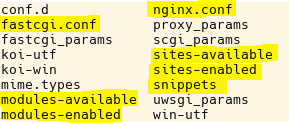
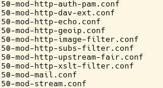

# 3.4 Der nginx Webserver

In diesem kleinen Unterkapitel zum **nginx** wird Ihnen vieles aus der Apache-Konfiguration vertraut vorkommen, nur in schlankerer Form. Auf der Debian9-Distribution ist der nginx nicht vorinstalliert, die Installation ist aber sehr einfach. Zuerst sollte der Apache-Webserver mit `systemctl stop apache2` gestoppt werden. Mit `apt-get install nginx` wird dann der nginx installiert und gestartet.

Die Dokumentation für den nginx ist unter [https://nginx.org/en/docs/](https://nginx.org/en/docs/) zu finden.

!!! tip "Hinweis"
    Es gibt vom Verlag O'Reilly ein kostenloses Buch:  
    [DeJonghe, Derek (2019): "The Complete NGINX Cookbook"](https://www.nginx.com/resources/library/complete-nginx-cookbook/)


Der nginx ist die schlanke und performante Alternative zum Apache-Webserver, bei der vieles ähnlich zu sein scheint.

!!! tip "Sicherheitshinweis"
    <big>Auch für den nginx - wie für jeden Webserver - gilt, dass die Standardkonfiguration aus Sicherheitsgründen nicht im produktiven Betrieb eingesetzt werden darf, sondern entsprechend den Anforderungen sorgfältig angepasst werden muss.</big>

## nginx Webserver starten und stoppen

Ob der nginx läuft, kann mit `ps aux | grep nginx` ermittelt werden. Im Gegensatz zum Apache sehen wir dann nur zwei Prozesse: einen Managerprozess und einen Bearbeiterprozesse, da der nginx eventbasiert alle Anfragen mit einem Prozess entgegen nimmt.

Mit `systemctl start nginx` und `systemctl stop nginx` wird der Webserver gestartet und gestoppt.

## Direkte Programmoptionen für den nginx

So wie beim Apache Webserver, gibt es auch beim nginx Parameter, die direkt in der Linux-Konsole eingegeben werden können:

- `nginx -v` ermittelt die installierte Version (z.B. nginx/1.10.3)
- `nginx -h` zeigt einen Überblick über die Optionen

## Module und Direktiven

Ebenso, wie beim Apache, gibt es [Module und Direktiven](https://nginx.org/en/docs/). Dabei fällt auf, dass es weniger Module gibt und diese in der Regel mit weniger Direktiven auskommen.

## Verzeichnisstruktur

Die Verzeichnisstruktur ist ähnlich der Apache Verzeichnisstruktur. Die Hauptkonfigurationsdatei heißt `nginx.conf` und befindet sich im Verzeichnis `/etc/nginx`. Die Debian-Verzeichnisstruktur ist hier sehr gut erläutert: [https://wiki.debian.org/Nginx/DirectoryStructure](https://wiki.debian.org/Nginx/DirectoryStructure)



Auch beim nginx sind Konfigurationsanweisungen ausgelagert und befinden sich beispielsweise in einem Unterverzeichnis `modules-enabled`.



Aber auch wenn die Struktur ähnlich aussieht, so verhält sich der nginx Webserver aufgrund seiner eventbasierten Arbeitsweise deutlich anders und ist auch anders zu konfigurieren.


## Konfiguration des nginx

Die Konfiguration des nginx ist insgesamt etwas übersichtlicher als die Konfiguration des Apache Webservers. Zusätzlich gibt es auch eine Reihe von [Standardkonfigurationen für häufig vorkommende Anwendungsszenarien](https://www.nginx.com/resources/wiki/start/) und [sehr gute Tipps, auch zum Thema Sicherheit](https://www.nginx.com/resources/wiki/start/topics/tutorials/config_pitfalls/).

!!! example "Beispiel"
    Original Hauptkonfigurationsdatei `nginx.conf`

    ```
    user www-data;
    worker_processes auto;
    pid /run/nginx.pid;
    include /etc/nginx/modules-enabled/*.conf;

    events {
        worker_connections 768;
        # multi_accept on;
    }

    http {

        ##
        # Basic Settings
        ##

        sendfile on;
        tcp_nopush on;
        tcp_nodelay on;
        keepalive_timeout 65;
        types_hash_max_size 2048;
        # server_tokens off;

        # server_names_hash_bucket_size 64;
        # server_name_in_redirect off;

        include /etc/nginx/mime.types;
        default_type application/octet-stream;

        ##
        # SSL Settings
        ##

        ssl_protocols TLSv1 TLSv1.1 TLSv1.2; # Dropping SSLv3, ref: POODLE
        ssl_prefer_server_ciphers on;

        ##
        # Logging Settings
        ##

        access_log /var/log/nginx/access.log;
        error_log /var/log/nginx/error.log;

        ##
        # Gzip Settings
        ##

        gzip on;
        gzip_disable "msie6";

        # gzip_vary on;
        # gzip_proxied any;
        # gzip_comp_level 6;
        # gzip_buffers 16 8k;
        # gzip_http_version 1.1;
        # gzip_types text/plain text/css application/json ...;

        ##
        # Virtual Host Configs
        ##

        include /etc/nginx/conf.d/*.conf;
        include /etc/nginx/sites-enabled/*;
    ```

Ein Hauptteil der Konfiguration befindet sich in der Datei `sites-enabled/default`. Wie beim Apache schon beschrieben, ist im Verzeichnis `sites-enabled/` nur ein Link auf eine Datei `default` im Verzeichnis `sites-available/` vorhanden. Somit wurden genau genommen die Daten aus der Datei `sites-available/default` verwendet.

!!! example "Beispiel"

    Datei `sites-available/default`

    ```html
    # Default server configuration
    #
    server {
        listen 80 default_server;
        listen [::]:80 default_server;

        # SSL configuration
        #
        # listen 443 ssl default_server;
        # listen [::]:443 ssl default_server;
        #
        # Note: You should disable gzip for SSL traffic.
        # See: https://bugs.debian.org/773332
        #
        # Read up on ssl_ciphers to ensure a secure configuration.
        # See: https://bugs.debian.org/765782
        #
        # Self signed certs generated by the ssl-cert package
        # Don't use them in a production server!
        #
        # include snippets/snakeoil.conf;

        root /var/www/html;

        # Add index.php to the list if you are using PHP
        index index.html index.htm index.nginx-debian.html;

        server_name _;

        location / {
            # First attempt to serve request as file, then
            # as directory, then fall back to displaying a 404.
            try_files $uri $uri/ =404;
        }

        # pass PHP scripts to FastCGI server
        #
        #location ~ \.php$ {
        #    include snippets/fastcgi-php.conf;
        #
        #    # With php-fpm (or other unix sockets):
        #    fastcgi_pass unix:/var/run/php/php7.0-fpm.sock;
        #    # With php-cgi (or other tcp sockets):
        #    fastcgi_pass 127.0.0.1:9000;
        #}

        # deny access to .htaccess files, if Apache's document root
        # concurs with nginx's one
        #
        #location ~ /\.ht {
        #    deny all;
        #}
    }
    ```

!!! warning "**Wichtig**"
    Bevor Sie Ihre Konfigurationsdateien verändern, sollten Sie auf jeden Fall eine Kopie anlegen!!!

## Beispiel Zugangsschutz nginx

Wir hatten den Apache Webserver mit einem einfachen Zugangsschutz gesehen. Diesen Zugangsschutz wollen wir nun auch beim nginx einrichten. Beim Apache hatten wir hierfür folgende Einträge verwendet:

```apache2
<Directory /var/www/>
    Options Indexes FollowSymLinks
    AllowOverride None
    AuthType Basic
    AuthName "Mein Zugangsschutz"
    AuthUserFile "/etc/apache2/htpass"
    Require user IhrUserName
</Directory>
```

Beim nginx erreichen wir einen einfachen Zugangsschutz mit folgenden Zeilen (in der Datei **default**):

```nginx
location / {
    auth_basic           "Mein Zugangsschutz";
    auth_basic_user_file /etc/nginx/htpass;
}
```

Natürlich müssen wir auch beim nginx die Datei **htpass** erst erstellen. Dies machen wir mit einem Editor und schreiben in die Datei:

```nginx
IhrUserName:IhrUserPW
```

Es fällt auf, dass das Passwort hier im Klartext in der Datei steht. Aber es ist auch möglich, die [htpasswd-Funktionalität](https://nginx.org/en/docs/http/ngx_http_auth_basic_module.html) zu verwenden.

