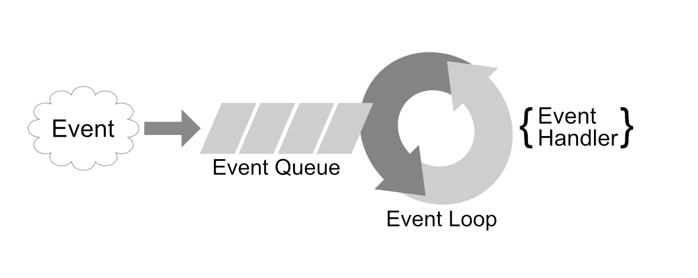

# 3.5 Der node.js Webserver

node.js ist kein Webserver im eigentlichen Sinn, sondern vielmehr eine Laufzeitumgebung für **serverseitiges JavaScript**, die als Webserver eingesetzt werden kann.

Node.js ist eine asynchrone, eventbasierte Laufzeitumgebung und wurde für die Entwicklung von skalierbaren Netzwerkanwendungen entworfen. Ein großer Unterschied zwischen Node.js und üblichen Server-Technologien ist, dass Node.js auf einem "Non Blocking"-Laufzeitmodell basiert. Im Vergleich zu Laufzeitmodellen, die Nebenläufigkeit über parallele Threads umsetzen, wie z.B. der Apache-Webserver, verwendet Node.js nur einen einzigen Thread, der eine Schleife ausführt. Diese, die sogenannte **"Event-Loop"**, arbeitet der Reihe nach alle eingehenden Events ab. Events können dabei z.B. eingehende Web-Anfragen über das Netzwerk, Laden von Daten aus dem Dateisystem oder Antworten von selbstgestellten Anfragen an andere Web-Services sein. Das "Geheimnis" dabei ist, dass (fast) alle Events in Node.js durch Callbacks abgearbeitet werden. Ein ähnliches Prinzip kennen Sie schon, wenn Sie bereits mit AJAX im Web-Browser gearbeitet haben. Wenn Sie im Browser asynchrone Daten anfordern, übergeben Sie in der Regel eine Funktion, die ausgeführt wird, wenn die angeforderten Daten geladen wurden. Genau dieses Programmiermuster nennt man einen Callback.

## Arbeitsweise der Event-Loop

Vereinfacht kann man sich vorstellen, dass sich Node.js für alle Events, die behandelt werden sollen, einen Event-Handler mit der Callback-Implementierung vorhält. Tritt nun ein Event auf, wird es in eine Liste (Event-Queue) hinzugefügt. Die Event-Loop arbeitet nun alle Callbacks zu den Events der Reihe nach ab.



Überträgt man die Art der Verarbeitung auf einen einfachen Web-Server mit Datenbank, kann man sich folgendes Beispiel ableiten:

1. Der Server ist gestartet, die Event-Queue ist leer und ein Event-Handler wartet auf eingehende Web-Anfragen.
2. Trifft eine Anfrage ein, wird ein passendes Event in die Event-Queue gelegt. Da keine anderen Events warten, wird mit der Verarbeitung begonnen.
3. Für die Verarbeitung der Anfrage werden Daten aus der Datenbank benötigt. Es wird ein Event-Handler inkl. Callback erstellt, der die Verarbeitung fortführt, wenn die Daten aus der Datenbank geladen sind, und die Anfrage an die Datenbank abschickt. Damit ist die Verarbeitung im Moment für die Web-Anfrage abgeschlossen und das Event wird aus der Event-Queue entfernt.
4. Die in der Zwischenzeit empfangenen Web-Anfragen werden ebenfalls als Event in die Event-Queue abgelegt. Während auf die Daten aus der Datenbank gewartet wird, werden diese der Reihe nach abgearbeitet. Dabei können Web-Anfragen, die ohne Datenbankaufruf auskommen, auch schon komplett bearbeitet werden. Die Anfrage an die Datenbank blockiert also die weitere Verarbeitung nicht (Stichwort: Non Blocking).
5. Die Daten aus der Datenbank sind angekommen und erstellen ein Event zur Weiterverarbeitung der Anfrage. Dieses Event wird ebenfalls hinten in die Event-Queue hinzugefügt. Ist dieses Event vorne in der Event-Queue angekommen, wird die Verarbeitung mit den Daten der Datenbank fortgesetzt und eine Antwort an den zugehörigen Browser gesendet.

Die oben beschriebenen Events vermischen sich natürlich mit vielen weiteren server-internen Events. Diese funktionieren aber in ähnlicher Weise. Wichtig ist hierbei, dass tatsächlich nur ein Thread aktiv ist, der über die Event-Loop eine fortlaufende Verarbeitung der Events vornimmt.

## NodeJS Package Manager

Eine weitere große Stärke von Node.js ist die Vielzahl an fertigen Funktionalitäten. Diese werden in Modulen bereitgestellt und können sehr einfach in ein eigenes Projekt integriert werden. Eine normale Installation von Node.js enthält dazu ein Kommandozeilen-Tool namens npm (Node.js Package Manager). Auf [https://www.npmjs.com/](https://www.npmjs.com/) können alle bereitgestellten Module gesucht werden. Neben Funktionalitäten für einen Node.js-Server, werden nahezu alle JavaScript-Frameworks und -Bibliotheken angeboten, sodass sich npm als Standard für professionelle Entwicklung (auch im Frontend) mit JavaScript durchgesetzt hat.

Um mit npm zu arbeiten, wird im eigenen Projekt eine Datei "package.json" mit Informationen zum Projekt benötigt. Diese Datei kann sehr einfach mit dem Befehl "npm init" erstellt werden. Alle benötigten Informationen werden interaktiv in der Kommandozeile abgefragt.

!!! example "Beispiel package.json"
    ```json
    {
      "name": "MeinProjekt",
      "version": "1.0.0",
      "description": "Kurze Beschreibung des Projekts",
      "main": "index.js",
      "scripts": {
        "test": "echo \\"Error: no test specified\\" && exit 1"
      },
      "author": "Ihr Name",
      "license": "ISC",
      "dependencies": {
        "express": "^4.16.2"
      }
    }
    ```

Für ein Projekt benötigte Module können innerhalb von "dependencies" eingetragen werden. Dadurch können sie, gesammelt mit dem Befehl "npm install", im Projektverzeichnis heruntergeladen werden. Modulabhängigkeiten werden aufgelöst und automatisch mit heruntergeladen, z.B. benötigt ein jQuery-Plugin-Modul wie jquery-validation das jquery-Modul und so weiter. Später benötigte Module können mit "npm install <Modul-Name> --save" hinzugefügt werden. Alle Module werden im Unterverzeichnis node_modules abgelegt.

In einer Node.js Umgebung können die heruntergeladenen Module aus dem node_modules-Verzeichnis mittels der require-Funktion im JavaScript importiert und als Objekt bereitgestellt werden. Beispiel (express-Module):

```javascript
var expressModule = require("express");
```

Aufbauend auf npm gibt es eine Vielzahl von weiteren Build-Tools, die bei der Entwicklung von JavaScript-basierter Software und der Entwicklung von Web-Frontends unterstützen.

Hier eine kleine Auswahl von sehr verbreiteten Tools, denen Sie bei der professionellen Entwicklung mit JavaScript und Web-Frontends begegnen werden.

| Tool      | Erläuterung                  |
|-----------|------------------------------|
| [gulp](https://gulpjs.com/)      | Build- und Automatisierung   |
| [grunt](https://gruntjs.com/)    | Build- und Automatisierung   |
| [Bower](https://bower.io/)       | Frontend Package-Manager     |
| [yeoman](http://yeoman.io/)      | Scaffolding Tool (Projekt- / Code-Generator) |
| [webpack](https://webpack.js.org/) | Static Asset Bundler        |
