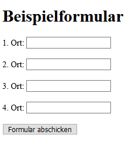
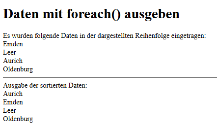

# 4.10.8 Beispiel Formulare - Daten sortieren

In diesem Beispiel verwenden wir vier Orte. Diese sollen sortiert ausgegeben werden.


```php linenums="1"
<?php
/**
 * Beispiel Formular - Daten einlesen
 * @author Lisa Meijer & Jörg Thomaschewski
 * @date 04.09.2019
 */

function writeHeaderAndHeadline()
{
    echo "<!DOCTYPE html>
          <html lang=\"de\">
          <head><title>Formular</title>
          </head>
          <body>
          <h1>Beispielformular</h1>";
}

function startForm($method, $url)
{
    echo "<form method=\"$method\" action=\"$url\">";
}

function writeInputField($text, $name)
{
    echo "<label for=\"$name\">$text: </label>
          <input type=\"text\" name=\"$name\" id=\"$name\">
          <br><br>";
}

function closeFormAndFooter()
{
    echo "<input type=\"submit\" value=\"Formular abschicken\">
          </form>
          </body></html>";
}

// Beginn des Hauptprogramms
writeHeaderAndHeadline();
startForm("post", "formular3a.php");
writeInputField("1. Ort", "ort1");
writeInputField("2. Ort", "ort2");
writeInputField("3. Ort", "ort3");
writeInputField("4. Ort", "ort4");
closeFormAndFooter();
?>
```

Screenshot des erzeugten Formulars



Die Ausgabe der Daten auf dem Browser erfolgt in deiesm Script.

```php linenums="1"
<?php
/**
 * Beispiel Formular - Daten mit foreach() ausgeben
 * @author Lisa Meijer & Jörg Thomaschewski
 * @date 04.09.2019
 */

function writeHeaderAndHeadline()
{
    echo "<!DOCTYPE html>
          <html lang=\"de\">
          <head><title>Formular</title>
          </head>
          <body>
          <h1>Daten mit foreach() ausgeben</h1>";
}

function writeHtmlEnd()
{
    echo "</body></html>";
}

// Beginn des Hauptprogramms
writeHeaderAndHeadline();
$error = false;

// Alle POST-Daten auslesen und auf leere Felder überprüfen
echo "Es wurden Daten in dieser Reihenfolge eingetragen:<br>";
foreach ($_POST as $field => $content) {
    if (!empty($content)) {
        echo "$content <br>";
    }
}

// Alle POST-Daten sortiert auslesen und auf leere Felder überprüfen
echo "<hr>Ausgabe der sortierten Daten:<br>";
asort($_POST);
foreach ($_POST as $field => $content) {
    if (!empty($content)) {
        echo "$content <br>";
    }
}

writeHtmlEnd();
?>
```

Screenshot der Datenausgabe



**Zeile 38** enthält die Sortierfunktion. So leicht kann das Sortieren eines Arrays in PHP sein.

Hier sei noch mal unbedingt erwähnt, dass es immer gut ist zwischendurch mit dem Quellcode "zu spielen". Probieren Sie es also auf ihrem eigenen Webserver aus!

!!! question "Aufgabe"
    Der obere Sourcecode ist auf 4 Orte begrenzt und die Funktionsaufrufe finden nicht über eine for-Schleife statt, was sehr "unschön" ist. Schreiben Sie das Programm um, sodass eine for-Schleife genutzt wird und sechs Felder erzeugt werden.

??? "Lösung"

    ```php linenums="1"
    <?php
    // Beginn des Hauptprogramms
    $fieldCount = 6;
    writeHeaderAndHeadline();
    startForm("post", "formular4a.php");
    
    for ($count = 1; $count <= $fieldCount; $count++) {
        writeInputField("$count. Ort", "ort$count");
    }
    
    closeFormAndFooter();
    ?>
    ```
