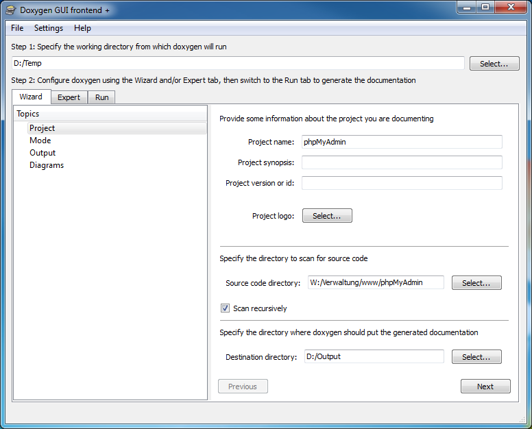
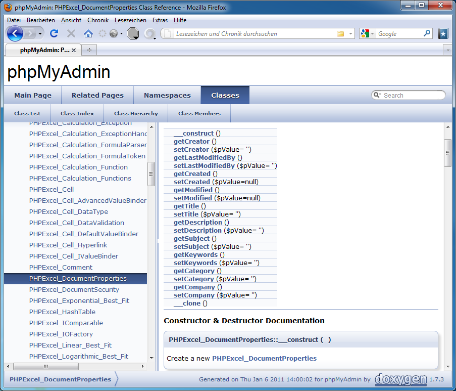
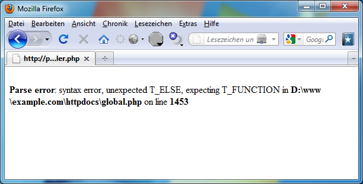

# 4.11 Dokumentation uns Testen

## Dokumentation

Analog zu JavaDoc gibt es unter PHP mehrere Wege automatische Dokumentationen zu erzeugen, beispielsweise mit [phpDocumentator](https://phpdoc.org/).

Nicht PHP-spezifisch, aber noch viel mächtiger, ist [doxygen](http://www.stack.nl/~dimitri/doxygen/). Dieses bietet, neben der Erstellung der Klassendiagramme und Abhängigkeitsbäume, auch viele Ausgabeformate, die eine Dokumentation sehr übersichtlich und nachvollziehbar machen.

**doxygen-Oberfläche**

**doxygen-Resultat**

Gewöhnen Sie sich die Arbeit mit **ausreichender Dokumentation** auf jeden Fall an! Für das spätere Ändern und Wieder-Einarbeiten ist eine Dokumentation unverzichtbar.

Auch mit Hilfe von UML können Sie entwickeln: [ArgoUML](http://argouml.tigris.org/) unterstützt die Erzeugung von PHP-Code.

## Testen

Vergessen Sie nie, Ihr PHP-Script umfangreich zu testen! Dabei sollten Sie auf Funktionalität und Schwachstellen testen. Sicherheitslücken in PHP-Projekten können einen enormen Schaden anrichten! Ein gutes Tool zum Testen ist z.B. [PHPUnit](https://phpunit.de/).

Sollten Sie kein Tool oder Framework zur Hand haben, lesen Sie sich Ihren Quellcode nochmal gut durch und testen Sie gegebenenfalls auch Fragmente dieses Codes. Testen Sie auch während der Entwicklung schrittweise. Somit erleichtern Sie sich die Suche nach einem Fehler.

So ist die Suche nach einer fehlenden geschweiften Klammer manchmal sehr aufwändig. Da es sich hierbei sogar meistens um einen „Parse error“ handelt, wird nichts anderes ausgegeben. Tatsächlich kann der Fehler hier allerdings schon in Zeile 900 auftreten, der sich allerdings erst auf die Zeile 1453 auswirkt. Somit müssten ohne hilfreiche Dokumentation und Tests ganze 553 Zeilen durchsucht werden, bis der Fehler gefunden wird - wenn er denn gefunden wird.

**Fehler in einer PHP-Datei**

