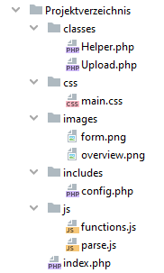

# 4.1 Arbeitsumgebung


**Dieses Unterkapitel "Arbeitsumgebung" ist nicht prüfungsrelevant.**

In diesem Kapitel wollen wir Ihnen einen Überblick über die Arbeitsumgebung geben, mit der Sie die Einsendeaufgaben sinnvoll bearbeiten können und die Sie natürlich auch darüber hinaus zum Arbeiten mit HTML, CSS, JavaScript, XML und PHP nutzen können.

!!! tip "Hinweis"
    In einem professionellen Umfeld sollte immer eine standardisierte Arbeitsumgebung vom Chefentwickler vorgegeben werden. Dies hilft Fehler zu reduzieren und effizient zu programmieren.

## Anforderungen an Editoren

Es gibt viele freie Editoren und Entwicklungsumgebungen (IDE) für die Web-Entwicklung. Hier stellen wir Ihnen zuerst einige kostenlose, einfache Editoren vor, die für den Start ausreichend sind.

Wenn Sie bereits mit einer Entwicklungsumgebung arbeiten und vertraut sind, dann können Sie diese natürlich auch hier weiterhin nutzen.

Die **Basisanforderungen** an einen Editor sind:

- **Auto-Completion**: Das Ergänzen der gängigen Befehle und der genutzten Variablen vermeidet "blöde Tippfehler".
- **Syntax-Highlighting**: Das Hervorheben unterschiedlicher Syntax-Strukturen hilft, einfach zu erkennen, wenn "etwas nicht stimmt", beispielsweise wenn Sie einen Kommentar nicht schließen und dadurch der nachfolgende Sourcecode ausgegraut ist.
- **Sourcecode in verschiedenen Tabs**: Gut, um schnell zwischen verschiedenen Sourcecodes zu wechseln.
- **W3C Validator (HTML, CSS)**: Zur automatischen Überprüfung der HTML/CSS-Syntax.

!!! tip "Wichtig"
    Vermeiden Sie Copy&Paste aus dem Internet. Gerade "Anfänger" sollten mit einem normalen Editor beginnen und selber tippen. Auch wenn dies nicht der effizienteste Weg ist, so ist es doch der Weg mit dem größten Lerneffekt.

Integrierte Entwicklungsumgebung (Integrated Development Environment)

Für die ersten Schritte in einer neuen Programmiersprache reicht oftmals ein einfacher Editor, der die Basisanforderungen erfüllt.

## IDEs und Editoren

Integrierte Entwicklungsumgebungen und Frameworks erleichtern die professionelle Programmierung.

- [PHPStorm](https://www.jetbrains.com/phpstorm/) - Verfügbar für Windows, Mac und Linux. Kostenlose Lizenz für Studierende.
- [Visual Studio Code](https://code.visualstudio.com/) - Verfügbar für Windows, Mac und Linux.
- [Zend Studio (kommerziell)](http://www.zend.com/) - Verfügbar für Windows, Mac und Linux.
- [Brackets](https://brackets.io/) - Verfügbar für Windows, Mac, Linux und alle Computer mit JavaScript, da der Editor in JavaScript erstellt wurde.
  - Besonders für Web- und Frontend-Entwickler.
  - Sinnvolles Plugin: W3C-Markup-Validator.
  - Live-Vorschau (in Google-Chrome).
  - Automatische Auswahl der Seitenstruktur.

!!! note "Anmerkung"
    Zu allen Editoren gibt es eine Reihe von Youtube-Videos, sodass Sie schon vor der Installation sehen können, ob Ihnen der Editor mit den entsprechenden Plugins gefallen könnte.


## Frameworks

- **Sehr empfehlenswert: [Symfony](http://www.symfony-project.org/)**, ein in der Praxis oft eingesetztes Framework: [Wikipedia über Symfony](http://de.wikipedia.org/wiki/Symfony).
- Laravel: ebenfalls ein MVC-Framework mit einfacher Syntax, umfangreiche Dokumentation vorhanden: [https://laravel.com/](https://laravel.com/), [Wikipedia über Laravel](https://de.wikipedia.org/wiki/Laravel).
- Zend Framework: umfangreiches, kommerzielles, gut dokumentiertes Framework: [http://www.zend.com/](http://www.zend.com/).

!!! tip "Hinweis"
    Wenn Sie mit Ihrer verwendeten PHP-Version auch über eine Offline-Dokumentation verfügen (z.B. auf Linux-Systemen), so sollten Sie diese Dokumentation benutzen - schließlich „passt“ diese genau zu Ihrer PHP-Version. Also achten Sie bitte im eigenen Interesse immer darauf, dass Ihre PHP-Version mit der in der Dokumentation angegebenen Version übereinstimmt.

## Arbeitserleichterungen

Beim Bearbeiten von HTML-Dateien in einem Editor wiederholen sich typischerweise die Schritte "ändern im Editor", "speichern im Editor" und "reload im Browser". Eine Automatisierung dieses Prozesses, insbesondere des Browser-Reloads, würde die Effizienz erheblich steigern.

Der Editor [Brackets](https://brackets.io/) bietet eine solche Automatisierung standardmäßig an. Für Nutzer anderer Editoren bietet das Tool [Browser-Sync](https://www.browsersync.io/) eine vergleichbare Funktionalität. Browser-Sync synchronisiert Dateiänderungen sofort mit dem Browser, was ein manuelles Neuladen überflüssig macht.

!!! example "Beispiel"
    Die Einrichtung von Browser-Sync für einen typischen Workflow könnte folgendermaßen aussehen:

    ```linux
    npm install -g browser-sync
    browser-sync start --server --directory --files "*.*"
    ```

    Dieser Befehl startet einen lokalen Server, überwacht alle Dateien im aktuellen Verzeichnis auf Änderungen und aktualisiert den Browser automatisch, wenn Änderungen gespeichert werden.

## Verzeichnisstrukturen

Für selbst kleinste Projekte ist es ratsam, eine klare Verzeichnisstruktur zu erstellen. Zum Beispiel können Ordner wie **"classes"** und **"includes"** alle Klassen- und Konfigurationsdateien enthalten, während im Hauptordner lediglich die `index.php`-Datei liegt.

Üblicherweise werden weitere Dateien eingebunden, die in entsprechenden Unterordnern wie **"css"**, **"js"** und **"images"** abgelegt werden, sodass im Hauptordner nur die HTML- oder PHP-Dateien zu finden sind.

Bei etwas größeren Projekten oder der Nutzung von Frameworks kommen dann zusätzliche Verzeichnisse für Frameworks, Template-Dateien usw. hinzu. Es ist wichtig, eigene Dateien von den Framework-Dateien zu trennen.

!!! note "Beispiel einer vorgeschlagenen Verzeichnisstruktur für kleine Projekte"
    

## Versionskontrolle

Eine Versionskontrolle, oder besser gesagt ein Versionsmanagement, ermöglicht es Ihnen, verschiedene Projektstände jeweils immer zu einer Version zusammenzufassen und alte Versionen wiederherstellen zu können. Dieses Instrument ist nicht nur im Alleingang am Computer nützlich, etwa beim Schreiben von Sourcecode, sondern erweist sich als unverzichtbar bei Teamarbeit, wo verschiedene Mitglieder am Sourcecode oder an Dokumenten arbeiten.

**Bestandteile der Versionskontrolle**

Die Versionskontrolle umfasst drei Hauptkomponenten:

1. **Die Versionskontrolle an sich**, wobei [GIT](https://git-scm.com/) der Standard ist.
2. **Eine grafische Oberfläche**, wie:
   - [TortoiseGit](https://tortoisegit.org/) für eine komfortable Bedienung unter Windows mittels Rechtsklick.
   - [Sourcetree](https://www.sourcetreeapp.com/), bekannt für seine übersichtliche Darstellung.
3. **Ein Cloud-Dienst für Teamarbeit**:
   - [GitHub](https://github.com/) ist weit verbreitet und viel genutzt.
   - [Bitbucket](https://bitbucket.org/) ist eine übersichtliche Alternative zu GitHub. Es bietet kostenlose private Repositories für kleine Teams und Projekte, im Gegensatz zu GitHub, wo bei kostenlosen Konten alle Projekte öffentlich sind.

!!! note "Lernen Sie GIT"
    Ein sehr guter Einstieg in GIT bieten die folgenden Ressourcen:
    - [Roger Dudler](https://rogerdudler.github.io/git-guide/index.de.html) bietet eine einfache und klare Einführung.
    - [Code School](https://www.codeschool.com/courses/try-git) bietet interaktive Kurse.
    - [Vogella](http://www.vogella.com/tutorials/Git/article.html) bietet umfangreiche Tutorials.

Die Verwendung von Versionskontrollsystemen wie GIT ermöglicht es, Änderungen nachzuvollziehen, zu verwalten und bei Bedarf frühere Versionen eines Projekts wiederherzustellen. Dies ist besonders wichtig in der Softwareentwicklung, sowohl für individuelle Entwickler als auch für Teams.

