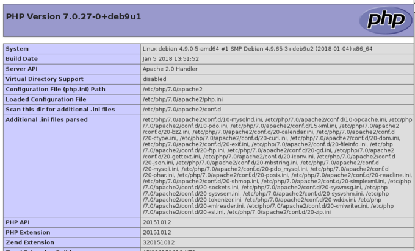
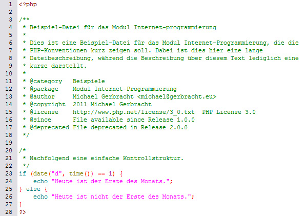

# 4.2 Allgemeine Informationen

Bevor die Programmierung beginnt, werden Sie in diesem Unterkapitel die Konfigurationsdatei `php.ini` kennen lernen, die PHP-Konventionen erlernen und erfahren, was in PHP ein "Guter Programmierstil" ist. Es ist somit ein wichtiges Kapitel für das „Handwerkszeug“ einer professionellen Programmierung.
 
## Umgebungsvariablen auslesen

Mit nur einer einzigen Zeile PHP-Code kann man die kompletten Variablen auslesen, die dem PHP-Modul bekannt sind. Dies ist überaus hilfreich.

```php
<?php phpinfo(); ?>
```

Hier kann man nun auch erfahren, welche Erweiterungen geladen und wie diese konfiguriert sind. Außerdem kann in der Abbildung sehr gut erkannt werden, dass es *ini*-Dateien gibt, die eingelesen werden.



!!! question 
    Erstellen Sie eine PHP-Datei, die nur die Zeile `<?php phpinfo(); ?>` enthält und lesen Sie damit jetzt die Umgebungsvariablen auf Ihrem Server aus.


## Konfigurationsdatei php.ini

PHP wird üblicherweise als Modul des Apache-Webservers genutzt. Für eine eigenständige Konfiguration des PHP-Moduls, unabhängig von den Konfigurationseinstellungen des Webservers, dient die Datei `php.ini`. Beim Start von PHP bzw. des Webservers wird diese Konfigurationsdatei geladen. Eine detaillierte Beschreibung der einzelnen Parameter findet sich im [Manual zu php.ini](http://php.net/manual/de/ini.php).

- Die `php.ini` ist normalerweise nur durch den Systemadministrator (root) änderbar. Mittels `<?php phpinfo(); ?>` können die Einstellungen eingesehen werden.
- Änderungen in der `php.ini` überschreiben die voreingestellten Konfigurationen des PHP-Moduls. Die Datei wird beim Start des Moduls bzw. des Apache-Webservers geladen.
- Auf einem Linux-System befindet sich die `php.ini` gewöhnlich im Verzeichnis `/etc/php/` oder einem entsprechenden Unterordner.
- Nach Modifikationen an der `php.ini` muss der Apache-Webserver neu gestartet werden, um die Änderungen zu übernehmen.

!!! question "Aufgabe"
    Ermitteln Sie, wo sich die Datei `php.ini` auf Ihrem System befindet. Vorsicht: auf einigen Linux-Systemen gibt es die php.ini gleich zweimal, wobei nur eine Datei eingebunden ist.

**Direktiven der `php.ini`**

Die Standardkonfigurationen sind in der folgenden Tabelle fett hervorgehoben. Die Default-Einstellungen sind essentiell für die Funktionsweise und Sicherheit von PHP-Anwendungen.

| Parameter | Erklärung |
|-----------|-----------|
| `display_errors = On|Off` | Bei `On` werden Fehlermeldungen direkt auf dem Bildschirm ausgegeben. Während dies auf Entwicklungs- und Testsystemen hilfreich ist, sollte auf Produktivsystemen aus Sicherheitsgründen `Off` gesetzt sein. |
| `log_errors = On|Off`<br>`error_log = pfad/datei` | Fehlermeldungen sollten mittels `log_errors = On` in eine Datei geschrieben werden, um eine Nachverfolgung zu ermöglichen. Der Speicherort kann frei gewählt werden, sofern der Server Schreibzugriff darauf hat. |
| `log_errors_max_len = 1024` | Bestimmt die maximale Größe der Log-Datei in Byte. Der Standardwert ist 1024 Byte, was sehr klein ist. Für unbegrenzte Größe kann der Wert auf 0 gesetzt werden, was allerdings vermieden werden sollte. |
| `error_reporting = E_ERROR \| E_WARNING \| E_STRICT \| E_DEPRECATED \| E_NOTICE \| E_ALL` | Filtert, welche Fehler angezeigt werden. Die verschiedenen Typen (z.B. `E_ERROR` für kritische Fehler, `E_NOTICE` für Hinweise) können kombiniert werden, um gezielt Informationen auszugeben. |
| `track_errors = On|Off` | Bei `On` ist die zuletzt aufgetretene Fehlermeldung über die Variable `$php_errormsg` zugänglich. |
| `auto_prepend_file = datei`<br>`auto_append_file = datei` | Bestimmt Dateien, die automatisch am Anfang bzw. Ende jedes Skripts eingefügt werden. |
| `max_execution_time = 30` | Legt die maximale Ausführungszeit eines Skripts in Sekunden fest. Nach Überschreiten erfolgt ein Timeout. |
| `file_uploads = On|Off`<br>`upload_tmp_dir =`<br>`upload_max_filesize = 2M` | Ermöglicht Datei-Uploads bis zu einer Größe von 2 MByte. Bei nicht benötigter Upload-Funktionalität sollte `Off` gesetzt sein. |

!!! tip "Wichtig"
    Es wird empfohlen, sowohl eine Fehlerausgabe im Browser (für Entwicklungssysteme) als auch eine Log-Datei für Fehlermeldungen zu konfigurieren. Standardmäßig wird keine Log-Datei für PHP-Fehlermeldungen erstellt, was eine der Einstellungen ist, die Sie in der `php.ini` anpassen sollten.


## Namenskonventionen

Folgende Namenskonventionen sollten eingehalten werden:

- **Variablen** beginnen mit einem klein geschriebenen Buchstaben, jedes weitere Wort mit einem Großbuchstaben. Für ein leichtes "Herunterlesen" des Codes, sollten Variablen aussagekräftig nach ihrem jeweiligen Zweck benannt werden, beispielsweise `$name`. Einer Variable wird ein Wert (Zahl, Text) nach einem Gleichheitszeichen zugewiesen, der später erneut überschrieben werden kann. Beispiele: `$pizzaTyp = "Salami"; $pizzaAnzahl = 2; $pizzaPreis = 9.50;` Die Ausgabe erfolgt durch echo.

- **Klassen** sollten immer mit einem Großbuchstaben beginnen und einen aussagekräftigen Namen besitzen – z.B. `HTMLCleaner`. Unbedingt zu beachten ist, dass Verben niemals am Anfang eines Klassennamens stehen sollten.

- **Methoden und Funktionen** werden stets klein geschrieben und jedes weitere Wort beginnt mit einem Großbuchstaben (dies wird auch „Kamel-Notation“ genannt) – z.B. `getUser()`. Hierbei sollten Funktionen stets ausdrücken, was sie im Programm ausführen.

- **Konstanten** bestehen ausschließlich aus Großbuchstaben – z.B. `HOST`;


## PHP-Konventionen

Codekonventionen sind für Unternehmen und Entwickler:innen aus verschiedenen Gründen wichtig:

- 40%-80% der Lebenszykluskosten einer Software gehen in die Wartung.
- Kaum eine Software wird vom Originalautor ein Leben lang gewartet.
- Codekonventionen verbessern die Lesbarkeit der Software und ermöglichen es Entwicklern, neuen Sourcecode schneller und gründlicher zu verstehen.
- Sourcecode wird normalerweise im Team entwickelt. Codekonventionen führen dazu, dass der Sourcecode dann über die verschiedenen Bereiche lesbar bleibt.



**Einrücken**

Viele Programmierer verwenden Tabulatoren, andere Leerzeichen. Die Empfehlungen sehen eine Einrückung von **4 Leerzeichen** vor, da Tabulatoren von unterschiedlichen Editoren unterschiedlich interpretiert werden.

!!! tip "Hinweis"
    In diesem Modul wurde die Einrückung an einigen Stellen mit nur zwei Leerzeichen vorgenommen, wenn der Sourcecode ansonsten nicht in das Browserfenster in eine Zeile passt. Es ist dann eine rein "didaktische Ausnahme".

**Zeilenlänge**

Es ist sehr sinnvoll, einen Zeilenumbruch bei ca. 80 Zeichen zu machen, um die Lesbarkeit editorübergreifend zu gewährleisten. Ein schnelles Editieren per Konsole auf einem Webserver fällt so zum Beispiel leichter.

**Anführungszeichen**

PHP erlaubt die Verwendung von einfachen oder doppelten Anführungszeichen, um Strings zu kennzeichnen. Auch wenn diese ein unterschiedliches Verhalten und viele Diskussionen über Lesbarkeit und Performance hervorrufen, ist das Sinnvollste innerhalb eines Scripts oder Projekts konsequent zu bleiben und eine gleiche Struktur beizubehalten.

**Kontrollstrukturen (z.B.: `if`-Bedingungen, `while`-, `for-` und `foreach`-Schleifen usw.)**

Zwischen dem Schlüsselwort und der ersten Klammer sollte ein Leerzeichen stehen, um sie von Funktionsaufrufen zu unterscheiden, und die geschweiften Klammern sollten stets gesetzt werden, selbst wenn ihre Verwendungen optional sind (wenn nur ein Befehl in ihnen steht).

```php
if ((Bedingung 1) || (Bedingung 2)) {
    Ausdruck 1
} else {
    Ausdruck 2
}
```

**Funktionsaufrufe & Variablenzuweisung**

Zwischen dem Funktionsnamen und der ersten Klammer sollte kein Leerzeichen eingefügt werden, ebenso wird zwischen der Klammer und dem ersten Parameter kein Leerzeichen verwendet. Bei mehreren Parametern steht hinter jedem Komma ein Leerzeichen. Bei der Zuweisung einer Variablen sollte vor und hinter dem Gleichheitszeichen jeweils ein Leerzeichen stehen, wobei die Gleichheitszeichen bei mehreren untereinander stehenden Zuweisungen eingerückt werden können.

```php
$variable1 = function1($par1, $par2, $par3);
$variable2 = function2($par4, $par5);
```

**Funktionsdefinitionen**

Auch hier gilt anders als bei Kontrollstrukturen, dass zwischen dem Funktionsnamen und der ersten Klammer kein Leerzeichen eingefügt werden sollte, ebenso wird zwischen der Klammer und dem ersten Parameter kein Leerzeichen verwendet. Ebenfalls anders als bei Kontrollstrukturen sollten geschweifte Klammern immer in die nächste Zeile gesetzt werden und nicht hinter dem Funktionsnamen. Übergabeparameter mit einem Standardwert stehen am Ende der Parameterliste. Wenn möglich, sollte ein Rückgabewert mit return definiert sein.

```php
function functionName($par1, $par2, $par3 = "standard")
{
    //Irgendwas
    return true;
}
```

## Kommentare

In PHP gibt es unterschiedliche Arten von Kommentaren. Hier folgt eine Übersicht.

**Einfache Kommentare**

- Für einzeilige Kommentare: `// ...` (siehe **Zeile 1**)
- Mehrzeilige Kommentare verwendet man `/* ... */` (siehe **Zeile 10-13**).

```PHP linenums="1"
// Funktion für Formularfelder
function createFormInput()
{
    echo "Name: <input type='text' name='nachname'></br>
          Vorname: <input type='text' name='vorname'></br>
          Matr.-Nr.: <input type='text' name='matrnr'></br>";
}


/* Eine Funktion, die ein Formular erstellt, innerhalb dessen man
 * die Möglichkeit hat, Eingaben für Name, Vorname und Matrikel-Nr.
 * zu tätigen
 */
function createFormInput()
{
    echo "Name: <input type='text' name='nachname'></br>
          Vorname: <input type='text' name='vorname'></br>
          Matr.-Nr.: <input type='text' name='matrnr'></br>";
}
```

**DocBlock**

Ein *DocBlock* ist ein strukturierter Kommentar `/** ... */` und dient der Beschreibung aller Funktionen und Methoden. Diese Syntax kann mit Programmen (z.B. [PHPDocumentor](https://phpdoc.org/)) automatisiert ausgelesen werden, sodass klar wird, welche Parameter übergeben werden müssen und welches Format der Rückgabewert hat.

- **@param** beschreibt die Eingabeparameter (in der Reihenfolge der Nennung).
- **@return** beschreibt die Rückgabe an das Hauptprogramm.

```php linenums="1"
 /**
  * Funktion addiert zwei Werte
  * @param float $firstValue    Erster Wert
  * @param float $secondValue   Zweiter Wert
  * @return float               Rückgabe des Ergebnisses
  */
function addValues($firstValue, $secondValue)
{
    return $firstValue + $secondValue;
}
```

**Kommentarheader**

**Jede (!)** Datei beginnt in der zweiten Zeile mit Kommentarzeilen (= Kommentarheader oder Programmheader), der im Stil des *DocBlock* geschrieben werden muss.

- **@author** Angabe des Autors der Datei mit Angabe einer E-Mail-Adresse
- **@since** beschreibt was ab welcher Version neu ist.

```php linenums="1"
<?php
/**
 * Datei zu Aufgabe 1
 *
 * @author       Jörg Thomaschewski <jt@imut.de>
 * @since 2.0    englische Namen für Variablen eingeführt
 * @since 2.1    kleine Verbesserungen
 */

...
```

Weitere Informationen finden Sie beim [phpDocumentor](https://docs.phpdoc.org/guide/references/phpdoc/basic-syntax.html#what-is-a-docblock).


!!! tip "Hinweis"
    Die Coding-Standards [PSR-1](https://www.php-fig.org/psr/psr-1/) und [PSR-2](https://www.php-fig.org/psr/psr-2/) geben ausführlich Auskunft über Konventionen des Codeschreibens innerhalb von Dateien, Klassen, Methoden, Konstanten und Variablen. Eine Übersicht erleichtert das Schreiben funktionierenden Codes, denn häufig finden sich Fehler in einer nicht den Vorgaben entsprechenden Syntax, wie beispielsweise einem fehlenden Leerzeichen nach einem Kommata.

!!! tip "Hinweis"
    In diesem Zusammenhang empfiehlt sich außerdem die Lektüre eines Blog-Artikels von Lars Moelleken mit dem Titel [Weniger schlecht programmieren](https://suckup.de/2014/05/weniger-schlecht-php-programmieren/), um ein Gefühl für nicht nur richtigen, aber auch besser zu lesenden Code zu bekommen. Es sei aber zu beachten, dass dieser Artikel von 2014 und somit bereits wieder einige Jahre alt ist.


## Enige Übungsaufgaben

!!! question "Aufgabe 1"
    Sie erstellen eine Seite, auf der Datei-Uploads bis 100MB erlaubt sind. Welche der folgenden Parameter sollten in der `php.ini` enthalten sein?

    A) `log_errors_max_len = 100`

    B) `display_errors = Off`

    C) `max_execution_time = 30`

    D) `file_uploads = On`

    E) `max_execution_time = 300`

    F) `upload_tmp_dir = upload_max_filesize = 300M`

    G) `upload_tmp_dir = upload_max_filesize = 100M`

??? example "Lösung zu Aufgabe 1"
    Richtig sind<br>
    B) `display_errors = Off`

    D) `file_uploads = On`

    E) `max_execution_time = 300`

    G) `upload_tmp_dir = upload_max_filesize = 100M`

!!! question "Aufgabe 2"
    Welche PHP-Konvention ist korrekt?

    A) `$variable1=function1 ($par1, $par2, $par3);`

    B) `$variable1 = function1($par1, $par2, $par3);`

??? example "Lösung zu Aufgabe 2"
    B) `$variable1 = function1($par1, $par2, $par3);`

!!! question "Aufgabe 3"
    Welche Aussagen zu PHP-Konventionen treffen zu?

    A) Variablen und Funktionen sollten immer prägnant in der entsprechenden Landessprache benannt werden.

    B) Geschweifte Klammern gehören bei Funktionen in die gleiche Spalte des Funktionsaufrufes.

    C) Einrückungen im Code sollten 4 Leerzeichen betragen.

    D) Nach dem Funktionsnamen folgt direkt die Klammer, ohne ein Leerzeichen zu setzen.

??? example "Lösung zu Aufgabe 3"
    Richtig sind<br>
    C) Einrückungen im Code sollten 4 Leerzeichen betragen.

    D) Nach dem Funktionsnamen folgt direkt die Klammer, ohne ein Leerzeichen zu setzen.

!!! question "Aufgabe 4"
    Welche der folgenden Namen folgen den Konventionen?

    A) `public function countAge`

    B) `public function numbers`

    C) `class PutNameIntoField`

    D) `const VERSION`

    E) `class AnimalDefiner`

    F) `$name = "Jörg"`

    G) `$firstName = "Jörg"`

??? example "Lösung zu Aufgabe 4"
    Richtig sind<br>
    D) `const VERSION`

    E) `class AnimalDefiner`

    G) `$firstName = "Jörg"`

!!! question "Aufgabe 5"
    Welche Kommentierungsarten nutzt man für normale Kommentare außerhalb der PHPDoc?

    A) `// ...`

    B) `/** ... */`

    C) `/* ... */`

??? example "Lösung zu Aufgabe 5"
    A) `// ...`

    C) `/* ... */`
