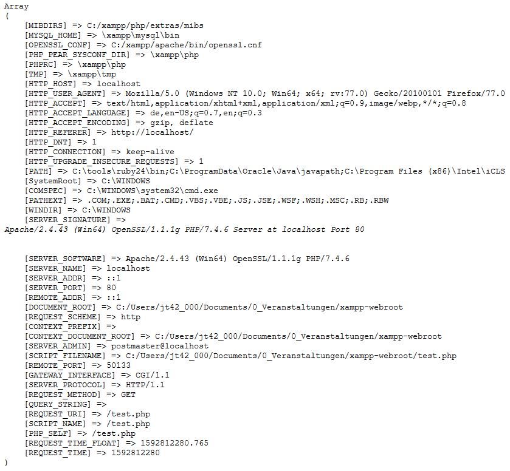

# 4.4.3 Vordefinierte Variablen

In PHP gibt es einige sogenannte [Superglobals](https://www.php.net/manual/de/language.variables.superglobals.php). Dies sind vordefinierte assoziative Arrays, die überall im Sourcecode verfügbar sind. Nachfolgend sollen einige dieser Variablen-Typen kurz erklärt werden. Es gibt jedoch noch weitere Variablen, die auf der PHP-Seite erläutert werden: [Vordefinierte Variablen](http://php.net/manual/de/reserved.variables.php).

**$_GET, $_POST**

In diesen Arrays werden die per GET oder POST vom Client übermittelten Daten bereitgestellt. Wird zum Beispiel die folgende URL aufgerufen:

`http://iprog-modul.de/index.php?autor=Thomaschewski`, so kann man den Wert `Thomaschewski` über die Variable `$_GET["autor"]` abrufen. Gleiches gilt für per POST-Methode übergebene Daten.

**$_COOKIE**

In diesem Array befinden sich die Daten, die mittels eines Cookies vom Client an den Server übermittelt wurden. Sie können Cookies mit `setcookie()` erstellen, um sie eventuell später wieder über das Array abzurufen.

**$_REQUEST**

Dieses Array enthält standardmäßig den gesamten Inhalt aus den Arrays `$_GET`, `$_POST` und `$_COOKIE`.

**$_SESSION**

Dieses Array enthält die Sessionvariablen. Sie können innerhalb einer Session beliebig Daten in dieses Array schreiben und wieder auslesen. Dabei ist jedoch die Verwendung der Funktion `session_start()` zu Beginn des Skripts erforderlich, sofern dies nicht automatisch geschieht.

**$GLOBALS**

Beinhaltet alle Variablen, die im globalen Gültigkeitsbereich vorhanden sind.

**$_SERVER**

In diesem Array sind Informationen aus dem HTTP-Header, der Apache-Konfiguration und einige Server-Verzeichnisse enthalten. Auf der [PHP-Seite](http://php.net/manual/de/reserved.variables.server.php) sind alle Array-Einträge aufgelistet, die jedoch nicht von allen Webservern unterstützt und befüllt werden. Ein Beispiel für `$_SERVER`: Mit `$_SERVER["REMOTE_ADDR"]` kann die aktuelle IP-Adresse des Clients abgerufen werden.

```php linenums="1"
echo "<pre>";
print_r($_SERVER);
echo "</pre>";
```



## Magische Konstanten

PHP hat sogenannte [magische Konstanten](https://www.php.net/manual/de/language.constants.predefined.php), die mit zwei Unterstrichen am Anfang und am Ende geschrieben werden.

| Magische Konstante | Beschreibung |
|--------------------|--------------|
| `__DIR__`          | Der Name des Verzeichnisses, in dem sich das PHP-Script befindet. |
| `__FILE__`         | Der vollständige Pfad- und Dateiname des PHP-Scripts. |
| `__LINE__`         | Die aktuelle Zeilennummer im PHP-Script. |

!!! question "Aufgabe"
    Kopieren Sie den folgenden Sourcecode in ein PHP-Script auf Ihren Server und schauen Sie sich das Ergebnis an.

    ```php linenums="1"
    <?php
    $flower = ["Tulpe" => "Gelb", "Rose" => "Rot", "Kornblume" => "Blau"];
    echo "Die Farbe der Rose ist " . $flower["Rose"] . "<br>";
    echo __DIR__ . "<br>";
    echo __FILE__ . "<br>";
    echo __LINE__ . "<br>";
    ?>
    ```
