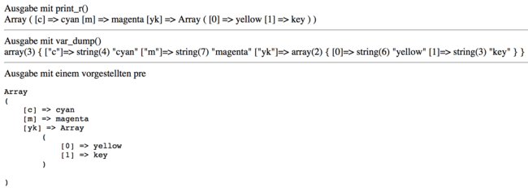

# 4.4.7 Debugging

Das Finden der Fehler wird als Debugging bezeichnet und kann auf verschiedene Arten erfolgen. Eine sehr wichtige Einstellung für das Debugging erfolgt in der [Konfigurationsdatei php.ini](https://isp.eduloop.de/loop/Konfigurationsdatei_php.ini) mit `display_errors = On`, da nur dann Fehler, Warnungen und Hinweise im Browser ausgegeben werden.

Aber selbst wenn das PHP-Programm keine Fehler ausgibt, macht es vielleicht nicht, was es machen soll. So ist es oftmals notwendig, die Inhalte einer Variablen oder eines Arrays zu ermitteln, um einen Fehler zu finden. Hier wird eine sehr einfache, hilfreiche Art des Debuggings benötigt, beispielsweise um festzustellen, welche Daten per POST übermittelt wurden.

**Alle Daten eines Arrays ausgeben**

Zur einfachen Ausgabe aller Informationen einer Variablen gibt es die Funktionen [var_dump](http://php.net/manual/de/function.var-dump.php) und [print_r()](http://php.net/manual/de/function.print-r.php). Sie sind bei der Entwicklung eines Programms eine sehr praktische Alternative zum Befehl `echo` und liefern eine strukturierte Ausgabe eines Arrays.

```php linenums="1"
$cmyk = ["c" => "cyan", "m" => "magenta", "yk" => ["yellow", "key"]];
echo "Ausgabe mit print_r() <br>";
print_r($cmyk);
echo "<hr>";

echo "Ausgabe mit var_dump() <br>";
var_dump($cmyk);
echo "<hr>";

echo "Ausgabe mit einem pre-Element";
echo "<pre>";
print_r($cmyk);
echo "</pre>";
```

Ausgabe: `print_r()` und `var_dump()` im Vergleich, inklusive `<pre>`


Sowohl `print_r()` als auch `var_dump()` eignen sich, um eine schnelle Übersicht über Variableninhalte zu bekommen. Während die Funktion `print_r()` eine übersichtlichere Ausgabe des geschachtelten Arrays enthält, gibt `var_dump()` zusätzlich die Längen der Arrays und Strings aus. Für eine noch schönere und ausformatierte Ausgabe geschachtelter Arrays, empfiehlt sich die Nutzung von `<pre>`-Elementen.

!!! tip "Hinweis"
    Wenn Sie PHP mit einem normalen Editor erstellen, dann ist es oftmals schwierig zu erkennen, ob aus einem Formular die Daten richtig an den Server übermittelt wurden. Hilfreich kann dann folgender Sourcecode sein, der auf jeder Seite eingebunden wird:

    ```php linenums="1"
    // Am Seitenanfang einfügen
    $debug="ja";

    session_start();
    if ($debug==="ja") {
        error_reporting(-1);
        echo "POST/GET <br>";
        print_r($_REQUEST);        
        echo "<hr>";
        echo "SESSION <br>";
        print_r($_SESSION);  
    } else {
        error_reporting(0);  
    }
    ```

Die hier noch unbekannten PHP-Befehle werden auf den kommenden Seiten erläutert.

!!! notice "Hinweis"
    `print_r()` und `var_dump()` dürfen nur während der Entwicklung für das Debugging verwendet werden und sind in einem produktiven System abzuschalten. Also nie im produktiven Code verwenden!
