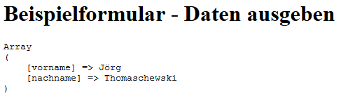
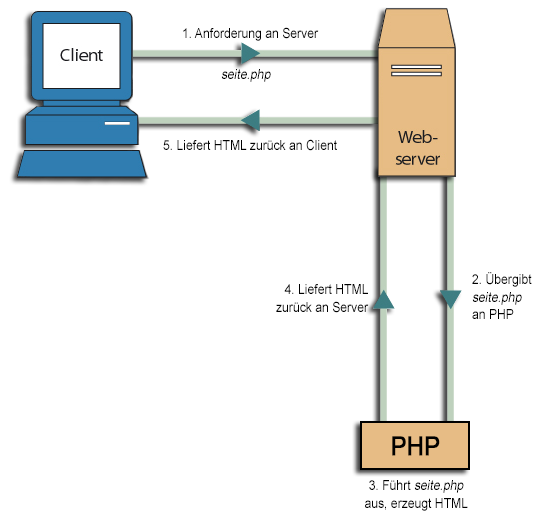

# 4.6.5 Beispiel Formulare - Daten einlesen

Das eben Erlernte soll nun an einem praxisnahen Beispiel erklärt werden. Das hier gezeigte Beispiel wird in den nächsten Unterkapiteln erweitert.

Zunächst muss über `echo`-Befehle ein HTML-Formular erstellt werden. Dieses Formular wird auf dem Webbrowser angezeigt und kann entsprechend ausgefüllt werden. Beim Klick auf den Button "Formular abschicken" werden die Daten aus dem Formular an den Webserver geschickt.

```php linenums="1"
<?php
/**
 * Beispiel Formular - Daten einlesen
 * Dateiname: formular2.php
 * @author Lisa Meijer
 * @date 19.04.2019
 */
function writeHeaderAndHeadline()
{
    echo "<!DOCTYPE html>
          <html lang=\"de\">
          <head><title>Formular</title>
          </head>
          <body>
          <h1>Beispielformular</h1>";
}

function startForm($method, $url)
{
    echo "<form method=\"$method\" action=\"$url\">";
}

function writeInputField($text, $name)
{
    echo "<label for=\"$name\">$text: </label>
          <input type=\"text\" name=\"$name\" id=\"$name\">
          <br><br>";
}

function closeFormAndFooter()
{
    echo "<input type=\"submit\" value=\"Formular abschicken\">
          </form>
          </body></html>";
}

// Beginn des Hauptprogramms
writeHeaderAndHeadline();
startForm("post", "formular2a.php");
writeInputField("Vorname", "vorname");
writeInputField("Name", "nachname");
closeFormAndFooter();
?>
```

Ausgabe:<br>
Screenshot des erzeugten Formulars:<br>


Das Hauptprogramm besteht nur aus Funktionsaufrufen. Die Daten werden also an die Datei `formular2.php` geschickt und sind dort im assoziativen Array `$_POST` gespeichert. Durch `print_r()` geben wir diese hier vorformatiert zum Testen aus.

```php linenums="1"
<?php
/**
 * Beispielformular - gesendete Formulardaten verarbeiten
 * Dateiname: formular2a.php
 * @author Lisa Meijer & Jörg Thomaschewski
 * @date 19.04.2019
 */
function writeHeaderAndHeadline()
{
    echo "<!DOCTYPE html>
          <html lang=\"de\">
          <head><title>Formular</title>
          </head>
          <body>
          <h1>Beispielformular - Daten ausgeben</h1>
          <pre>";
}

function writeHtmlEnd()
{
    echo "</pre>
          </body></html>";
}

// Beginn des Hauptprogramms
writeHeaderAndHeadline();
print_r($_POST);
writeHtmlEnd();
?>
```

Ausgabe:<br>
Screenshot der erzeugten Ausgabeseite, wenn zuvor in die Formularfelder die Daten "Jörg" und "Thomaschewski" eingetragen wurden:<br>



## Veranschaulichung der Datenübertragung
Zur nochmaligen Veranschaulichung, wie der Client, der Server, sowie HTTP und PHP zusammenarbeiten, sehen Sie nachfolgend eine Grafik:


