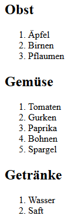

# 4.7.4 Arrays im Array - Teil 2

Hier soll noch ein weiteres Beispiel gezeigt werden, wie Arrays zu einem Array sinnvoll verbunden werden können.

```php linenums="1"
<?php
$fruits = ["Äpfel", "Birnen", "Pflaumen"];
$vegetables = ["Tomaten", "Gurken", "Paprika", "Bohnen", "Spargel"];
$drinks = ["Wasser", "Saft"];

$products = [
    "Obst" => $fruits,
    "Gemüse" => $vegetables,
    "Getränke" => $drinks
];

foreach ($products as $category => $items) {
    echo "<h2>$category</h2>";
    echo "<ol>";
    foreach ($items as $item) {
        echo "<li>$item</li>";
    }
    echo "</ol>";
}
```

Ausgabe:<br>


Das obige Beispiel zeigt, wie durch Verschachtelung von `foreach`-Schleifen über ein Array von Arrays iteriert werden kann. In diesem Fall haben wir ein assoziatives Array namens `$products`, das drei Kategorien enthält: Obst, Gemüse und Getränke. Jede Kategorie enthält wiederum ein Array von entsprechenden Produkten. Durch die Verschachtelung der `foreach`-Schleifen können wir über die Kategorien und deren Produkte iterieren und eine strukturierte Ausgabe erzeugen.
