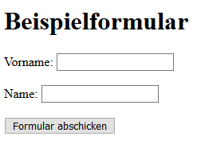
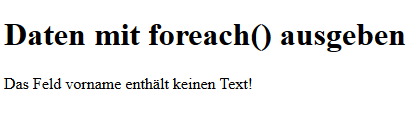
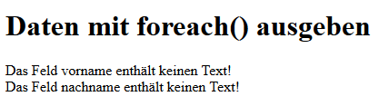

# 4.7.7 Beispiel Formulare - Daten ausgeben

Durch bedingte Anweisungen, Schleifen und Sprungbefehlen können die übertragenen Daten nun überprüft und verarbeitet werden. Um jedoch den Rahmen dieses Kapitels nicht zu sprengen, wird die Überprüfung einfach gehalten und nur überprüft, ob diese Felder leer sind. Diese Überprüfung findet mit der Funktion [empty()](http://php.net/manual/de/function.empty.php) statt.

Zunächst wird zur Darstellung des Formulars das bereits bekannte Beispiel aus dem Unterkapitel "Formulare - Daten einlesen" hier verwendet.

```php linenums="1"
<?php
/**
 * Beispiel Formular - Daten einlesen
 * @author Lisa Meijer
 * @date 19.04.2019
 */
function writeHeaderAndHeadline()
{
    echo "<!DOCTYPE html>
          <html lang=\"de\">
          <head><title>Formular</title>
          </head>
          <body>
          <h1>Beispielformular</h1>";
}

function startForm($method, $url)
{
    echo "<form method=\"$method\" action=\"$url\">";
}

function writeInputField($text, $name)
{
    echo "<label for=\"$name\">$text: </label>
          <input type=\"text\" name=\"$name\" id=\"$name\">
          <br><br>";
}

function closeFormAndFooter()
{
    echo "<input type=\"submit\" value=\"Formular abschicken\">
          </form>
          </body></html>";
}

// Beginn des Hauptprogramms
writeHeaderAndHeadline();
startForm("post", "formular2a.php");
writeInputField("Vorname", "vorname");
writeInputField("Name", "nachname");
closeFormAndFooter();
?>
```

Ausgabe:<br>
*Screenshot des erzeugten Formulars (wie bisher)*



Die Neuerungen sind im folgenden PHP-Sourcecode, in dem die Formulardaten verarbeitet werden.

```php linenums="1"
<?php
/**
 * Beispiel Formular - Daten mit foreach() ausgeben
 * @author Lisa Meijer & Jörg Thomaschewski
 * basiert auf einer Version von Michael Gerbracht
 * @date 02.05.2019
 */
function writeHeaderAndHeadline()
{
    echo "<!DOCTYPE html>
          <html lang=\"de\">
          <head><title>Formular</title>
          </head>
          <body>
          <h1>Daten mit foreach() ausgeben</h1>";
}

function writeHtmlEnd()
{
    echo "</body></html>";
}

// Beginn des Hauptprogramms
writeHeaderAndHeadline();
$error = false;

// Alle POST-Daten mit foreach() auslesen und überprüfen
foreach ($_POST as $field => $content) {
    if (empty($content)) {
        echo "Das Feld $field enthält keinen Text!<br />";
        $error = true;
    }
}

if (!$error) {
    echo "Hallo " . $_POST["vorname"] . " " . $_POST["nachname"] . "!";
}

writeHtmlEnd();
?>
```

Ausgabe:<br>
*Screenshot der Ausgabe, wenn beide Felder ausgefüllt wurden*


*Screenshot der Ausgabe, wenn ein Feld nicht ausgefüllt wurde*



*Screenshot der Ausgabe, wenn beide Felder nicht ausgefüllt wurden*




!!! warning "**Sicherheitshinweis**"
    Das Formular ist sehr unsicher, da die Daten vor der Weiterverarbeitung nicht überprüft werden und es dient hier nur didaktischen Zwecken. Die Programmierung **DARF SO NICHT PRODUKTIV EINGESETZT WERDEN**. Alle mit POST oder GET übertragende Daten MÜSSEN mit [Regulären Ausdrücken](../6RegExp/index.md) zuvor geprüft werden.

!!! tip "Anmerkung"
    In einem Fehlerfall könnte anstelle der einfachen Fehlermeldung auch das v


## Bessere Programmierung: Formular und Ausgabe in einer Datei
```php linenums="1"
<?php
/**
 * Beispiel Formular - Daten einlesen und mit foreach() ausgeben
 * 
 * Autor: Jörg Thomaschewski
 * Datum: 04.04.2024
 */
error_reporting(E_ALL & ~E_NOTICE); // Notice-Meldung ausschalten

function writeHeaderAndHeadline()
{
    echo "<!DOCTYPE html>
          <html lang=\"de\">
          <head><title>Formular</title>
          </head>
          <body>
          <h1>";

    if (isset($_POST['submit'])) {
        echo "Daten mit foreach() ausgeben";
    } else {
        echo "Beispielformular";
    }
    echo "</h1>";
}

function startForm($method, $url)
{
    echo "<form method=\"$method\" action=\"$url\">";
}

function writeInputField($text, $name)
{
    echo "<label for=\"$name\">$text: </label>
          <input type=\"text\" name=\"$name\" id=\"$name\">
          <br><br>";
}

function closeFormAndFooter()
{
    echo "<input type=\"submit\" name=\"submit\" value=\"abschicken\">
          </form>";
}

function writeHtmlEnd()
{
    echo "</body></html>";
}

// Beginn des Hauptprogramms
writeHeaderAndHeadline();

if ($_POST['submit']==="abschicken") {
    // 2. Seite mit der Datenausgabe erzeugen
    // Alle POST-Daten mit foreach() auslesen und überprüfen
    $error = false;
    array_pop($_POST); // den letzten Array-Eintrag mit dem Button aus $_POST löschen
    foreach ($_POST as $field => $content) {
        if (empty($content)) {
            echo "Das Feld $field enthält keinen Text!<br />";
            $error = true;
        }
    }

    if (!$error) {
        echo "Hallo " . $_POST["vorname"] . " " . $_POST["nachname"] . "!";
    }
    writeHtmlEnd();
} else {
    // 1. Seite mit der Datenausgabe erzeugen
    startForm("post", "index.php");
    writeInputField("Vorname", "vorname");
    writeInputField("Name", "nachname");
    closeFormAndFooter();
    writeHtmlEnd();
}


?>
```

