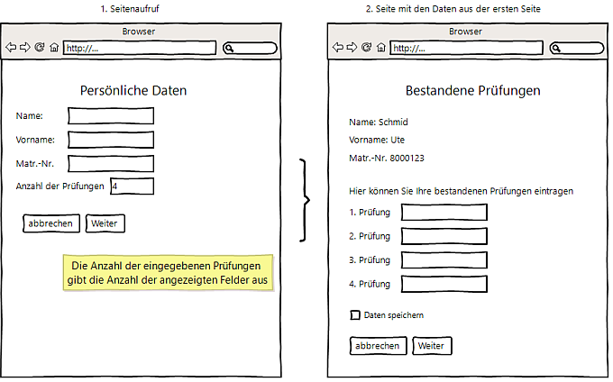

# 5.9.4 Daten im JSON-Format speichern

JSON (= **J**ava**S**cript **O**bject **N**otation) basiert auf JavaScript (ECMA-Script 3) und ist ein kompaktes Datenformat. Es bietet sich in sehr vielen Projekten als Alternative zum viel komplexeren Datenformat XML an und kann aufgrund seiner **sehr einfachen Struktur** ideal zum **Datenaustausch** zwischen Systemen verwendet werden. Parser zum Einlesen und Ausgeben des JSON-Formats gibt es für alle gängigen (Web-)Programmiersprachen. Außerdem bieten viele Web-Frameworks an, die Daten mittels JSON als Alternative zu XML auszutauschen. Dies ist besonders interessant für Web-Anwendungen, da diese JSON mittels JavaScript sehr einfach als Datenobjekt interpretieren können.

Das JSON-Format ist für Menschen und Maschinen einfach lesbar, viel einfacher als ein XML-Dokument. JSON-Elemente bestehen aus Werten, für die die JavaScript-Regeln gelten:

- String
- Number
- Boolean (true/false)
- null

und können nur in zwei Strukturen gespeichert werden:

- **Arrays**: Sortierte Listen, also im Sinne anderer Programmiersprachen **"indizierte Arrays"**. Ein JSON-Array wird in eckigen Klammern dargestellt: ["Value1", "Value2", "Value3", "Value4"].

- **Objekte**: Dies sind keine Objekte im Sprachgebrauch der objektorientierten Programmierung, sondern **Name-Wert-Paare**, und diese entsprechen in anderen Programmiersprachen **assoziativen Arrays**. Ein JSON-Objekt wird in geschweiften Klammern dargestellt: {"Name1": "Value1", "Name2": "Value2", "Name3": "Value3", "Name4": "Value4"}.

Die Mächtigkeit ergibt sich durch die Möglichkeit (wie bei Arrays üblich), die beiden Strukturen ineinander zu verschachteln.

!!! example "Beispiel"
    Hier ein typisches Beispiel eines JSON-Objekts, das ein Array enthält:
    
    ```json linenums="1"
    {
        "name": "Thomas",
        "age": 36,
        "hobbys": ["music", "arts", "sports"]
    }
    ```

## JSON und PHP

Nehmen wir nun ein anderes Beispiel. Gegeben sei ein PHP-Formular. Die Daten daraus sollen im JSON-Format gespeichert werden. 



Dann könnte die dazugehörige JSON-Datei wie folgt aussehen. Und hier ein Beispiel für ein verschachteltes JSON-Objekt:

```json linenums="1"
{
    "name": "Schmid",
    "prename": "Ute",
    "exams": ["Mathe 2", "BWL", "Design", "IProg"]
}
```

Dieses JSON-Format erzeugt die PHP-Funktion [json_encode(ARRAY)](https://secure.php.net/manual/de/function.json-encode.php) automatisch, wenn das PHP-Array korrekt aufgebaut ist. Das dazugehörige PHP-Array muss wie folgt aussehen:

```php linenums="1"
$person = [
    "name"    => "Schmid", 
    "prename" => "Ute", 
    "exams"   => ["Mathe 2", "BWL", "Design", "IProg"]
];

$jsonString = json_encode($person);
echo $jsonString;
```

Ausgabe:<br>
*`{"name":"Schmid","prename":"Ute","exams":["Mathe 2","BWL","Design","IProg"]}`*

Da JSON ein übliches Format zum Datenaustausch ist, können die so erzeugten Daten von anderen Programmen gut eingelesen werden. Ein JSON-Objekt kann mit [json_decode(STRING)](https://secure.php.net/manual/en/function.json-decode.php) wieder in ein PHP-Array umgewandelt werden. Weitere Hinweise gibt es beispielsweise auf der Seite von [Michael Nitschinger](http://nitschinger.at/Handling-JSON-like-a-boss-in-PHP/).


...

Da JSON ein übliches Format zum Datenaustausch ist, können die so erzeugten Daten von anderen Programmen gut eingelesen werden. Ein JSON-Objekt kann mit [json_decode(STRING)](https://secure.php.net/manual/en/function.json-decode.php) wieder in ein PHP-Array umgewandelt werden. Weitere Hinweise gibt es beispielsweise auf der Seite von [Michael Nitschinger](http://nitschinger.at/Handling-JSON-like-a-boss-in-PHP/).

## Optionen für json_encode()

Bei der Verwendung von `json_encode()` können verschiedene Attribute angegeben werden, um das Verhalten und das Format des erzeugten JSON-Strings anzupassen. Diese Optionen werden als zweiter Parameter in `json_encode()` übergeben.

!!! info "Tabelle: Optionen für json_encode()"
    | Attribut | Beschreibung |
    |----------|---------------|
    | `JSON_HEX_QUOT` | Kodiert alle doppelten Anführungszeichen in `\u0022`. |
    | `JSON_HEX_TAG` | Kodiert `<` und `>` in `\u003C` und `\u003E`. |
    | `JSON_HEX_AMP` | Kodiert `&` in `\u0026`. |
    | `JSON_HEX_APOS` | Kodiert einfache Anführungszeichen in `\u0027`. |
    | `JSON_NUMERIC_CHECK` | Kodiert numerische Strings als Zahlen. |
    | `JSON_PRETTY_PRINT` | Sehr sinnvoll: nutzt Leerzeichen in der Ausgabe von JSON, um diese lesbarer zu machen. |
    | `JSON_UNESCAPED_SLASHES` | Verhindert das Escapen von Schrägstrichen `/`. |
    | `JSON_FORCE_OBJECT` | Gibt Arrays immer als Objekte zurück, auch wenn sie indizierte Arrays sind. |
    | `JSON_UNESCAPED_UNICODE` | Kodiert multibyte Unicode-Zeichen buchstäblich. |

Diese Attribute können auch kombiniert werden, indem sie mit dem Bitwise-OR-Operator `|` verknüpft werden, z.B. `json_encode($value, JSON_PRETTY_PRINT | JSON_UNESCAPED_SLASHES);`.
