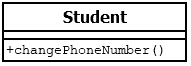

# 6.2.1 Klassen und Objekte

Eine Klasse ist ein Behälter zusammengehöriger Funktionen (Funktionen heißen nun **Methoden**) und Variablen (Variablen heißen nun **Eigenschaften**).
Diesem Behälter geben wir einen Namen (den Klassennamen). Alles, was zu einer Klasse gehört, wird mit diesen Klammern { ... } zusammengefasst.

Damit sieht der formale Aufbau einer einfachen Klasse wie folgt aus

```php linenums="1"

class Klassenname
{
  // Eigenschaften

  // Methoden()
}
```

Dies zeichnen wir in einem Klassendiagramm, damit wir wissen, zu welchem Klassennamen welche Eigenschaften und Methoden gehören. Wir zeichnen sozusagen den Inhalt des "Behälters".

Ein Klassendiagramm unterteilt sich immer in drei Bereiche. Im oberen Bereich steht der Klassenname. Im Bereich darunter stehen alle Eigenschaften und im unteren Bereich stehen alle Methoden.

Darstellung einer Klasse mit einem Klassendiagramm.


## 1. Beispiel einer einfachen Klasse

Im ersten Beispiel gibt es nur eine Methode `changePhoneNumber()`. 

```php linenums="1"
<?php declare(strict_types=1);

class Student
{
    public function changePhoneNumber(string $newPhoneNumber): void
    {
        echo "Die Telefonnummer lautet: $newPhoneNumber";
    }
}
```
    
Darstellung im Klassendiagramm



In diesem Beispiel haben wir die neuen Möglichkeiten einer Klasse noch nicht genutzt. Beispielsweise gibt es noch keine Eigenschaften der Klasse.

**Zeile 5 `public`**: Auf das `public` gehen wir [später](https://isp.eduloop.de/loop/Sichtbarkeit) ein. Hier einfach mal so hinnehmen, dass wir dies vor `function` so hinschreiben.

**Zeile 5 `string`**: Anders als bei Funktionen geben wir nun bei Methoden an, welchen Typ der Variablen (also `string`, `int`, etc.) an Methoden übergeben werden. Dass wir dies angeben müssen, wurde in **Zeile 1** mit `<?php declare(strict_types=1)` festgelegt. In unserem Beispiel muss aus dem Hauptprogramm der Inhalt der Variablen `$newPhoneNumber` also ein `string` sein.

**Zeile 5 `void`** bedeutet, dass keine Rückgabe an das Hauptprogramm erfolgt. In unserem Beispiel ist dies klar, denn mit echo geben wir die Ausgabe direkt an den Browser.

## 2. Beispiel einer einfachen Klasse

Im zweiten Beispiel wird die Telefonnummer in einer Eigenschaft gespeichert und ist später "fest im Objekt enthalten" und kann jederzeit abgerufen werden (solange das Programm läuft).

```php linenums="1"
<?php declare(strict_types=1);
class Student
{
    // Eigenschaften der Klasse festlegen
    public $phoneNumber = "keine Angabe";
    
    // Methoden der Klasse festlegen
    public function changePhoneNumber(string $newPhoneNumber): void
    {
        $this->phoneNumber = $newPhoneNumber;
        echo "Die Telefonnummer lautet: $newPhoneNumber";
    }
}
```

Darstellung im einfachen Klassendiagramm:


Alternative Darstellung im ausführlichen Klassendiagramm:


??? "Warum String statt Integer bei `$phoneNumber`"

    Das Problem ist, dass Telefonnummern oft mit einer `0` beginnen und es dann zu Überraschungen kommen kann ([siehe Umwandlung in Oktalzahlen](https://ispa.oncampus.de/loop/Integer)). Da mit Telefonnummern normalerweise keine mathematischen Berechnungen durchgeführt werden, kann man besser `String` statt `Integer` verwenden.

    Wichtig: alle Daten, die über ein Webformular an den PHP-Code geschickt werden, sind im Array `$_REQUEST()` enthalten und immer vom Typ `string`. Sie müssen die Variablen dann im Hauptprogramm konvertieren oder alternativ als `string` weitergeben, sofern Sie mit den Variablen keine Berechnungen vornehmen möchten.

**Zeile 9:** Die Methode `changePhoneNumber()` nimmt aus dem Hauptprogramm eine Telefonnummer entgegen und speichert diese in der Variablen `$newPhoneNumber`. Mit dieser Variablen `$newPhoneNumber` kann innerhalb der Methode "gearbeitet" werden. Wie auch in Funktionen, gilt diese Variable `$newPhoneNumber` nur innerhalb dieser Methode und nirgendwo anders.

**Zeile 6:** Jetzt haben wir aber eine Eigenschaft `$phoneNumber` in der Klasse eingeführt und wollen die neue Telefonnummer fest in der Klasse (oder genauer gesagt im Objekt) speichern. Dazu müssen wir die Variable `$newPhoneNumber` der Eigenschaft zuweisen. Dies erfolgt mit der Syntax `$this->` (siehe **Zeile 11**).

Somit übertragen wir in **Zeile 11** die Telefonnummer der Variable `$newPhoneNumber` an die Eigenschaft `$phoneNumber` mit: `$this->phoneNumber = $newPhoneNumber;`

!!! important "Wichtig"
    Achtung: `$newPhoneNumber` ist eine ganz normale Variable in einer Methode. `$phoneNumber` hingegen ist eine Eigenschaft der Klasse. Diese Unterscheidung muss Ihnen ganz glasklar sein/werden.

## Eigenschaften überschreiben
In der objektorientierten Programmierung spricht man oft vom **überschreiben**. Das Verständnis, was damit gemeint ist, fällt Studierenden oft schwer. Dabei ist es ganz einfach.

Im Beispiel oben haben wir die Eigenschaft `$phoneNumber` in **Zeile 4** mit dem Wert `"keine Angabe"` vorbelegt. Sobald das Hauptprogramm die Methode `changePhoneNumber()` aufruft und eine Telefonnummer in `$newPhoneNumber` übergeben bekommt, wird in **Zeile 9** der vorbelegte Wert `"keine Angabe"` mit dem neuen Wert **überschrieben**.

## Klassen im Hauptprogramm "bekannt machen" = Objekte erzeugen
Nun wollen wir mit der Klasse im Hauptprogramm arbeiten. Früher konnten wir mit einer Funktion einfach arbeiten, indem wir die Funktion aufgerufen haben. Nun aber haben wir die Klasse als "Behälter" für viele Funktionen eingeführt (die wir nun Methoden nennen). Wir müssen somit den "Behälter" mit seinen Eigenschaften und Methoden dem Hauptprogramm bekannt machen.

Wir rufen die Klasse nicht einfach auf, sondern machen uns beim Aufruf "eine Art Kopie" der Klasse, so wie man ein "Schnittmuster für ein T-Shirt (= Klasse)" als Vorlage für das "wirkliche T-Shirt (= Objekt)" verwendet. Die Klasse ist die Vorlage, die beschreibt, wie sich etwas verhalten soll, sobald damit gearbeitet wird. Diese Abbildung des Verhaltens nennen wir **Objekt**. Den Vorgang des Erstellens eines Objektes aus einer Klasse nennen wir **Instanzieren**.

Objekte werden erzeugt, indem man mit `new` die Klasse aufruft:

```php
$meinObjekt = new Klassename();     // Objekt aus der Klasse erzeugen
$meinObjekt->eigenschaft;           // Eigenschaft eines Objekts aufrufen
$meinObjekt->methode("Parameter");  // Methode eines Objekts aufrufen
```

Wie wir es schon von den Funktionen kennen, können die Parameter entweder direkt als String oder Zahl übergeben werden, also `$meinObjekt->methode("Parameter")` oder indem der Inhalt einer Variable (bzw. eines Arrays) übergeben wird, also `$meinObjekt->methode($variable)`. 

**Achtung:** Hier wird nicht die Variable selbst übergeben, sondern nur der Inhalt der Variablen wird an die Funktion übergeben. Der Inhalt ist dann in einer neuen Variable nur innerhalb der Funktion verfügbar. Die Ausnahme sind wiederum Objekte oder Referenzen auf Variablen, zu denen wir später noch kommen.

## Ein Hauptprogramm für unsere Klasse erstellen

Für unser nächstes Beispiel erzeugen wir nun Objekte für zwei Studierende.

```php linenums="1"
<?php declare(strict_types=1);
// Klasse
class Student
{
    // Eigenschaften der Klasse festlegen
    public $phoneNumber = "keine Angabe";
    
    // Methoden der Klasse festlegen
    public function changePhoneNumber(string $newPhoneNumber): void
    {
        $this->phoneNumber = $newPhoneNumber;
        echo "Die Telefonnummer lautet nun: $newPhoneNumber <br>";
    }
}

// Hauptprogramm - zwei Objekte erstellen
$ute = new Student;
$max = new Student;

echo "Methode aufrufen<br>";
$max->changePhoneNumber("0170123456");  // Methode aufrufen

echo "<br>Eigenschaften auslesen<br>";
echo "Im Objekt gespeicherte TelNr. von Ute: " . $ute->phoneNumber . " <br>";  
echo "Im Objekt gespeicherte TelNr. von Max: " . $max->phoneNumber . " <br>";
```

Ausgabe:<br>
*Methode aufrufen*<br>
*Die Telefonnummer lautet nun: 0170123456*<br>

*Eigenschaften auslesen*<br>
*Im Objekt gespeicherte TelNr. von Ute: keine Angabe*<br>
*Im Objekt gespeicherte TelNr. von Max: 0170123456*<br>


!!! info "Zwei didaktische Hinweise"
    
    1. Wenn Ihnen die Objektorientierung noch nicht so vertraut ist, dann empfehle ich ernsthaft, dass Sie sich die neuen Vokabeln und deren Bedeutung aufschreiben. Hier die Vokabeln dieser Seite: `Klasse`, `Objekt`, `instanzieren`, `Eigenschaft`, `Methode`, `überschreiben`, `Klassendiagramm`.
    
    2. Vielleicht konnten Sie sich nicht die ganze Zeit konzentrieren und haben einige Abschnitte dieser Seite nur durchgeblättert. Mein ernsthafter Tipp: nicht weiterklicken, **bevor Sie die Inhalte dieser Seite WIRKLICH VERSTANDEN haben**.


??? abstract "PHP versus Python: einfache Klasse"
    
    In PHP

    ```php linenums="1"
    <?php declare(strict_types=1);
    class Student
    {
        // Eigenschaften der Klasse festlegen
        public $phoneNumber = "keine Angabe";
        
        // Methoden der Klasse festlegen
        public function changePhoneNumber(string $newPhoneNumber): void
        {
            $this->phoneNumber = $newPhoneNumber;
            echo "Die Telefonnummer lautet: $newPhoneNumber";
        }
    }
    // Hauptprogramm
    $student = new Student();
    $student->changePhoneNumber("0123456789");


    ```

    In Python

    ```python linenums="1"
    class Student:

        def __init__(self):
            # Eigenschaften der Klasse festlegen
            self.phoneNumber = "keine Angabe"

        # Methoden der Klasse festlegen
        def changePhoneNumber(self, newPhoneNumber: str) -> None:
            self.phoneNumber = newPhoneNumber
            print(f"Die Telefonnummer lautet: {newPhoneNumber}")

    # Hauptprogramm
    student = Student()
    student.changePhoneNumber("0123456789")
    ```