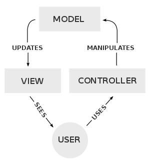

# 5.2.3 Klassen in Dateien auslagern und MVC-Prinzip

In den bisherigen Beispielen haben wir aus didaktischen Gründen (weil es in den Beispielen übersichtlicher ist), die Klasse und das Hauptprogramm zusammen in einer Datei dargestellt.

Man sollte aber unbedingt die **Klassen in eigene Dateien auslagern**. Hierzu gibt es ein paar Regeln:

- Der **Dateiname sollte so heißen, wie der Klassenname**.
- **Keine echo-Befehle in Klassen verwenden**, sofern es sich nicht um eine Klasse handelt, die ausschließlich zur Ausgabe dient. Die Erklärung hierzu kommt gleich im Abschnitt MVC-Konzept.
- **Klassen ohne den schließenden PHP-Tag `?>` schreiben**. Denn falls man nach dem schließenden PHP-Tag noch eine Leerzeile einfügen würde, dann würde diese als HTML-Leerzeile auf dem Browser mit ausgegeben. Durch einen kleinen Flüchtigkeitsfehler im Editor würde dann das HTML-Layout zerstört oder es könnten Standard HTTP Header ausgegeben, die zu Problemen führen.

Damit würde das Beispiel wie folgt aussehen:

!!! example "Beispiel"

    Klasse `Student.php`.
    
    ```php linenums="1"
    <?php
    class Student
    {
        public $phoneNumber = "keine Angabe";
        public $name = "keine Angabe";
    
        public function changePhoneNumber(
            string $newPhoneNumber, 
            string $name
        ): string {
            $this->phoneNumber = $newPhoneNumber;
            $this->name = $name;
    
            return $this->phoneNumber;
        }
    }
    ```
    
    Hauptprogramm `index.php`.
    
    ```php linenums="1"
    <?php
    $classPath = __DIR__.DIRECTORY_SEPARATOR.'class'.DIRECTORY_SEPARATOR;
    require_once $classPath.'Student.php';
    
    $max = new Student;
    echo 'Methode aufrufen und return-Wert in $data speichern<br>';
    $data = $max->changePhoneNumber("0170123456", "Max");  // Methodenaufruf
    
    echo "Mit return zurückgegebenen TelNr.: $data";
    ```

Entsprechend dem angegebenen `$classPath` wird die Klasse `Student.php` in einem Unterverzeichnis `class` erwartet.

## Model-View-Controller (MVC)

Klassen sollten je nach Einsatzzweck getrennt werden. Dies ist als MVC-Prinzip bekannt.

- **Model** (= Modell): Die Model-Klassen verarbeiten die Daten, die später auf der Website dargestellt werden sollen. Die Daten bekommen die Model-Klassen von den Controller-Klassen und aus Datenbanken oder z.B. JSON-Dateien.
- **View** (= Präsentation): Die View-Klassen sind nur für die Darstellung zuständig. Alle Daten, die dargestellt werden, kommen normalerweise aus den Model-Klassen.
- **Controller** (= Steuerung): Die Controller-Klassen nehmen die Nutzereingaben entgegen, prüfen diese und leiten die Daten zur Speicherung weiter an die Model-Klassen.

MVC-Prinzip. Quelle: RegisFrey, Public Domain, [https://commons.wikimedia.org/wiki/File:MVC-Process.svg](https://commons.wikimedia.org/wiki/File:MVC-Process.svg)




Wenn nur wenige Daten ausgegeben werden (wie in den bisher gezeigten Beispielen), dann sollten alle echo-Befehle im Hauptprogramm erfolgen.

!!! important "Wichtig"
    Aber schon bei kleinen Beispielen, bei denen (Formular-)HTML-Seiten erzeugt werden, sind viele echo-Befehle notwendig. Dann sollten alle Ausgaben in entsprechenden View-Klassen zusammengefasst werden.
    
    **Oder noch besser:** die View-Klassen bereiten einen String vor, der dann mit `return` an das Hauptprogramm gegeben wird und dort ausgegeben wird. Dieses Vorgehen scheint zunächst komplizierter, doch es vereinfacht das Debugging (also das Finden von Fehlern) sehr.
    
    Echo-Befehle in Klassen führen oft zu sogenannten Seiteneffekten (= man weiß nicht genau, von wo jetzt die Ausgabe erfolgt), und diese Seiteneffekte sollten unbedingt vermieden werden.

