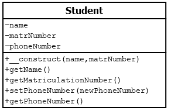

# 5.3.2 Konstruktor __construct()

Der Konstruktor wird genutzt, um einem Objekt bei seiner Erzeugung Anfangswerte zuzuweisen. Der Konstruktor hat in PHP immer die Bezeichnung `__construct()` und **wird mit zwei Unterstrichen geschrieben**.

Wir wollen in unserem Beispiel den Studierenden eine Matrikelnummer zuweisen. Anders als bei einer Telefonnummer soll jede/jeder Studierende eine eindeutige, nicht änderbare Matrikelnummer erhalten.

```php linenums="1"
<?php
class Student
{
    private $name = "keine Angabe";
    private $matrNumber = 0;    
    private $phoneNumber = "keine Angabe";

    public function __construct(string $name, int $matrNumber)
    {
        $this->matrNumber = $matrNumber;
        $this->name = $name;
        echo "Der Konstruktor wurde für $name aufgerufen <br>";
    }

    public function getName(): string
    {
        return $this->name; 
    }

    public function getMatriculationNumber(): int
    {
        return $this->matrNumber; 
    }

    public function setPhoneNumber(string $newPhoneNumber): void
    {
        $this->phoneNumber = $newPhoneNumber;
    }

    public function getPhoneNumber(): string
    {
        return $this->phoneNumber;
    }
}
```


!!! question "Aufgabe"

    Erstellen Sie nun ein Klassendiagramm für diese Klasse.

??? example "Lösung"

    

Das Hauptprogramm `index.php` kann dann wie folgt aussehen:

```php linenums="1"
<?php
$classPath = __DIR__.DIRECTORY_SEPARATOR.'class'.DIRECTORY_SEPARATOR;
require_once $classPath.'Student.php';

$max = new Student("Max", 7201234);
$ute = new Student("Ute", 7209999);

echo 'Methode aufrufen und die Telefonnummer speichern<br>';
$max->setPhoneNumber("0170123456"); 

echo $max->getName() . " hat die Tel.-Nr. " . $max->getPhoneNumber();
?>
```

Ausgabe:<br>
*Der Konstruktor wurde für Max aufgerufen*<br>
*Der Konstruktor wurde für Ute aufgerufen*<br>
*Methode aufrufen und die Telefonnummer speichern*<br>
*Max hat die Tel.-Nr. 0170123456*


!!! important "Basisregel"
    
    - Eigenschaften eines Objekts, die bereits bei der Erzeugung vorhanden sind, sollten in einem Konstruktor übergeben werden. Hier sind dies der Name und die Matrikelnummer. 
    - Eigenschaften eines Objekts, die erst später festgelegt werden können oder die optional sind, sollen erst in einer anderen Methode gesetzt werden. 
    - Eigenschaften, die ein Objekt nicht benötigt, sollten auch nicht als Eigenschaften festgelegt werden. Beispiele wären hier, dass die Studierenden müde oder hungrig sind, da dies (normalerweise) keine festen Eigenschaften, sondern temporäre Zustände sind.

**Ein ganz typischer Konstruktor**
Eine Klasse, die eine Verbindung zur Datenbank herstellt, benötigt eigentlich immer 

- IP-Adresse oder Host-Adresse der Datenbank
- Name der Datenbank
- Username und Passwort

```php linenums="1"
class DbMysql
{
    // ... Eigenschaften ...
    private $connect = []; 

    // Konstruktor
    public function __construct(
        string $host, 
        string $database, 
        string $user, 
        string $passwd
    ) {
        $this->connect = [$host, $database, $user, $passwd];
    }

    // ... weitere Methoden ...
}
```