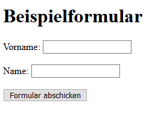
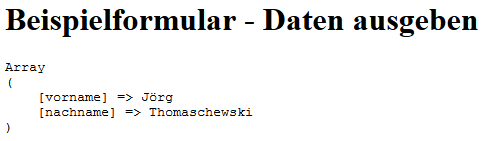

# 5.3.7 Selbsttest Nr. 2 zu OOP in PHP

Einige Übungen (mit Lösungen) und Aufgaben (ohne Lösungen) zum Verständnis.

Gegeben ist der folgende PHP-Code:
    
```php linenums="1"
<?php
class Horse
{
    private $horseType;

    public function __construct(string $horseType)
    {
        $this->horseType = $horseType;
    }

    public function ride(string $location): void
    {
        echo "Ich habe ein {$this->horseType} und reite {$location} <br>";
    }
}

// Hauptprogramm
$anna = new Horse("Deutsches Reitpony");
$paula = new Horse("Welsh B");

$anna->ride("in der Halle");
$paula->ride("am Strand");
```

!!! question "Übung"

    Welche Ausgabe erzeugt dieser Sourcecode auf dem Browser?

??? example "Lösung"

    Ausgabe: <br>
    *Ich habe ein Deutsches Reitpony und reite in der Halle*<br>
    *Ich habe ein Welsh B und reite am Strand*


!!! question "Übung"
    Schreiben Sie den Sourcecode so um, dass die Ausgabe nicht mehr in der Methode erfolgt, sondern die Methode einen String an das Hauptprogramm liefert, der dort ausgegeben wird.


??? example "Lösung"

    ```php linenums="1"
    <?php
    class Horse
    {
        private $horseType;

        public function __construct(string $horseType)
        {
            $this->horseType = $horseType;
        }

        public function ride(string $location): void
        {
            return "Ich habe ein {$this->horseType} 
                    und reite {$location} <br>";
        }
    }

    // Hauptprogramm
    $anna  = new Horse("Deutsches Reitpony");
    $paula = new Horse("Welsh B"); 

    echo "{$anna->ride("in der Halle")}";
    echo "{$paula->ride("am Strand")}";
    ```

## Hauptprogramm ergänzen

!!! question "Aufgabe"
    Schreiben Sie das Programm weiter, sodass auf dem Browser ausgegeben wird:
    
    a) "Der Edelmann besitzt einen Goldklumpen".
    
    b) Nutzen Sie dann eine Stringfunktion, damit der Großbuchstabe E erzeugt wird und ausgegeben wird: "Der Edelmann besitzt einen Goldklumpen".
    
    c) Und mit Hilfe einer Schleife dann die drei Sätze:
    
    - "Der Ritter besitzt einen Helm"
    - "Der Edelmann besitzt einen Goldklumpen"
    - "Der Zauberer besitzt einen Stab"

    Beginnen Sie mit dem folgenden Programmrahmen:

    ```php linenums="1"
    <?php

    class Avatar
    {
        public $feature;

        public function __construct(string $feature)
        {
            $this->feature = $feature;
        }

        // Hier Methoden ergänzen
    }

    // Hauptprogramm
    $avatar = [
        'ritter' => new Avatar("Helm"),
        'edelmann' => new Avatar("Goldklumpen"),
        'zauberer' => new Avatar("Stab"),
    ];

    // Hier das Hauptprogramm ergänzen
    ```

## Wichtige Aufgabe Klassen/Methoden statt Funktionen verwenden

!!! question "Wissen anwenden"
    **Diese Aufgabe ist für den weiteren Wissenserwerb total wichtig**! Lesen Sie sich bitte zunächst alle Aufgabenteile durch und gehen Sie dann schrittweise wie beschrieben vor.

    1. Schreiben Sie das Programm **formular2.php** so um, dass aus den bisherigen Funktionen nun Methoden werden (Sichtbarkeit public). Erstellen Sie also eine Klasse **Html** und instanzieren Sie diese Klasse im Hauptprogramm. Aus den Funktionsaufrufen im Hauptprogramm werden nun Methodenaufrufe. Probieren Sie das Programm anschließend aus.

    2. Schreiben Sie die Methoden so um, dass sich darin keine echo-Befehle mehr befinden. Die echo-Ausgabe soll nur noch im Hauptprogramm stattfinden.

    3. Lagern Sie nun die Klasse in eine eigene Datei **Html.php** aus und vergessen Sie nicht im Hauptprogramm eine Zeile einzufügen mit der die Klasse inkludiert wird. Kommentieren Sie nun die Klasse (Kommentarheader und Kommentare an den wichtigen Programmstellen).

    4. Bearbeiten Sie die Datei **formular2a.php** entsprechend, sodass auch hierin nur noch die Methodenaufrufe der Klasse **Html.php** vorhanden sind.

    5. Und wer es jetzt wirklich schön mag, der sollte die Inhalte der Dateien **formular2.php** und **formular2a.php** nun in einer Datei **index.php** zusammenfassen. Die Abfrage, ob die Formularseite oder die Ausgabeseite angezeigt wird, soll mit einer Fallunterscheidung (= if-Abfrage) erfolgen, bei der das Array `$_POST` auf `empty()` überprüft wird.

    Hier das zuvor schon einmal gezeigte Programm

    ```php linenums="1"
    <?php
    /**
     * Beispiel Formular - Daten einlesen
     * Dateiname: formular2.php
     * @author Lisa Meijer
     * @date 19.04.2019
     */
    function writeHeaderAndHeadline()
    {
        echo "<!DOCTYPE html>
            <html lang=\"de\">
            <head><title>Formular</title>
            </head>
            <body>
            <h1>Beispielformular</h1>";
    }

    function startForm($method, $url)
    {
        echo "<form method=\"$method\" action=\"$url\">";
    }

    function writeInputField($text, $name)
    {
        echo "<label for=\"$name\">$text: </label>
            <input type=\"text\" name=\"$name\" id=\"$name\">
            <br><br>";
    }

    function closeFormAndFooter()
    {
        echo "<input type=\"submit\" value=\"Formular abschicken\">
            </form>
            </body></html>";
    }

    // Beginn des Hauptprogramms
    writeHeaderAndHeadline();
    startForm("post", "formular2a.php");
    writeInputField("Vorname", "vorname");
    writeInputField("Name", "nachname");
    closeFormAndFooter();
    ?>
    ```

    Ausgabe:<br>
    Screenshot des erzeugten Formulars:<br>
    

    Das Hauptprogramm besteht nur aus Funktionsaufrufen. Die Daten werden also an die Datei `formular2.php` geschickt und sind dort im assoziativen Array `$_POST` gespeichert. Durch `print_r()` geben wir diese hier vorformatiert zum Testen aus.

    ```php linenums="1"
    <?php
    /**
     * Beispielformular - gesendete Formulardaten verarbeiten
     * Dateiname: formular2a.php
     * @author Lisa Meijer & Jörg Thomaschewski
     * @date 19.04.2019
     */
    function writeHeaderAndHeadline()
    {
        echo "<!DOCTYPE html>
            <html lang=\"de\">
            <head><title>Formular</title>
            </head>
            <body>
            <h1>Beispielformular - Daten ausgeben</h1>
            <pre>";
    }

    function writeHtmlEnd()
    {
        echo "</pre>
            </body></html>";
    }

    // Beginn des Hauptprogramms
    writeHeaderAndHeadline();
    print_r($_POST);
    writeHtmlEnd();
    ?>
    ```

    Ausgabe:<br>
    Screenshot der erzeugten Ausgabeseite, wenn zuvor in die Formularfelder die Daten "Jörg" und "Thomaschewski" eingetragen wurden:
    
    

