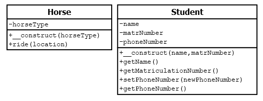

# 5.4.1 Mehrere Klassen verwenden

Beginnen wir nun zunächst sehr einfach. Wir können uns ein Beispiel überlegen, in dem wir zwei Klassen haben und mit beiden Klassen im Hauptprogramm arbeiten. Stellen wir uns vor, dass Anna ein Studium als Tierärztin macht und reitet. Dann könnten wir die zwei bisher betrachteten Klassen **Student** und **Horse** nehmen.

**Klasse Horse.php**

```php linenums="1"
<?php
class Horse
{
    private $horseType;

    public function __construct(string $horseType)
    {
        $this->horseType = $horseType;
    }

    public function ride(string $location): string
    {
        return "Ich habe ein {$this->horseType} und reite {$location} <br>";
    }
}
```

**Klasse Student.php**
```php linenums="1"
<?php
class Student
{
    private $name = "keine Angabe";
    private $matrNumber = 0;    
    private $phoneNumber = "keine Angabe";

    public function __construct(string $name, int $matrNumber)
    {
        $this->matrNr = $matrNumber;
        $this->name = $name;
    }

    public function getName(): string
    {
        return $this->name; 
    }

    public function getMatriculationNumber(): int
    {
        return $this->matrNumber; 
    }

    public function setPhoneNumber(string $newPhoneNumber): void
    {
        $this->phoneNumber = $newPhoneNumber;
    }

    public function getPhoneNumber(): string
    {
        return $this->phoneNumber;
    }
}
```

Nun können wir im Hauptprogramm eine **Instanz der Klasse Horse** und eine **Instanz der Klasse Student** bilden.

**Hauptprogramm**
```php linenums="1"
$annaHorse = new Horse("Deutsches Reitpony");
$annaStudent = new Student("Anna", "7205555");
```

Damit haben wir die beiden Objekte `$annaHorse` und `$annaStudent`. Und auf die Methoden der jeweiligen Objekte können wir unabhängig voneinander zugreifen.

Im Klassendiagramm sieht dies dann so aus, dass beide Klassen ohne eine Beziehung, also ohne eine Relation zueinander dargestellt werden.

**Zwei Klassen ohne Relation**



Nun schauen wir uns im nächsten Abschnitt verschiedene Relationen an.
