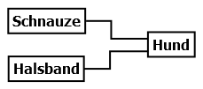

# 5.4.2 UML-Diagramme verstehen

Es kann verschiedene Relationen zwischen Klassen geben. Im Folgenden schauen wir uns zunächst die Klassendiagramme an und dann, wie dies im Sourcecode aussieht.

Wir unterscheiden die beiden Relationstypen **"IST-EIN"** und **"HAT-EIN"**.

- **IST-EIN**: Bei der **Vererbung** haben wir eine Basisklasse, z.B. "Tier", und zwei Unterklassen, z.B. "Hund" und "Katze". Somit können wir sagen:
  - Ein "Hund" **ist ein** "Tier".
  - Sowie eine "Katze" **ist ein** "Tier".

Im Klassendiagramm sieht dies wie folgt aus:

**Der geschlossene Pfeil zeigt damit immer zur Basisklasse, so wie wir auch den Satz gebildet haben: "Hund" -> "Tier".** Eine Vererbung ist immer dann sinnvoll, wenn bestimmte Dinge auf die Unterklassen zutreffen, z.B. hören, sehen, laufen etc., die man aber zentral in einer Basisklasse definieren kann.

- **HAT-EIN**: Bei der Relation HAT-EIN wird etwas aus einer anderen Klasse genutzt. Und wir können zwei Fälle unterscheiden, die im folgenden Beispiel klar werden:
  - Ein "Hund" **hat eine** Schnauze. Dies ist eine **Komposition** zweier Klassen. Von einer Komposition wird immer dann gesprochen, wenn ein Teil nicht ohne das genutzte Teil existieren kann. Da es keine Schnauze ohne einen Hund gibt, besteht eine **harte Abhängigkeit** zwischen diesen beiden Klassen.
  - Ein "Hund" **hat ein** Halsband. Dies ist eine **Aggregation** zweier Klassen. Von einer Aggregation wird immer dann gesprochen, wenn beide Teile unabhängig voneinander existieren können, also eine **weiche Abhängigkeit** zwischen diesen beiden Klassen besteht. Es gibt Hunde ohne Halsband und es gibt Halsbänder zu kaufen, die noch keinem Hund zugeordnet sind. Wenn aber Hund und Halsband vorhanden sind, dann lässt sich (in der Regel) eindeutig eine (Sprech-)Richtung angeben: ein "Hund" **hat ein** "Halsband".

Im Klassendiagramm gibt es nun die Besonderheit, dass in beiden Fällen die "Pfeile" genau umgekehr zur Sprechrichtung gezeichnet werden. Die Komposition wird mit einer ausgemalten Raute gekennzeichnet und die Aggregation mit einer nicht ausgemalten Raute.

Das Klassendiagramm zeigt noch etwas: Hebt man den Hund hoch, so hat man auch die Schnauze und das Halsband mit im Arm. An der Klasse, die man "hochhebt", sind immer die Rauten.

!!! tip "Anmerkung"
    Die Begriffe "Komposition" und "Aggregation" werden zum Oberbegriff "Assoziation" zusammengefasst. Eine "Assoziation" wird mit einem einfachen Strich dargestellt und zeigt damit normalerweise keine (Sprech-)Richtung an.

Nun können wir das oben Gelernte zu einem komplexeren Klassendiagramm zusammenfassen. Dabei beachten wir, dass nicht nur der Hund, sondern auch die Katze eine Schnauze hat und wir somit die Klasse "Schnauze" der Basisklasse "Tier" zuordnen können. Wir nehmen aber an, dass sich Katzen nicht mit Halsbändern wohlfühlen.

In den nächsten Unterkapiteln wird nun gezeigt, wie diese Relationen programmiert werden können. Wir beginnen bei der Vererbung, doch zuvor muss nun noch eine neue Art des Klassenaufrufs eingeführt werden: Der statische Aufruf von Klassen.
