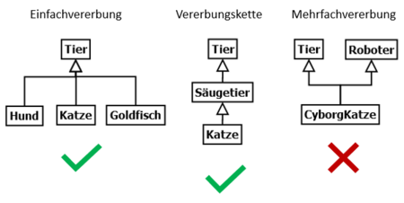
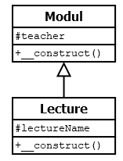

# 5.4.4 Vererbung

PHP unterstützt nur die sogenannte Einfachvererbung. Damit kann nur von einer einzigen Klasse geerbt werden. Aber Klassen können beliebig oft vererbt werden. Erben erfolgt mit `extends`.



!!! tip "Anmerkung"
    Das Wort "vererben" (= inheritance) beschreibt eigentlich gar nicht so gut, was passiert. Die in PHP (und Java) verwendete Bezeichnung "extends" (= erweitern) ist da viel besser, denn die Basisklasse wird durch eine Unterklasse um Eigenschaften und Methoden erweitert. **Klasse B extends (= erweitert) Klasse A.** 
    
    **In der Basisklasse A sind also einige Eigenschaften und Methoden vorhanden und die Unterklasse B erweitert nun die Eigenschaften und Methoden aus Klasse A um weitere Eigenschaften und Methoden**. Damit ist aus meiner Sicht die Sache viel klarer dargestellt als wenn man vom "erben" spricht.

Auf alle Methoden der Basisklasse A kann mit dem Schlüsselwort `parent::` zugegriffen werden. Wie bereits behandelt, nutzen wir `parent::` für den statischen Methodenaufruf. In dem gezeigten Beispiel wird damit der Konstruktor der Basisklasse `Modul` aufgerufen, was bei PHP nicht automatisch geschieht.

```php linenums="1"
<?php
class Modul                          // Basisklasse "Modul"
{
    protected $teacher;              // Eigenschaft der Basisklasse

    public function __construct()    // Konstruktor der Basisklasse
    {
        $this->teacher = "Thomaschewski";
    }
}

class Lecture extends Modul          // Unterklasse "Lecture"
{
    protected $lectureName;          // Eigenschaft von "Lecture"

    public function __construct()    // Konstruktor von "Lecture"
    {
        $this->lectureName = "Vorlesung Internetprogrammierung";
        parent::__construct();
    }
}
```

Eine Vererbung wird im Klassendiagramm durch einen Pfeil "mit offenem Dreieck" gezeichnet. Für unser Beispiel sieht das Klassendiagramm wie folgt aus:



Im Hauptprogramm wird dann (normalerweise) nur die Unterklasse verwendet, die aber durch die Vererbung alle Eigenschaften und Methoden der Basisklasse hat.

!!! question "Wichtige Programmieraufgabe zum Ermitteln des Wissenstandes"
    Im Beispiel sind die Strings "Thomaschewski" und "Vorlesung Internetprogrammierung" im Konstruktor fest vorgegeben. So etwas macht man natürlich nicht, sondern man übergibt die Daten aus dem Hauptprogramm. Hier kommt somit eine mehrstufige Aufgabe:

    1. Schreiben Sie ein Hauptprogramm zu den Klassen. Jede Klasse soll in eine eigene Datei. Somit gibt es dann also die Dateien **Modul.php**, **Lecture.php** und das Hauptprogramm **index.php**. Natürlich wird so noch nichts ausgegeben, da die Klassen ja nur aus Konstruktoren bestehen. Schreiben Sie also zusätzlich in der Klasse Lecture eine Getter-Methode `getLecture()`, die die Inhalte der Eigenschaft `$lectureName` mittels return an das Hauptprogramm in einem sinnvollen String übergibt. Im Hauptprogramm selbst müssen Sie drei Dinge machen 

        (a) mit `require_once 'Modul.php';` und `require_once 'Lecture.php';` die Klassen dem Hauptprogramm bekannt machen,
    
        (b) eine Instanz von Lecture bilden und
    
        (c) im echo-Befehl die Getter-Methode aufrufen.
      
    2. Schreiben Sie nun eine weitere Getter-Methode **getLectureWithTeacher()**, die die Eigenschaften `$teacher` und `$lectureName` mittels `return` an das Hauptprogramm übergibt. Im Hauptprogramm rufen Sie dann `getLectureWithTeacher()` statt `getLecture()` auf. Hinweis: Aufgrund der Vererbung können Sie einfach `$this->teacher` verwenden, obwohl die Eigenschaft in der Basisklasse definiert ist.

    3. Schreiben Sie das Hauptprogramm und die Klasse `Lecture` so um, dass der String "Vorlesung Internetprogrammierung" aus dem Hauptprogramm an den Konstruktor übergeben wird.

    4. Ersetzen Sie nun den festen Eintrag "Thomaschewski" in der Basisklasse, sodass dieser auch bei der Instanzierung übergeben wird.

??? example "Lösungen für den Notfall oder zum Vergleichen"

    Es ist total wichtig, dass Sie diese Aufgabe selbst probieren. Hier kommen die Lösungen zu den Aufgabenteilen 1 [Vererbung1-Lösung1.zip](media/Vererbung1Loesung1.zip) und 3 [Vererbung1-Lösung3.zip](media/Vererbung1Loesung3.zip)

Im nächsten Unterkapitel schauen wir uns ein komplettes Beispiel an. 