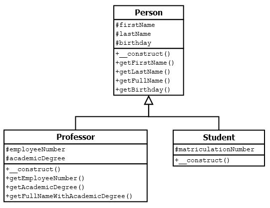

# 5.4.5 Vererbung - weiteres Beispiel

Nun soll ein etwas komplexeres Beispiel gezeigt werden, in dem zwei Klassen von einer Basisklasse erben.



**Basisklasse Person**

```php linenums="1"
<?php declare(strict_types=1);
class Person
{
    protected $firstName;
    protected $lastName;
    protected $birthday;

    public function __construct(
        string $firstName, 
        string $lastName, 
        DateTime $birthday
    ) {
        $this->firstName = $firstName;
        $this->lastName = $lastName;
        $this->birthday = $birthday;
    }

    public function getFirstName(): string
    {
        return $this->firstName;
    }

    public function getLastName(): string
    {
        return $this->lastName;
    }

    public function getFullName(): string
    {
        return $this->firstName . ' ' . $this->lastName;
    }

    public function getBirthday(): DateTime
    {
        return $this->birthday;
    }
}
```

**Klasse Professor**

```php linenums="1"
<?php declare(strict_types=1);
class Professor extends Person
{
    protected $employeeNumber;
    protected $academicDegree;

    public function __construct(
        string $firstName,
        string $lastName,
        DateTime $birthday,
        int $employeeNumber,
        string $academicDegree
    ) {
        parent::__construct($firstName, $lastName, $birthday);
        $this->employeeNumber = $employeeNumber;
        $this->academicDegree = $academicDegree;
    }

    public function getEmployeeNumber(): int
    {
        return $this->employeeNumber;
    }

    public function getAcademicDegree(): string
    {
        return $this->academicDegree;
    }

    public function getFullNameWithAcademicDegree(): string
    {
        return $this->academicDegree 
               . ' ' . $this->firstName 
               . ' ' . $this->lastName;
    }
}
```

**Klasse Student**

```php linenums="1"
<?php declare(strict_types=1);
class Student extends Person
{
    protected $matriculationNumber;

    public function __construct(
        string $firstName,
        string $lastName,
        DateTime $birthday,
        int $matriculationNumber
    ) {
        parent::__construct($firstName, $lastName, $birthday);
        $this->matriculationNumber = $matriculationNumber;
    }
}
```

Beachten Sie die Schreibweise bei den Konstruktoren. Dort wurden zur Übersichtlichkeit die Variablen untereinander geschrieben.

Und in der Klasse **Professor** wurde in den **Zeilen 32-35** auch die return-Zeile übersichtlich untereinander geschrieben, jeweils mit dem "." beginnend. Der "." verkettet die einzelnen Strings zu einem Gesamtstring.

Verwenden lassen sich beide Klassen im folgenden Hauptprogramm.

**Hauptprogramm**

```php linenums="1"
<?php declare(strict_types=1);
require_once __DIR__ . DIRECTORY_SEPARATOR . 'Person.php';
require_once __DIR__ . DIRECTORY_SEPARATOR . 'Professor.php';
require_once __DIR__ . DIRECTORY_SEPARATOR . 'Student.php';

$student = new Student(
    'Hans',
    'Müller',
    new DateTime('1995-03-21'),
    12345678
);

$professor = new Professor(
    'Alberta',
    'Zweistein',
    new DateTime('1970-02-01'),
    42,
    'Prof. Dr.'
);

echo "Wir haben den " 
     . $professor->getFullNameWithAcademicDegree() 
     . " <br>";
```

Ausgabe:<br>
*Wir haben den Prof. Dr. Alberta Zweistein*

In den **Zeilen 6 & 16** wurde ein Objekt gebildet mit `new DateTime(...)`. Anstelle einer Variablen übergeben wir nun ein Objekt an die Methoden. Denn schließlich wird ein Objekt mit `new` gebildet. Der Aufruf des Konstruktors im Hauptprogramm erfolgt also mit:

```php
$professor = new Professor(
    'Alberta',
    'Zweistein',
    new DateTime('1970-02-01'),
    42,
    'Prof. Dr.'
);
```

Und der Konstruktur in der Klasse **Professor** erwartet dieses Objekt mit:

```php
public function __construct(
    string $firstName,
    string $lastName,
    DateTime $birthday,
    int $employeeNumber,
    string $academicDegree
)
```

Während wir mit den Gettern `getEmployeeNumber()`, `getAcademicDegree()` etc. einen String zurückbekommen und diesen direkt mit `echo` ausgeben können, klappt dies bei `getBirthday()` nicht, denn da bekommen wir ja ein Objekt zurück und dies lässt sich mit `echo` nicht ausgeben. Wie wir das Geburtsdatum angezeigt bekommen, behandeln wir erst im Unterkapitel [Datum ausgeben mit DateTime](5.5.1DatumausgebenmitDateTime.md).

!!! tip "Anmerkung"
    Studierende möchte oft wissen, wie sie sich ein Objekt vorstellen können. 

    - Sie haben sich an den Begriff **Variable** gewöhnt und wissen, dass eine Variable einen Wert enthält. 
    
    - Sie haben sich sogar an den Begriff **Array** gewöhnt und wissen, dass in einem Array ganz viele Werte stecken können (entweder durchnummeriert als indiziertes Array oder jeweils mit einem Key versehen als assoziatives Array). 
    
    - Wenn Sie sich unter einem Objekt etwas vorstellen wollen, dann wäre es ein Karton, der verschiedene Dinge enthalten kann. In unserem Fall enthält dieser Karton jedoch nur einen String (im Datumsformat).

Hier können Sie eine Zip-Datei herunterladen, die den gesamten Sourcecode enthält. Sie sollten das Programm unbedingt **auf Ihrem Server installieren und ausprobieren**: [Vererbung3.zip](media/Vererbung3.zip).

!!! tip "Anmerkung"
    Hinweis: Der Sourcecode in den Dateien von Vererbung3.zip enthält (anders als der Sourcecode auf dieser Seite) sinnvolle Kommentare, so wie ein Sourcecode professionell aufgebaut werden sollte. Für Anfänger*innen sind die Kommentare oft störend, da der Sourcecode dann insgesamt so lang ist. Wenn die Kommentare stören, dann erstmal löschen, um das Programm zu verstehen. Und sobald Sie das Programm verstanden haben, sollten Sie die Kommentare ansehen und auch diese verstehen.

