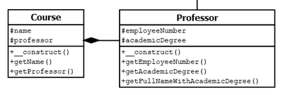
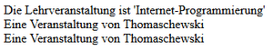

# 5.4.6 Aggregation und Komposition

In den bisherigen Beispielen haben wir die Vererbung (= **IST-EIN**) behandelt. Der "Professor" ist eine "Person" und der "Student" ist eine "Person". Im Unterkapitel "[UML-Diagramme verstehen](5.4.2UMLDiagrammeverstehen.md)" haben wir aber auch die Relation **HAT-EIN** eingeführt. Hier wollen wir den PHP-Code zu folgendem Beispiel zeigen:

**Jeder Course hat einen Professor (Komposition)**



In der Programmierung können wir dies sehr einfach realisieren, indem wir **in der Klasse Course eine Eigenschaft schreiben, in die später das Objekt der Klasse Professor gespeichert wird** (siehe **Zeile 5**).

Wir übergeben im Konstruktor (**Zeile 7**) dann das Objekt der **Klasse Professor**, das wir zuvor im Hauptprogramm erstellen müssen.

```php linenums="1"
<?php declare(strict_types=1);
class Course
{
    protected $name;
    protected $professor;

    public function __construct(Professor $professor, string $name)
    {
        $this->professor = $professor;
        $this->name = $name;
    }

    public function getName(): string
    {
        return $this->name;
    }

    public function getProfessor(): Professor
    {
        return $this->professor;
    }
}
```
Bildlich gesprochen stellen wir uns eine Klasse ja als "Behälter" vor, in der Eigenschaften und Methoden vorhanden sind (siehe [Warum Objektorientierung](5.1WarumObjektorientierung.md)).
Und damit füllen wir einen Behälter einfach in einen anderen Behälter ein, so wie man einen Karton in einem anderen Karton verpacken kann.
Damit enthält der "Karton" *Course* nun den "Karton" *Professor*.

Die Eigenschaft `$name` ist der Name des Kurses, also z.B. "Internet-Programmierung".

Das zugehörige Hauptprogramm sieht dann so aus, dass wir zunächst die Klasse *Professor* instanzieren (**Zeile 10**) und dann die Klasse *Course* (**Zeile 22**).

```php linenums="1"
<?php declare(strict_types=1);
require_once 'Course.php';
require_once 'Person.php';    
require_once 'Professor.php';

/*
* Klasse Professor instanzieren - also ein Objekt $professor erstellen
*/
$professor = new Professor(
    'Jörg',
    'Thomaschewski',
    new DateTime('1970-02-01'),
    42,
    'Prof. Dr.'
);

/*
* Klasse Course instanzieren - also ein Objekt $course erstellen.
* Klasse 'Course' erhält das zuvor erstellte Objekt $professor.
*/
$course = new Course(
    $professor,
    'Internet-Programmierung'
);

echo "Die Lehrveranstaltung ist '{$course->getName()}'<br>";
echo "Veranstaltung von {$course->getProfessor()->getLastName()} <br>";
echo "Veranstaltung von {$professor->getLastName()} <br>";
```

Ausgabe auf dem Browser:




Der wichtige Punkt ist also, dass wir zunächst die Klasse *Professor* instanziiert haben und ein Objekt *$professor* erstellt haben. Anschließend haben wir die Klasse *Course* instanziiert und im Konstruktor das Objekt *$professor* übergeben. Wir haben also ein Objekt *$course*, das das Objekt *$professor* enthält.

- **Zeile 27**: Hier wird auf die Methode `getName()` der Klasse Course bzw. besser ausgedrückt des Objektes `$course` zugegriffen und der Name der Lehrveranstaltung ausgelesen. Bei `getName()` handelt es sich ja um einen Getter, der die entsprechende Eigenschaft *$name* (Klasse Course, Zeilen 13-16 bzw. Zeile 4) ausliest und einen String zurückliefert.

!!! important "**Wichtig**"

    **Bevor Sie jetzt weiterlesen, sollte es Ihnen wirklich klar sein, was hier passiert, denn ansonsten können Sie den nächsten Punkt nicht verstehen!**

- **Zeile 29**: Hier haben wir etwas Neues! Wir greifen auf die Methode `getProfessor()` des Objektes `$course` zu. Hierbei handelt es sich wiederum um einen Getter, aber diesmal wird kein String, sondern das komplette Objekt `$professor` zurückgegeben. `$course->getProfessor()` enthält also das Objekt `$professor`, auf das wir den Getter `getLastName()` anwenden, um den Nachnamen des Professors als String zu bekommen.

!!! tip "Nochmals zum Verständnis von Objekten"
    Zum besseren Verständnis des Ganzen: Sie haben ein Paket mit vielen verschiedenen Süßigkeiten bekommen. Und die Süßigkeiten sind natürlich auch wieder in Päckchen verpackt. Obendrauf liegt eine Karte mit dem String "Viele Grüße". Wenn Sie jetzt einen "Getter" auf die Karte anwenden, dann erhalten Sie als Ergebnis den String "Viele Grüße". Wenn Sie aber einen Getter auf ein Süßigkeiten-Päckchen anwenden, dann entnehmen Sie das ganze Päckchen, können es öffnen und eine Süßigkeit naschen.

- **Zeile 31**: Im Ergebnis kommt dasselbe raus, wie bei Zeile 29. Der Getter `getLastName()` des Objektes `$professor` wird aufgerufen.

Warum ein Aufruf wie in **Zeile 29** Sinn machen kann, zeigen wir später an einem anderen Beispiel. Hier begnügen wir uns damit, dass es so funktioniert. Nun sollten Sie das Programm auf Ihrem Server installieren: [Komposition.zip](media/Komposition.zip).

!!! important "Wichtig"
    Wir haben ein Beispiel für die Komposition erstellt. Damit sagen wir, dass ein *Course* immer einen *Professor* haben muss. Aber in der Programmierung macht es (zunächst) keinen Unterschied, ob es eine Komposition oder eine Aggregation ist. Beides wird gleich erstellt. Beides bedeutet "ein Course **hat einen** Professor".

