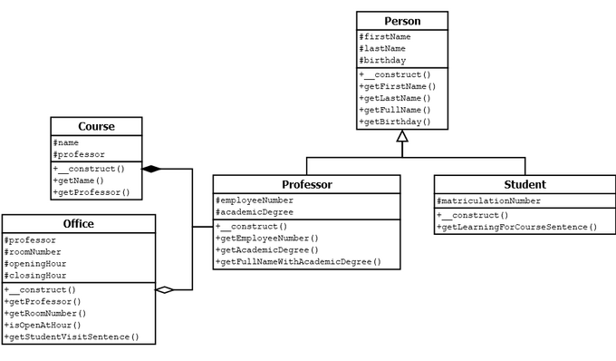

# 5.4.7 Beispiel mit Vererbung, Aggregation und Komposition

Nun wird es noch etwas komplexer, denn wir nehmen noch eine Klasse hinzu. Das gesamte Klassendiagramm sieht nun wie folgt aus: 

Klassendiagramm für das Beispiel




??? "Klasse Person ansehen (wie bisher)"

    ```php linenums="1"
    <?php declare(strict_types=1);

    class Person
    {
        protected $firstName;
        protected $lastName;
        protected $birthday;

        public function __construct(
            string $firstName,
            string $lastName,
            DateTime $birthday
        ) {
            $this->firstName = $firstName;
            $this->lastName = $lastName;
            $this->birthday = $birthday;
        }

        public function getFirstName(): string
        {
            return $this->firstName;
        }

        public function getLastName(): string
        {
            return $this->lastName;
        }

        public function getFullName(): string
        {
            return $this->firstName.' '.$this->lastName;
        }

        public function getBirthday(): DateTime
        {
            return $this->birthday;
        }
    }
    ```

??? "Klasse Professor ansehen (wie bisher)"

    ```php linenums="1"
    <?php declare(strict_types=1);

    class Professor extends Person
    {
        protected $employeeNumber;
        protected $academicDegree;

        public function __construct(
            string $firstName,
            string $lastName,
            DateTime $birthday,
            int $employeeNumber,
            string $academicDegree
        ) {
            parent::__construct($firstName, $lastName, $birthday);
            $this->employeeNumber = $employeeNumber;
            $this->academicDegree = $academicDegree;
        }

        public function getEmployeeNumber(): int
        {
            return $this->employeeNumber;
        }

        public function getAcademicDegree(): string
        {
            return $this->academicDegree;
        }

        public function getFullNameWithAcademicDegree(): string
        {
            return $this->academicDegree.' '.$this->firstName.' '.$this->lastName;
        }
    }
    ```

??? "Klasse Student ansehen (neue Methode `getLearningForCourseSentence()`)"
    
    ```php linenums="1"
    <?php declare(strict_types=1);

    class Student extends Person
    {
        protected $matriculationNumber;

        public function __construct(
            string $firstName,
            string $lastName,
            DateTime $birthday,
            int $matriculationNumber
        ) {
            parent::__construct($firstName, $lastName, $birthday);
            $this->matriculationNumber = $matriculationNumber;
        }

        public function getLearningForCourseSentence(Course $course): string
        {
            return "{$this->getFullName()} is learning "
                ."for course {$course->getName()} "
                ."taught by 
                {$course->getProfessor()->getFullNameWithAcademicDegree()}.";
        }
    }
    ```


??? "Klasse Course ansehen (wie bisher)"
    
    ```php linenums="1"
    <?php declare(strict_types=1);

    class Course
    {
        protected $name;
        protected $professor;

        public function __construct(Professor $professor, string $name)
        {
            $this->professor = $professor;
            $this->name = $name;
        }

        public function getName(): string
        {
            return $this->name;
        }

        public function getProfessor(): Professor
        {
            return $this->professor;
        }
    }
    ```

??? "Klasse Office ansehen (neue Klasse)"
    
    ```php linenums="1"
    <?php declare(strict_types=1);

    class Office
    {
        protected $professor;
        protected $roomNumber;
        protected $openingHour;
        protected $closingHour;

        public function __construct(
            Professor $professor,
            int $roomNumber,
            int $openingHour,
            int $closingHour
        ) {
            $this->professor = $professor;
            $this->roomNumber = $roomNumber;
            $this->openingHour = $openingHour;
            $this->closingHour = $closingHour;
        }

        public function getProfessor(): Professor
        {
            return $this->professor;
        }

        public function getRoomNumber(): int
        {
            return $this->roomNumber;
        }

        public function isOpenAtHour(int $hour): bool
        {
            return $this->openingHour < $hour && $hour < $this->closingHour;
        }

        public function getStudentVisitSentence(Student $student, int $hour): string
        {
            $visitSentence = $student->getFullName()
                .' is attempting to visit '
                .$this->professor->getFullNameWithAcademicDegree()
                .' in room '
                .$this->roomNumber
                .' at '
                .$hour
                ." o'clock, ";

            if ($this->isOpenAtHour($hour)) {
                $visitSentence .= 'and '.$this->professor->getFullNameWithAcademicDegree().' is available.';
            } else {
                $visitSentence .= 'but '.$this->professor->getFullNameWithAcademicDegree().' is not available';
            }

            return $visitSentence;
        }
    }
    ```

??? "Hauptprogramm  ansehen (leicht abgewandelt)"
    
    ```php linenums="1"
    <?php declare(strict_types=1);

    require_once __DIR__.DIRECTORY_SEPARATOR.'Course.php';
    require_once __DIR__.DIRECTORY_SEPARATOR.'Office.php';
    require_once __DIR__.DIRECTORY_SEPARATOR.'Person.php';
    require_once __DIR__.DIRECTORY_SEPARATOR.'Professor.php';
    require_once __DIR__.DIRECTORY_SEPARATOR.'Student.php';

    $student = new Student(
        'Hans',
        'Müller',
        new DateTime('1995-03-21'),
        12345678
    );
    $professor = new Professor(
        'Alberta',
        'Zweistein',
        new DateTime('1970-02-01'),
        42,
        'Prof. Dr.'
    );


    $course = new Course($professor, 'Advanced Physics');
    $office = new Office($professor, 5, 14, 18);

    echo $student->getLearningForCourseSentence($course)."<br>".PHP_EOL;
    print $office->getStudentVisitSentence($student, 12)."<br>".PHP_EOL;
    print $office->getStudentVisitSentence($student, 15)."<br>".PHP_EOL;
    ```

Nun sollten Sie das Programm auf Ihrem Server installieren und ausprobieren. Und Sie sollten alle Dateien mit einem professionellen Editor öffnen, da die Übersichtlichkeit im Editor besser ist, als hier im Modul: [GesamtbeispielKlassenRelationen.zip](media/GesamtbeispielKlassenRelationen.zip).

**Was ist neu?**

Die Vererbung haben wir bereits behandelt und auch die Komposition zwischen den Klassen `Course` und `Professor`. Die Aggregation zwischen den Klassen `Office` und `Professor` funktioniert genauso und ist damit auch nicht neu. Aber in der Klasse **Office** ist eine interessante Methode, die wir uns hier genauer ansehen.

```php linenums="1"
public function getStudentVisitSentence(
    Student $student, 
    int $hour
): string {
    $visitSentence = $student->getFullName()
        .' is attempting to visit '
        .$this->professor->getFullNameWithAcademicDegree()
        .' in room '
        .$this->roomNumber
        .' at '
        .$hour
        ." o'clock, ";

    if ($this->isOpenAtHour($hour)) {
        $visitSentence .= 'and '
        .$this->professor->getFullNameWithAcademicDegree()
        .' is available.';
    } else {
        $visitSentence .= 'but '
        .$this->professor->getFullNameWithAcademicDegree()
        .' is not available';
    }

    return $visitSentence;
}
```

In **Zeile 2** wird das Objekt `$student` der Klasse `Student` an eine Methode übergeben. Damit ist es möglich, dass in **Zeile 5** mit dem Methodenaufruf `$student->getFullName()` der Name des Studierenden ausgelesen werden kann. Wir lernen also, dass Objekte in einem Methodenaufruf genauso übergeben werden können, wie Variablen.

Die **Zeilen 5-12** gehören zusammen und bilden einen langen String. Der "."-Operator verkettet (="verklebt") die Einzelteile zu einem Gesamtstring. Ebenso die **Zeilen 15-17** und die **Zeilen 19-21**. Die Schreibweise ist sicherlich gewöhnungsbedürftig. Aber wenn man sich daran gewöhnt hat, dann ist sie wirklich übersichtlich.

!!! question "Beispiel abändern - Aufgabe 1"
    Ändern Sie das Beispiel so ab, dass es Ihren Namen als Student*in enthält, sowie eine von Ihnen belegte Lehrveranstaltung. Die Zeiten für die Sprechstunden soll von 14:00 - 16:00 Uhr sein und alle Ausgabetexte sollen auf deutsch sein.

!!! question "Beispiel abändern - Aufgabe 2"
    Nun geht es nicht mehr um die Sprechzeiten, sondern um die Vorlesungszeiten, die angezeigt werden sollen. Schreiben Sie eine neue Methode, sodass die Vorlesungszeit ausgegeben werden kann. Achten Sie auf eine korrekte Benennung der Methoden und auch ansonsten auf eine saubere Programmierung.

Wenn Sie es geschafft haben, das Gesamtbeispiel wirklich zu verstehen und die o.g. Aufgaben zu lösen, dann können Sie nun die Grundlagen der Objektorientierten Programmierung! Natürlich gibt es ab hier noch viele Feinheiten, aber die Grundlage ist aus meiner Sicht hiermit vollbracht.

