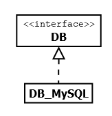
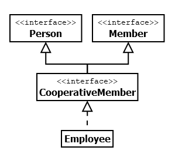

# 5.4.8 Abstrakte Klassen und Interfaces (=Schnittstellen)

Es gibt noch eine Besonderheit der Vererbung. Denn Vererbung kann auch dafür eingesetzt werden, **dass in einer Basisklasse nur definiert wird, was dann später in einer Unterklasse implementiert werden muss**.

!!! example "Beispiel"
    Stellen Sie sich vor, dass Sie ein Team mit vielen Programmierer*innen leiten. Sie können dann in einer Basisklasse die Eigenschaften und Methoden vorgeben, die das Team nutzen muss. Machen wir das Beispiel mal konkreter: Es soll eine Software zur einheitlichen Verwaltung von Schülerinnen und Schülern in unterschiedlichsten Schulen erstellt werden und Sie geben vor, welche Eigenschaften (z.B. Vorname, Nachname, Geburtsdatum, etc.) und welche Methoden als Basis in allen Schulen vorhanden sein sollen, damit die Datenbank des Ministeriums wirklich konsistent aufgebaut werden kann.

**Abstrakte Klassen**  
Eine abstrakte Klasse ist eine nicht instanzierbare Klasse. Also wird eine abstrakte Klasse nie direkt verwendet, sondern immer als Basisklasse eingesetzt. Sie vererbt ihre **(Grund-)Eigenschaften** und ihre **Methodendefinitionen**.

Ein typisches Beispiel für eine abstrakte Klasse ist eine Datenbankklasse, die für verschiedene Datenbanksoftwaretypen eine Anbindung vereinheitlichen soll. Man hat also eine abstrakte Klasse, in der die Grundeigenschaften und Methodendefinitionen stehen. Für jedes konkrete Datenbanksystem (MySQL, Oracle, MicrosoftDB, etc.) gibt es dann eine entsprechende Unterklasse, die zunächst einmal die Eigenschaften und Methoden der abstrakten Basisklasse implementieren muss und dann darüber hinaus noch weitere spezifische Eigenschaften und Methoden des konkreten Datenbanksystems haben kann.

Abstrakte Eigenschaften und Methoden werden mit dem Begriff ***abstract*** gekennzeichnet. Abstrakte Methoden (z.B. **Zeile 14 + 15**) haben keine geschweiften Klammern, in denen "etwas gemacht" wird. Wir sprechen davon, dass abstrakte Klassen keinen Methodenkörper haben.

**Abstrakte Basisklasse**

```php linenums="1"
<?php declare(strict_types=1);
abstract class Db
{
    protected $connection = null;

    abstract public function connect(
        string $host = null,
        string $db = null,
        string $user = null,
        string $password = null,
        int $port = null
    );

    abstract public function query(string $query);
    abstract public function close();

    protected function escapeString(string $string): string
    {
        return addslashes($string);
    }
}
```

**Unterklasse**  
Für das konkrete Datenbanksystem MySQL

```php linenums="1"
<?php declare(strict_types=1);
class DbMysql extends Db
{
    public function connect(
        string $host = null,
        string $db = null,
        string $user = null,
        string $password = null,
        int $port = null
    ) {
        $this->connection = mysqli_connect(
            $host . (!empty($port) ? ":{$port}" : ""),
            $user,
            $password
        );
        if (!empty($db)) {
            mysqli_select_db($db);
        }
    }

    public function query(string $query): string
    {
        return mysql_send_query($this->escapeString($query));
    }

    public function close(): bool
    {
        return mysqli_close();
    }

    public function escapeString(string $string): string
    {
        return mysql_real_escape_string($string);
    }
}
```

Wir haben nun in der Unterklasse alle Methoden der abstrakten Basisklasse erneut verwendet und ein Verhalten implementiert, also geschweifte Klammern verwendet und einem Methodenkörper erstellt.

Eine abstrakte Klasse muss aber nicht ausschließlich abstrakte Eigenschaften und abstrakte Methoden enthalten. In der Basisklasse gibt es eine Methode (**Zeile 17**), die nicht als *abstract* gekennzeichnet ist und einen Methodenkörper enthält (also etwas, was in geschweiften Klammern steht und "etwas macht").

## Interfaces (=Schnittstellen)
Interfaces sind noch "abstrakter". Interfaces dürfen keine Eigenschaften besitzen und alle Methoden müssen *abstract* sein, wobei das Schlüsselwort *abstract* entfällt, weil sie sowieso *abstract* sein müssen. Wir schreiben das Beispiel von oben mal als Interface.

```php linenums="1"
<?php declare(strict_types=1);
interface Db
{
    public function connect(
        string $host = null,
        string $db = null,
        string $user = null,
        string $password = null,
        int $port = null
    );

    public function query(string $query);
    public function close();
    public function escapeString(string $string);
}
```

Folgende Dinge sind nun anders:

- Das Schlüsselwort ist nicht mehr *class* sondern ***interface***.

- Es darf keine Eigenschaften im Interface geben.

- Die Sichtbarkeit aller Methoden muss ***public*** sein.

- Das *abstract* entfällt, da ja sowieso alle Methoden "abstrakt" sind.

```php linenums="1"
<?php declare(strict_types=1);
class DbMysql implements Db
{
    // Implementierungsdetails
}
```

Das zugehörige UML-Diagramm:



## Mehrfachvererbung bei "Interface"

Ein Interface kann also als vollständig abstrakte Klasse betrachtet werden. Aber es gibt noch eine Besonderheit für ein Interface. Von einer "normalen" Basisklasse dürfen zwar beliebig viele andere Klassen erben (es kann also viele Unterklassen geben), aber es gibt keine Mehrfachvererbung. Beim Interface ist Mehrfachvererbung erlaubt. Hier ein Beispiel.

**Interface Person**
```php linenums="1"
interface Person
{
    public function getName();
}
```

**Interface Member**
```php linenums="1"
interface Member
{
    public function getId();
}
```

**Interface CooperativeMember erbt von Person und Member**
```php linenums="1"
interface CooperativeMember extends Person, Member
{
    public function getSalary();
}
```

**Klasse Employee implementiert CooperativeMember**
```php linenums="1"
class Employee implements CooperativeMember
{
    public function getName()
    {
        // Implementierung
    }

    public function getId()
    {
        // Implementierung
    }

    public function getSalary()
    {
        // Implementierung
    }
}
```

Das zugehörige UML-Diagramm:



Ein Interface bietet damit umfangreichen Mögichkeiten in größeren Projekten, da nun zugehörige Methoden in "Basisklassen" zusammengefasst werden können, die dann entsprechend erweitert werden können. 