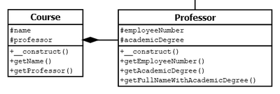

# 5.4.9 Selbsttest Nr. 3 zu OOP in PHP

!!! question "Aufgabe 1"
    Beantworten Sie Fragen zu diesem Sourcecode:

    ```php linenums="1"
    <?php
    class Lecture extends Modul
    {
        protected $lectureName;

        public function __construct()
        {
            $this->lectureName = "Vorlesung Internetprogrammierung";
            parent::__construct();
        }
    }
    ```

    Welche Aussagen treffen zu?

    A) Es gibt eine Aggregation der Klasse Modul.  
    B) Es gibt eine Vererbung der Klasse Modul an die Klasse Lecture.  
    C) Die Klasse Modul ist die Basisklasse.  
    D) Die Klasse Lecture ist die Basisklasse.  
    E) Die Basisklasse hat einen Konstruktor, der mit `parent::__construct()` aufgerufen wird.  
    F) Der Konstruktor der Basisklasse wird statisch aufgerufen.  
    G) In obigem Beispiel erfolgt ein statischer Aufruf über `parent::`.  
    H) In obigem Beispiel erfolgt ein statischer Aufruf über `$this->`.  

??? example "Lösung zu Aufgabe 1"
    
    Richtig sind:

    B) Es gibt eine Vererbung der Klasse Modul an die Klasse Lecture.  
    C) Die Klasse Modul ist die Basisklasse.    
    E) Die Basisklasse hat einen Konstruktor, der mit `parent::__construct()` aufgerufen wird.  
    F) Der Konstruktor der Basisklasse wird statisch aufgerufen.  
    G) In obigem Beispiel erfolgt ein statischer Aufruf über `parent::`.  

!!! question "Aufgabe 2"

    Beantworten Sie Fragen zu dieser UML-Diagramm:

    


    Wie programmiert man eine Komposition?

    A) Zunächst erstellt man eine Basisklasse "Professor" und dann ruft man diese im Hauptprogramm auf.  
    B) Zunächst erstellt man im Hauptprogramm Objekte der Klassen Professor und Course und dann verbindet man beide mit `$professor => $course`.  
    C) Zunächst erstellt man im Hauptprogramm ein Objekt der Klasse Professor und dann übergibt man das Objekt `$professor` an den Konstruktor von Course.  
    D) In der Klasse Course muss eine Eigenschaft $professor vorhanden sein, die das Objekt der Klasse Professor benötigt.  
    E) In der Klasse Professor muss eine Eigenschaft $course vorhanden sein, die das Objekt der Klasse Course benötigt.


??? example "Lösung zu Aufgabe 2"
    
    Richtig sind:

    C) Zunächst erstellt man im Hauptprogramm ein Objekt der Klasse Professor und dann übergibt man das Objekt `$professor` an den Konstruktor von Course.  
    D) In der Klasse Course muss eine Eigenschaft `$professor` vorhanden sein, die das Objekt der Klasse Professor benötigt.  