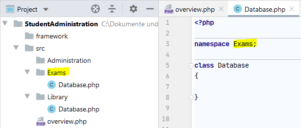
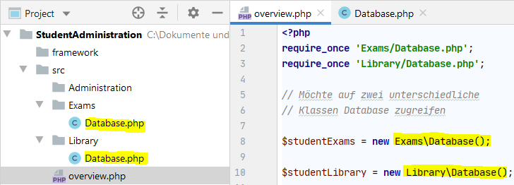
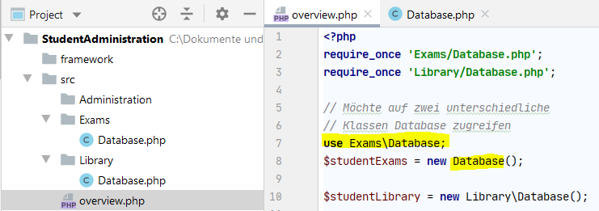

# 5.5.6 Namespaces

Bisher müssen unsere Klassen **eindeutige Namen** haben, da ansonsten bei der Instanzierung z.B. *$ute = new Student()* unklar wäre, welche Klasse *Student* gemeint ist. Also **darf bisher jeder Klassenname nur einmal vergeben werden**.

In kleineren Projekten ist dies ok, aber wenn viele Entwickler:innen an einem Projekt arbeiten oder wenn man ein Framework einsetzt (also hunderte von Klassen installiert hat), dann ist dies ein großes Problem.

**Das Problem der eindeutigen Namen kann aber mit dem Konzept *Namespaces* gelöst werden.**

Zunächst organisiert man die Dateistruktur auf der Festplatte so, dass unterschiedliche Bereiche in unterschiedlichen Ordnern gespeichert werden (siehe Abbildung, linke Seite mit der Ordnerstruktur). So kann es nun beispielsweise eine Datei (=Klasse) "Database.php" im Ordner "Exams" und eine gleichnamige Datei (=Klasse) "Database.php" im Ordner "Library" geben. Jetzt wird **in der Klasse *Database* die im Ordner "Exams" liegt, der *namespace Exams*** eingeführt. Dabei sollte **der Namespace immer benannt werden, wie der Ordnername**.

Wenn man dies auch für die Klasse *Database* im Ordner "Library" macht, dann kann man die Klassen mit den identischen Klassennamen wieder eindeutig ansprechen. Hierzu wird beim Instanzieren der Namespace vor den Klassennamen geschrieben (siehe Abbildung, rechte Seite mit *Exams\Database()* und *Library\Database()*.

Angenommen man greift normalerweise immer auf die Klassen im Namespace *Exams* zu und nur selten auf andere Klassen in anderen Namespaces. Dann kann man mit *use Exams* eine Abkürzung einführen. Somit muss man beim Instanzieren den Namespace nicht mehr mit angeben.

**Regeln**

- In der Datei muss der Befehl *namespace* immer am Anfang stehen, bevor die Klasse mit *class ...* begonnen wird.
- Ein Namespace besteht normalerweise nicht nur aus einem Namen, sondern bildet die Verzeichnisstruktur ab. Dabei wird zur Trennung immer der Backslash "\\" verwendet. Also beispielsweise *Ordner\Unterordner*.
- Ein Namespace sollte so heißen, wie der Ordner bzw. wenn es sich um eine verschachtelte Ordnerstruktur handelt, so wie der komplette Pfad zum Ordner.
- Alle Klassen eines Unterordners haben somit normalerweise denselben Namespace.
