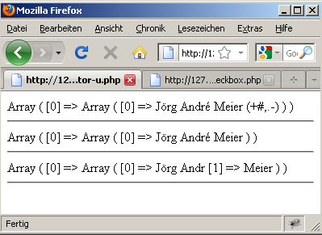

# 6.2.5 Modifikatoren und Umlaute

Hinter dem abschließenden Slash des Suchstrings kann ein sogenannter Modifikator angegeben werden.

| Modifikator | Erklärung |
|-------------|-----------|
| `/ /i`      | Groß-/Kleinschreibung ignorieren. |
| `/ /s`      | Single-line-Mode: Zeichenketten als eine einzige Zeile betrachten. Der Punkt-Operator gilt auch für das newline-Zeichen. |
| `/ /x`      | Ignoriert Whitespace und erlaubt Kommentare (#). So kann bei längeren Suchmustern eine Formatierung zur besseren Lesbarkeit des Suchmusters vorgenommen werden, indem das Suchmuster über mehrere Zeilen geschrieben wird. |
| `/ /u`      | Schaltet auf UTF-8 um, damit Umlaute und andere Buchstaben-Sonderzeichen in Mengenklammern gefunden werden. Dies ist nur notwendig, wenn UTF-8 noch nicht automatisch im System als Default vorhanden ist. |


### Beispiel für den Modifikator `/i`
    
Text: *Die Tester testen die Software*<br>
Suchmuster: `/(test)/i`<br>
Ergebnis: Die <u>Test</u>er testen die Software

Der Modifikator `/i` ist oftmals sehr praktisch. Anstelle der Menge `/[A-Za-z]/` kann nun `/[A-Z]/i` geschrieben werden.

### Beispiel für die Formatierung mit dem Modifikator `/x`
Hierbei wird das Suchmuster in mehreren kommentierten Zeilen geschrieben. Dies ist für einen längeren regulären Ausdruck sehr sinnvoll!

```php linenums="1"
<?php
$text = "Ich habe 122,50 € ausgegeben.";
$such = '/
        ^.*?          # Am Textanfang beginnen
        (             # Klammer für $1
        \d{1,6}       # 1-6 Zahlen für Eurobetrag
        ,?            # Komma für Cent-Beträge (optional)
        (\d{1,2})?    # Zwei Nachkommastellen (optional)
        \s?€          # Leerzeichen (optional) und €-Zeichen
        )             # Klammer für $1 schließen
        .*$           # bis zum Ende
        /x';
$ersetz = '$1';
$b = preg_replace($such, $ersetz, $text);
print $b;
?>
```

Ausgabe:<br>
*122,50 €*

!!! question "Übung"
    Was steht in  `$b` (s. Listing) bei folgendem Text?
    
    `$text = "Ich habe nix ausgegeben.";`
    
??? example "Lösung"
    `$b` enthält den gesamten Text "Ich habe nix ausgegeben." Der reguläre Ausdruck trifft nicht, denn es kommt keine Zahl darin vor. Dann jedoch wird der gesamte String in die Variable `$b` übernommen.

## Problem Umlaute

Umlaute und reguläre Ausdrücke können ein sehr großes Problem darstellen, je nachdem mit welchem Zeichensatz das Betriebssystem arbeitet. (Ich habe leider kein Generalrezept wann es gut geht und wann nicht).

Aufgabenstellung: Umlaute und andere Schriftzeichen im Namen sollen erlaubt sein, aber andere Sonderzeichen nicht. Unser Test-Text sei: `$text = "Jörg André Meier (+#,.-)";`

Der Name soll gefunden werden und die Sonderzeichen in der Klammer sollen gelöscht werden. Im folgenden Sourcecode sehen Sie drei Ansätze.

```php linenums="1"
<?php
$text = "Jörg André Meier (+#,.-)";

# Alles finden – nur zur Kontrolle
$such1 = '/^.*$/';
preg_match_all($such1, $text, $treffer);
print_r($treffer);
echo "<hr />";

# Mit \w arbeiten
$such2 = '/[\w\s]+/';
preg_match_all($such2, $text, $treffer);
print_r($treffer);
echo "<hr />";

# Sonderzeichen einzeln angeben
$such3 = '/[a-zäöü\s]+/i';
preg_match_all($such3, $text, $treffer);
print_r($treffer);
echo "<hr />";
?>
```

- In **Zeile 5**: `/^.*$/` ist alles erlaubt. Dies dient nur zur Kontrolle des Scripts.

- In **Zeile 11**: `/[\w\s]+/` klappt es je nach Betriebssystem und Spracheinstellung, da `\w` definiert ist als Menge der alphanumerischen Zeichen.

- In **Zeile 17**: `/[a-zäöü\s]+/i` funktioniert es nur teilweise. Im Internet und in Büchern wird empfohlen in die Menge `[a-z]` die Umlaute mit aufzunehmen. Davon möchte ich abraten, denn viel zu viele Schriftzeichen werden dann nicht erlaubt. Eine weitere, oft vorkommende Empfehlung lautet die verbotenen Zeichen auszuschließen. Auch dies ist sehr kritisch, da zu leicht Sonderzeichen übersehen werden, die z.B. hexadezimal codiert sein können.

Ergebnis zum Listing




!!! tip "Wichtig"
    Wenn es mit den Umlauten nicht wie in Zeile 11 mit `\w` klappt, dann sollten Sie den Modifierer `u` verwenden. Dieser Modifierer schaltet `UTF-8` an. Der reguläre Ausdruck sollte dann wie folgt aussehen:
    
    ```php linenums="1"
        <?php
        $such2 = '/[\w\s]+/u';
        ?>
    ```

Weitere Hinweise zu dem Modifier `/u` finden Sie unter [https://www.regular-expressions.info/unicode.html](https://www.regular-expressions.info/unicode.html)

Weitere Hinweise zu allen Modifiern finden Sie unter [http://php.net/manual/de/reference.pcre.pattern.modifiers.php](http://php.net/manual/de/reference.pcre.pattern.modifiers.php)
