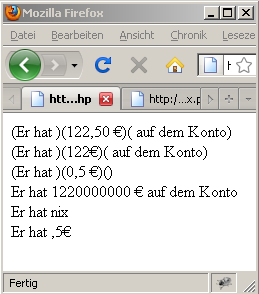

# 6.2.6 Mit Arrays arbeiten

Bislang war `$text` immer als String gegeben. Sehr praktisch ist, dass `$text` auch ein Array sein kann und dass [`preg_replace()`](http://php.net/manual/de/function.preg-replace.php) das Array automatisch nimmt und den regulären Ausdruck auf jedes Element des Arrays anwendet.


```php linenums="1"
<?php
$text = [
    "Er hat 122,50 € auf dem Konto",
    "Er hat 122€ auf dem Konto",
    "Er hat 0,5 €",
    "Er hat 1220000000 € auf dem Konto",
    "Er hat nix",
    "Er hat ,5€"
];
$such = '/^([A-Z\s]*?)(\d{1,6},?(\d{1,2})?\s?€)(.*)$/i';
$ersetz = '($1)($2)($4)';
$b = preg_replace($such, $ersetz, $text);
foreach ($b as $value) {
    echo "$value <br/>";
}
?>
```

Ergebnis zum Listing



Die ersten 3 Zeilen des Ergebnisses zeigen anhand der runden Klammern, dass der reguläre Ausdruck erfolgreich durchgelaufen ist und in den Klammern finden sich die Inhalte der Variablen `$1, $2` und `$4` (`$3` ist nur eine Hilfsvariable und wurde daher nicht mit ausgegeben).