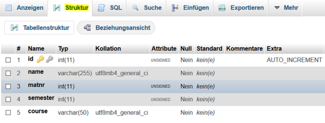
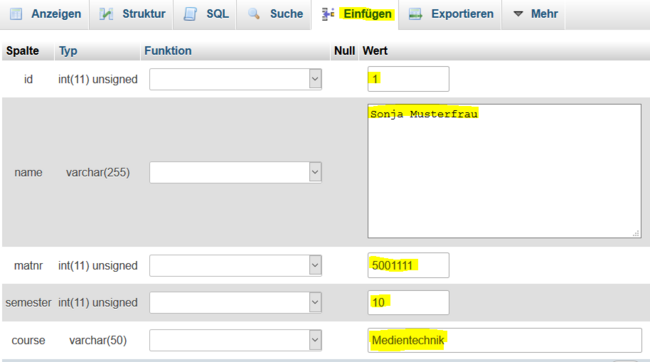
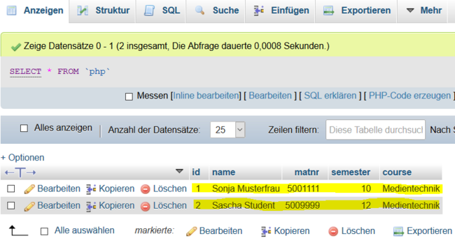

# 7.4 Datenbankverwaltung mit phpMyAdmin

Im Zusammenhang mit PHP und MySQL ist vor allem [phpMyAdmin](https://www.phpmyadmin.net/) ein sehr weit verbreitetes Tool.

Normalerweise ist phpMyAdmin auf Ihrem Server schon vorinstalliert.

- Wenn Sie mit XAMPP (Windows) oder MAMP (Mac) arbeiten, dann einfach [localhost/phpmyadmin](http://localhost/phpmyadmin/) aufrufen.
- Wenn Sie mit einem externen Server arbeiten, dann "IHRE-DOMAIN/phpmyadmin" aufrufen.

phpMyAdmin bietet eine Benutzeroberfläche, die den Umgang mit MySQL einfacher macht. Das heißt, man muss z.B. Tabellen nicht mit den üblichen SQL-Befehlen erstellen, sondern kann sie in phpMyAdmin einfach mit ein paar Klicks anlegen. Dabei kann man sich bei jedem Schritt den SQL-Befehl ausgeben lassen, der hierzu genutzt wurde.

Es gibt so viele Videos zum Umgang mit phpMyAdmin, dass hier auf die externen Videos verwiesen wird.

- [https://www.youtube.com/watch?v=pdd1fnTcuzU](https://www.youtube.com/watch?v=pdd1fnTcuzU)
- [https://www.youtube.com/watch?v=ktR0OqcHYUg](https://www.youtube.com/watch?v=ktR0OqcHYUg)
- [https://www.youtube.com/watch?v=IV6vGuHcQy8](https://www.youtube.com/watch?v=IV6vGuHcQy8)
- [https://www.youtube.com/watch?v=49VGid_w1kQ](https://www.youtube.com/watch?v=49VGid_w1kQ)

Die Oberfläche von phpMyAdmin ändert sich immer mal wieder, aber die Grundfunktionalität bleibt gleich. Gegebenenfalls müssen Sie sich selbst neuere Videos im Internet suchen, die zu Ihrer aktuellen phpMyAdmin-Version passen.

!!! question "Aufgabe"
    **Beispieltabelle mit phpMyAdmin anlegen**

    Die Durchführung dieser Aufgabe ist wichtig, da wir im nächsten Unterkapitel auf die Abfrage der Datenbank eingehen. Erstellen Sie eine Datenbank **example** mit einer Datenbanktabelle **php** mit folgendem Inhalt:

    | id  | name             | matnr   | semester | course        |
    |-----|------------------|---------|----------|---------------|
    | 1   | Sonja Musterfrau | 5001111 | 10       | Medientechnik |
    | 2   | Sven Student     | 5009999 | 12       | Medientechnik |

    Schauen Sie sich ein Video zur Erstellung an und übertragen Sie die Videobeispiele auf das obige Beispiel.

    

    Viele Videos enden bei der Erstellung der Tabellenstruktur. Aber es wird empfohlen, einige Beispieldaten zunächst von Hand einzutragen und später mittels PHP-Script abzurufen.

    

    Der zugehörige SQL-Befehl zum Füllen der Tabelle lautet:

    ```sql
    INSERT INTO `php` (`id`, `name`, `matnr`, `semester`, `course`) VALUES ('1', 'Sonja Musterfrau ', 
    '5001111 ', '10 ', 'Medientechnik '), ('2', 'Sven Student ', '5009999', '12', 'Medientechnik');
    ```

    Die gefüllte Datenbanktabelle sieht dann wie folgt aus:

    

Nun haben Sie eine erste kleine Datenbank und die Daten werden wir jetzt mittels PHP-Script abrufen. 

!!! tip "Hinweis"
    Es ist sinnvoll, die Spalten der Datenbank englischsprachig und in Kleinbuchstaben zu wählen. Wir werden später sehen, dass die Spalten der Datenbank später genutzt werden, als wären es PHP-Variablen.
