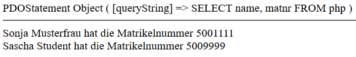

# 7.5 PHP und MySQL verbinden

Zur Arbeit mit einer Datenbank nutzen wir die fertigen Klassen des [PHP Data Objects (PDO)](https://www.php.net/manual/de/class.pdo). Hierdurch können wir mit einer Schnittstelle unterschiedlichste Datenbanken ansprechen.

!!! tip "Anmerkung"
    Zunächst sollten wir nachsehen, ob PDO aktiv ist. Mit dem uns schon bekannten `phpinfo()` lässt sich dies sehr einfach ermitteln.

    ```php
    phpinfo();
    ```

    Und dann bis zum Abschnitt "P" auf der Website scrollen. Wenn wir so eine Ausgabe sehen, dann ist PDO aktiv.

    

## Daten aus einer Datenbank abfragen

Im letzten Unterabschnitt haben Sie eine Datenbank mittels phpMyAdmin in die SQL-Datenbank angelegt und diese mit den Beispieldaten gefüllt. 

| id | name            | matnr   | semester | course        |
|----|-----------------|---------|----------|---------------|
| 1  | Sonja Musterfrau| 5001111 | 10       | Medientechnik |
| 2  | Sascha Student  | 5009999 | 12       | Medientechnik |

Hier wollen wir Daten aus der Tabelle abfragen:

```php linenums="1"
<?php
// Verbindung zum Datenbankserver und der Datenbank "example" herstellen
$pdo = new PDO('mysql:host=localhost; dbname=example', 'root', '');

// Abfrage der Tabelle "php"
$result = $pdo->query("SELECT name, matnr FROM php");

// Nachsehen, was in $result enthalten ist
print_r($result);
echo "<hr>";

// Ausgeben der Inhalte
foreach ($result as $row) {
    echo $row['name'] . " hat die Matrikelnummer " . $row['matnr'] . "<br>";
}
```

Auf dem Brower sollten wir dann die Ausgabe sehen.



- In **Zeile 4** stellen wir die Verbindung zum Datenbankserver her und geben als Ziel die Datenbank "example" ein.
- In **Zeile 7** führen wir eine Datenbankabfrage durch.
- In **Zeile 10** schauen wir, was $result eigentlich ist und erhalten als Ergebnis, dass es sich dabei um ein Objekt der Datenbankabfrage handelt (siehe "Die Ausgabe auf dem Browser").
- Trotzdem können wir dieses Objekt in **Zeile 14** in `foreach ($result as $row)` wie ein Array benutzen. Also wird im Hintergrund ein **ArrayAccess-Interface** vorhanden sein, die uns dies ermöglicht. Wir haben hier also ein Beispiel, wie wir ein Objekt wie ein Array behandeln.

## Daten in einer Datenbank ändern

Mit der PDO-Methode `query()` können wir nicht nur Daten abfragen, sondern beliebige SQL-Befehle ausführen. Also die Daten auch ändern.

```php linenums="1"
<?php
// Verbindung zum Datenbankserver und der Datenbank "example" herstellen
$pdo = new PDO('mysql:host=localhost; dbname=example', 'root', '');

// Daten in der Datenbank ändern
$pdo->query("UPDATE `php` SET `semester` = '13' WHERE `php`.`matnr` = '5009999'");
$result = $pdo->query("SELECT name, semester FROM php");

// Ausgeben der geänderten Daten
foreach ($result as $row) {
    echo $row['name'] . " ist nun im Semester: " . $row['semester'] . "<br>";
}
```

Auf dem Brower sollten wir dann die geänderte Ausgabe sehen.


- In **Zeile 7** haben wir einen Datensatz geändert und die Änderung in Zeile 8 wieder abgefragt. "Sascha Student" ist nun im 13. Semester.


!!! tip "Anmerkung"
    Gerade wenn Sie erste Programmierungen mit einer Datenbankanbindung realisieren, sollten Sie wie folgt vorgehen:
    - Datenbank und Tabellen in phpMyAdmin erstellen.
    - Datenbank mit realistischen Daten in phpMyAdmin füllen.
    - SQL-Befehle immer in phpMyAdmin ausprobieren und wenn das Ergebnis "wie gewünscht" ist, dann die SQL-Abfrage in das PHP-Script kopieren.
    - Zunächst üben, ob Sie die Daten der Datenbank mit ihrem PHP-Script abrufen können.
    - Danach erst Daten mit dem PHP-Script ändern oder neue Datensätze in die Datenbank schreiben. Dabei sollten Sie phpMyAdmin immer geöffnet haben und nachsehen, was in die Datenbank geschrieben wurde.
