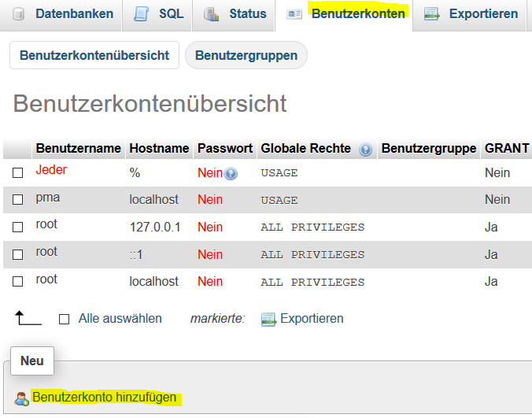
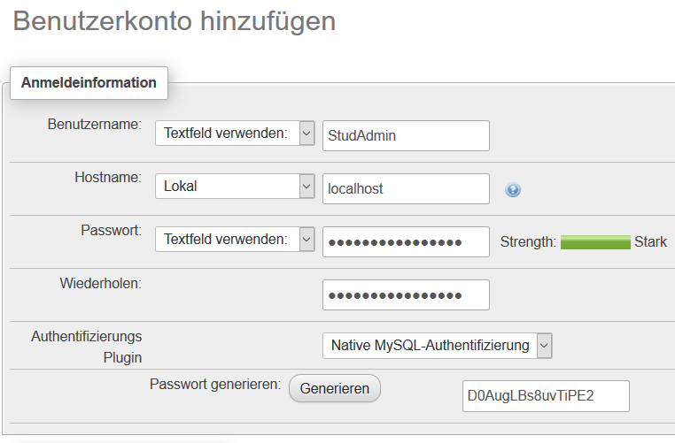
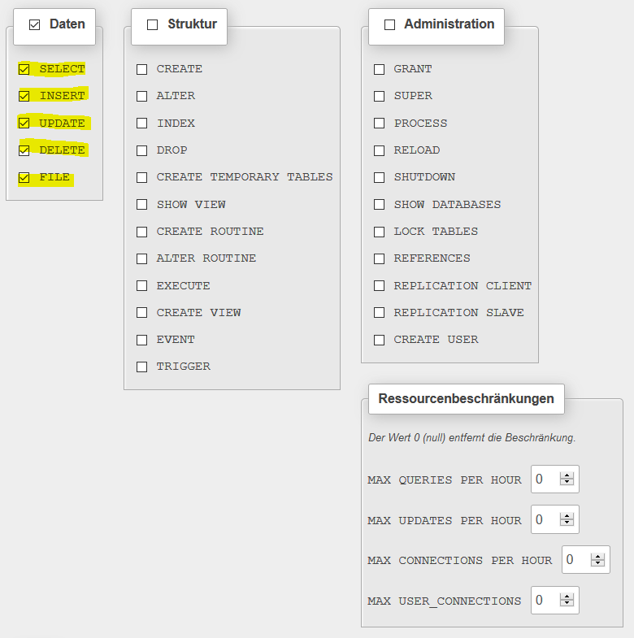

# 7.6 Datenbankverbindung verbessern

Dieser Abschnitt behandelt die Verbesserung der Datenbankverbindungen durch die Verwendung von Prepared Statements.

### Prepared Statements

Wir hatten bereits im Unterkapitel [SQL](./7.2SQL.md) die Vorteile benannt und geschrieben: "Ein Prepared Statement führt eine Datenbankabfrage durch und nutzt dabei keine konkreten Parameterwerte, sondern Platzhalter anstelle der Parameter". Hier wollen wir uns nun die Durchführung ansehen.

Eigentlich ist es ganz einfach, wenn wir die Methode `query()` durch die Methoden `prepare()` und `execute()` ersetzen.


```php linenums="1"
<?php
$pdo = new PDO('mysql:host=localhost; dbname=example', 'root', '');

$stmt = $pdo->prepare("SELECT name, matnr FROM php");
$stmt->execute();

foreach ($stmt as $row) {
    echo $row['name']
        . " hat die Matrikelnummer "
        . $row['matnr']
        . "<br>";
}
```

Ausgabe:<br>
*Sonja Musterfrau hat die Matrikelnummer 5001111*<br>
*Sascha Student hat die Matrikelnummer 5009999*

In **Zeile 4** schreiben wir das Prepared Statement und in **Zeile 5** führen wir dieses aus.

Im nächsten Beispiel wird klar, wie wir ein Prepared Statement sinnvoll nutzen können, denn oftmals soll nur ein Teilbereich ausgegeben werden.

```php linenums="1"
<?php
$start = 5000000;
$end = 5005000;

$pdo = new PDO('mysql:host=localhost; dbname=example', 'root', '');

$stmt = $pdo->prepare("SELECT * FROM php WHERE matnr BETWEEN :start AND :end");

$stmt->bindParam(":start", $start);
$stmt->bindParam(":end", $end);
$stmt->execute();

foreach ($stmt as $row) {
    echo $row['name']
        . " hat die Matrikelnummer "
        . $row['matnr']
        . "<br>";
}
```

Ausgabe:<br>
*Sonja Musterfrau hat die Matrikelnummer 5001111*

Mit der Methode `bindParam()` in den **Zeilen 9 und 10** können wir Parameter angeben. Diese Parameter könnten z.B. durch ein Webformular an das PHP-Programm geschickt werden.

!!! question "Aufgabe"
    Erstellen Sie ein Webformular mit zwei Formularfeldern, sodass die Variablen `$start` und `$end` nun über das Formular eingegeben werden können.

**Sicherheitshinweis: Arbeiten Sie bitte immer mit Prepared Statements** (anstelle von einfachen `query`-Abfragen), denn in `query`-Abfragen kann man SQL-Befehle einschleusen, die zu SQL-Injections und damit zu sehr großen Sicherheitsrisiken führen. Bei `prepare()` kann dies nicht passieren, da nur einzelne Parameter und keine SQL-Befehle zur Datenbank übernommen werden.

Um dann noch potentielle Sicherheitslücken zu SQL-Injections über unterschiedliche Zeichensätze zu vermeiden, sollten wir beim Aufruf der Datenbank 'charset=utf8 mit angeben:

```php
PDO('mysql:host=localhost; charset=utf8; dbname=example', 'root', '');
```

Außerdem sollten wir bei PDO noch eine Zeile als Sicherheitseinstellung mit hinzufügen:

```php
$pdo->setAttribute(PDO::ATTR_EMULATE_PREPARES, false);
```

### Datenbank mit Passwort schützen!!!

Nun müssen wir unbedingt unsere Datenbank **mit einem Passwort schützen**!

Und natürlich sollte man einen Datenbankzugriff auf keinen Fall mit root-Rechten erlauben. Also müssen wir einen Datenbank-Nutzer (=Benutzerkonto) anlegen. Dieses Benutzerkonto wird verwendet, damit das PHP-Script mit dem Nutzernamen und dem Passwort auf die Datenbanktabelle zugreifen darf (aber nur auf die angegebene Tabelle und nicht auf die gesamte Datenbank!).

Ein Benutzerkonto können wir über phpMyAdmin anlegen. Dazu im Reiter "Benutzerkonten" klicken auf "Benutzerkonto hinzufügen":



Auf der Seite "Benutzerkonto hinzufügen" die Felder entsprechend des Screenshots ausfüllen:



Weiter unten auf der Seite noch die Rechte vergeben, was natürlich je nach Anwendung genau überlegt sein muss. Wir vergeben für unser Beispiel alle "Daten-Rechte".



Unsere Beispielanwendung sieht inzwischen wie folgt aus und enthält in **Zeile 6** das Passwort zur Datenbank.


```php linenums="1"
<?php

$start = 5000000;
$end = 5005000;

$pdo = new PDO('mysql:host=localhost; charset=utf8; dbname=example', 'StudAdmin', 'D0AugLBs8uvTiPE2');

$pdo->setAttribute(PDO::ATTR_EMULATE_PREPARES, false);
$stmt = $pdo->prepare("SELECT * FROM php WHERE matnr BETWEEN :start AND :end");
$stmt->bindParam(":start", $start);
$stmt->bindParam(":end", $end);
$stmt->execute();
foreach ($stmt as $row) {
    echo $row['name']
        . " hat die Matrikelnummer "
        . $row['matnr']
        . "<br>";
}
```

Ausgabe:<br>
*Sonja Musterfrau hat die Matrikelnummer 5001111*

- Mit `$start = 5000000` und `$end = 6000000` erhalten wir beide Datensätze. Probieren Sie es aus!
- [PDO](https://www.php.net/manual/de/book.pdo.php) ist sehr mächtig und einen kleinen Teil dieser Mächtigkeit werden wir uns nun ansehen.
