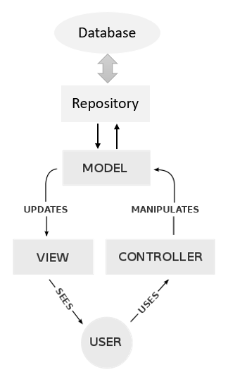
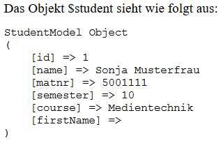
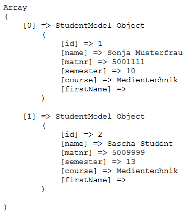
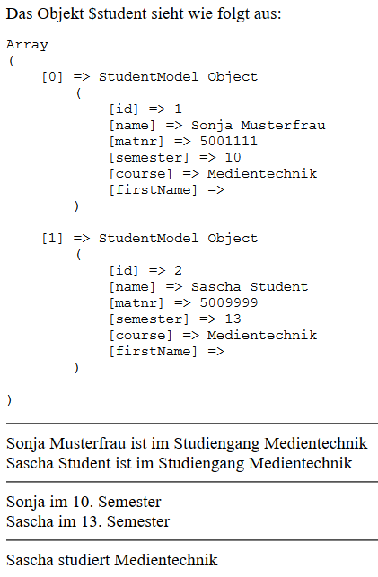

# 7.7 Datenbankverbindung professionell

Natürlich wollen wir die Datenbankverbindung in eine Klasse auslagern. Klassen, die für eine Verbindung mit einer Datenbank stehen, kann man gut mit dem Wort "Repository" kennzeichnen. Wir erstellen uns also eine Klasse `StudentRepository`.

Wenn wir im Unterkapitel [Klassen in Dateien auslagern und MVC-Prinzip](../5OOP/5.2.3KlasseninDateienauslagernundMVCPrinzip.md) nachsehen, dann wurde dort das MVC-Prinzip erläutert. Dieses MVC-Prinzip wollen wir hier durch ein Repository ergänzen.



Was wir eben in einer Datei `index.php` hatten, wird nun **in drei Dateien** aufgeteilt.

### index.php
`index.php` ist das Hauptprogramm und muss mit `require_once` die anderen Dateien einbinden. Anschließend kommen die Variablen und die Verbindung zur Datenbank. Bis **Zeile 10** entspricht es dem bekannten Sourcecode aus dem letzten Unterkapitel.

**Datei index.php (nur erste Zeilen)**

```php linenums="1"
<?php declare(strict_types=1);
require_once __DIR__.DIRECTORY_SEPARATOR.'StudentRepository.php';
require_once __DIR__.DIRECTORY_SEPARATOR.'StudentModel.php';

$start = 5000000;
$end = 6000000;

// Verbindung zur Datenbank herstellen
$pdo = new PDO('mysql:host=localhost; charset=utf8; dbname=example', 'StudAdmin', 'D0AugLBs8uvTiPE2');
$pdo->setAttribute(PDO::ATTR_EMULATE_PREPARES, false);

// Datenbankabfrage über die Klasse StudentRepository() vornehmen
$studentRepository = new StudentRepository($pdo);
$student = $studentRepository->fetchStudentByMatNr($start, $end);
...
```

In **Zeile 14** erstellen wir ein Objekt der (noch neu zu erstellenden Klasse) `StudentRepository` und müssen der Klasse das Datenbankobjekt `$pdo` übergeben, damit eine Verbindung zur Datenbank vorhanden ist.

In **Zeile 15** rufen wir die Methode `fetchStudentByMatNr()` auf, die dann die eigentliche Datenbankabfrage enthalten wird.

### StudentRepository.php

`StudentRepository.php` führt die Datenbankabfrage durch. Die Datenbankabfrage haben wir in eine Methode `fetchStudentByMatnr()` geschrieben. Sicherlich würden in einem realen Projekt einige weitere Abfragen hinzukommen, die man dann alle in eigene Methoden schreiben kann.

**Datei StudentRepository.php**

```php linenums="1"
<?php
declare(strict_types=1);
class StudentRepository
{
    private $pdo;
    
    public function __construct(PDO $pdo)
    {
        $this->pdo = $pdo;
    }
    
    public function fetchStudentByMatnr(int $start, int $end): object
    {
        $stmt = $this->pdo->prepare("SELECT * FROM php WHERE matnr BETWEEN :start AND :end");
        $stmt->bindParam(":start", $start);
        $stmt->bindParam(":end", $end);
        $stmt->execute();
        ...
    }
```
    
In Repository-Klassen finden "echte" Datenbankabfragen statt. Aber oftmals möchte man Datenbankabfragen noch bearbeiten, z.B. um Teilbereiche zu bekommen. Wir haben in unserer Datenbanktabelle z.B. Vorname und Nachname in einem Feld (sollte man nicht machen!) und wollen nun jeweils die Vornamen auslesen. Hierfür ist eine Model-Klasse gut, die die Datenbankabfragen um "virtuelle Abfragen" ergänzen kann. Mit der Model-Klasse werden also Datenbankstrukturen sinnvoll erweitert, ohne dass redundante Daten in der Datenbank gespeichert werden müssen.


`StudentRepository.php` enthält als Eigenschaften (`$id`, `$name`, `$matnr`, `$semester` und `$course`) alle Spalten der Datenbank (id, name, matnr, semester und course), sowie weitere Eigenschaften, die über Methoden gefüllt werden. In unserem Fall wird mittels regulärem Ausdruck aus dem Gesamtnamen der Vorname ermittelt.


### StudentModel.php

**StudentModel.php (fertig)**

```php linenums="1"
<?php
declare(strict_types=1);
class StudentModel
{
    // Spalten der Datenbank
    public $id;
    public $name;
    public $matnr;
    public $semester;
    public $course;
    
    // Zusätzliche Eigenschaften
    public $firstName;
    
    public function extractFirstName(string $name): void
    {
        // geht bis zum 1. Leerzeichen und speichert dies in $1
        $this->firstName = preg_replace('/^(.+?)\s(.+)$/', '$1', $name);
    }
}
```

### Daten von StudentRepository an StudentModel übergeben

Wir wollen später in der `index.php` mit Objekten arbeiten und nicht mit Arrays. Dies hat in der professionellen Programmierung viele Vorteile.

**Datei StudentRepository.php (vollständig, aber noch vorläufig)**

```php linenums="1"
<?php declare(strict_types=1);

class StudentRepository
{
    private $pdo;

    public function __construct(PDO $pdo)
    {
        $this->pdo = $pdo;
    }

    public function fetchStudentByMatnr(
        int $start, 
        int $end
    ): object {
        $stmt = $this->pdo->prepare(
            "SELECT * FROM php WHERE matnr BETWEEN :start AND :end"
        );
        $stmt->bindParam(":start", $start);
        $stmt->bindParam(":end", $end);
        $stmt->execute();

        // Objekt $student erstellen (und von Hand befüllen)
        $studentArray = $stmt->fetch();

        $student = new StudentModel();
        $student->id = $studentArray["id"];
        $student->name = $studentArray["name"];
        $student->matnr = $studentArray["matnr"];
        $student->semester = $studentArray["semester"];
        $student->course = $studentArray["course"];

        echo 'Das Objekt $student sieht wie folgt aus:<pre>';
        print_r($student);
        echo '</pre>';

        return $student;

    }
}
```


Die Ausgabe auf dem Browser:




- Bis **Zeile 19** kennen wir die Datei schon (siehe oben). 
- In **Zeile 24** nutzen wir die PDO-Methode `fetch()`, die uns die erste Zeile des Ergebnisses in ein Array liefert. 
- In **Zeile 26** wird die Klasse `StudentModel` instanziert, sodass z.B. mit `$student->id` auf die Eigenschaften zugegriffen werden kann.
- In **Zeilen 27 - 31** werden alle Eigenschaften "gefüllt".
- In **Zeilen 33 - 35** wird das Objekt `$student` ausgegeben. Es kann erkannt werden, dass es sich wirklich um ein Objekt handelt.

Somit kann jetzt in der `index.php` ein Datenbankeintrag mit z.B. `$student->name` angesprochen werden.

!!! tip "Anmerkung"

    Sie können sich immer mal wieder mit `print_r()` oder `var_dump()` vergewissern, was Sie gerade in Variablen haben! An der Ausgabe oben können Sie sehen, dass das HTML-Tag `<pre>` hierfür sehr hilfreich sein kann. Vergessen Sie aber diese Befehle nicht im Quellcode wieer zu löschen, da es zu Fehlern bei der Ausgabe von HTML und HTTP Headern kommen kann.


### StudentRepository.php

Nun kommt einen weitere Verbesserung: In der Datei **StudentRepository.php** hatten wir die Eigenschaften der Klasse *StudentModel* alle einzeln gefüllt. Mit PDO-Methoden können wir dies automatisch erledigen, sodass der finale Sourcecode dann wie folgt aussieht:


**Datei StudentRepository.php (fertig)**

```php linenums="1"
<?php declare(strict_types=1);

class StudentRepository
{
    private $pdo;

    public function __construct(PDO $pdo)
    {
        $this->pdo = $pdo;
    }

    public function fetchStudentByMatnr(
        int $start,
        int $end
    ): array {
        $stmt = $this->pdo->prepare(
            "SELECT * FROM php WHERE matnr BETWEEN :start AND :end"
        );
        $stmt->bindParam(":start", $start);
        $stmt->bindParam(":end", $end);
        $stmt->execute();

        // Ergebnis soll in "StudentModel" gefüllt werden
        // Objekt "$student" der Klasse "StudentModel" wird 
        // automatisch erstellt, ohne "$student = new StudentModel()" 
        $stmt->setFetchMode(PDO::FETCH_CLASS, "StudentModel");
        $student =  $stmt->fetchAll(PDO::FETCH_CLASS, "StudentModel");

        echo 'Das Objekt $student sieht wie folgt aus:<pre>';
        print_r($student);
        echo '</pre>';

        return $student;
    }
}
```

Die Ausgabe auf dem Browser: 



Bis **Zeile 21** kennen wir die Datei schon (siehe oben).
Mit `fetch()` hatten wir nur den ersten Eintrag bekommen. Mit `fetchAll()` in **Zeile 27** erhalten wir nun alle abgefragten Datenbankeinträge.

Die PDO-Methoden `setFetchMode()` in **Zeile 26** und `fetchAll()` in **Zeile 27** benötigen als Parameter `PDO::FETCH_CLASS` und die Zielklasse `StudentModel`. `PDO::FETCH_CLASS` ist eine [PDO-Konstante](https://www.php.net/manual/en/pdostatement.fetchall.php) für die Datenformatierung.


Zwei weitere Dinge sind bemerkenswert:

- Wir haben ein Objekt `$student` der Klasse `StudentModel`, das direkt über den Aufruf von `setFetchMode()` erstellt wurde. Die Zeile `$student = new StudentModel()` ist somit nicht mehr notwendig.
- Wir haben nun ein indiziertes Array `$student` und die einzelnen Einträge im Array sind Objekte, jeweils ein Objekt für eine (Ergebnis-)Zeile der Datenbank.


### index.php

**index.php (fertig)**

```php linenums="1"
<?php
declare(strict_types=1);
require_once __DIR__.DIRECTORY_SEPARATOR.'StudentRepository.php';
require_once __DIR__.DIRECTORY_SEPARATOR.'StudentModel.php';

$start = 5000000;
$end = 6000000;

// Verbindung zur Datenbank herstellen
$pdo = new PDO('mysql:host=localhost; charset=utf8; dbname=example', 'StudAdmin', 'D0AugLBs8uvTiPE2');
$pdo->setAttribute(PDO::ATTR_EMULATE_PREPARES, false);

// Datenbankabfrage über die Klasse StudentRepository vornehmen
$studentRepository = new StudentRepository($pdo);
$student = $studentRepository->fetchStudentByMatNr($start, $end);

// 1. Ausgabe
echo 'Das Objekt $student sieht wie folgt aus:<pre>';
print_r($student);
echo '</pre>';

echo "<hr>";

// 2. Ausgabe
foreach ($student as $row) {
    echo $row->name . " ist im Studiengang " . $row->course . "<br>";
}

echo "<hr>";

// 3. Ausgabe
foreach ($student as $row) {
    $row->extractFirstName($row->name);
    echo $row->firstName . " im " . $row->semester . ". Semester <br>";
}

echo "<hr>";

// 4. Ausgabe
echo $student[1]->firstName . " studiert " . $student[1]->course;
?>
```

Die Ausgabe auf dem Browser: 



**Sie haben hier mehrere Dinge gelernt**

- Die Datenbankverbindung wird im Hauptprogramm erstellt (hier: Objekt `$pdo`).
- Das Objekt `$pdo` wird an die Repository-Klasse (hier: StudentRepository) weitergegeben und die Datenbankabfrage in einer Methode (hier: `fetchStudentByMatNr()`) ausgeführt.
- Anschließend wird das Ergebnis der Datenbankabfrage an die Model-Klasse (hier: StudentModel) weitergereicht. Dazu wird ein Objekt der Model-Klasse erstellt oder aber eine PDO-Methode erstellt dieses Objekt automatisch.
- Dadurch, dass dem Repository sowohl die Objekte der Klasse PDO als auch die Model-Klasse bekannt sind, kann man im Hauptprogramm auf die Zeilen- und Spalteneinträge der Datenbankergebnisse zugreifen (z.B. `$student[1]->course`).

Hier können Sie eine Zip-Datei herunterladen, die den gesamten Sourcecode enthält. Sie sollten das Programm unbedingt **auf Ihrem Server installieren und ausprobieren**: [StudentDatabaseRequest.zip](media/StudentDatabaseRequest.zip).

!!! question "Übung"
    Angenommen Sie müssen eine neue Spalte in der Datenbank hinzufügen (z.B. das Datum der Immatrikulation). An welchen Stellen müssen Sie den Sourcecode anpassen?

??? example "Lösung"
    Damit alles so funktioniert wie vorher, müssen Sie lediglich in der Datei `StudentModel.php` eine Eigenschaft hinzufügen, die genauso heißt, wie die Datenbankspalte. Damit ist die Art der Programmierung schon recht gut erweiterbar. 

