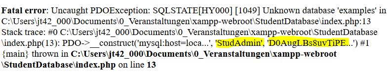

# 7.8 Datenbankverbindung Fehlerausgabe abfangen

Es ist immer wieder problematisch, dass das Datenbankpasswort im Klartext im PHP-Programm steht. Schauen wir uns mal an, was passiert, wenn die Verbindung zur Datenbank nicht wie gewünscht hergestellt werden kann.



In der Fehlermeldung stehen der Nutzername *StudAdmin* und das Passwort zur Anmeldung an die Datenbank im **Klartext**! So etwas darf nicht passieren und daher ist es in diesem Fall besonders wichtig den Fehler abzufangen.


```php linenums="1"
<?php declare(strict_types=1);

require_once __DIR__.DIRECTORY_SEPARATOR.'StudentRepository.php';
require_once __DIR__.DIRECTORY_SEPARATOR.'StudentModel.php';

$start = 5000000;
$end = 6000000;

// Verbindung zur Datenbank herstellen
try {
    $pdo = new PDO('mysql:host=localhost; charset=utf8; dbname=example', 'StudAdmin', 'D0AugLBs8uvTiPE2');
} catch (Exception $e) {
    echo "Verbindung zur Datenbank funktioniert nicht";
    exit;
}
...
```

Ausgabe:<br>
*Verbindung zur Datenbank funktioniert nicht*

Mit einem try-catch-Block (**Zeilen 10-15**) werden Fehlermeldungen abgefangen, sodass es nicht mehr zur Ausgabe des Passwortes kommt. Mit `try` wird der nachfolgende Block ausprobiert und wenn es zu einem Fehler kommt, dann wird der `catch`-Block ausgeführt. Somit wird dann mit `echo` der String ausgegeben und in **Zeile 14** wird der PHP-Befehl `exit` verwendet, damit die weitere Programmausführung abgebrochen wird, weil es ja ohne Datenbankverbindung keinen Sinn macht und nur zu anderen Fehlermeldungen führen würde.

Bei der Fehlerbehandlung wird auf die vordefinierte PHP-Klasse [Exception](https://www.php.net/manual/de/class.exception.php) zugegriffen (siehe **Zeile 12**).

!!! tip "Anmerkung"
    Eine professionelle Fehlerbehandlung (Exception handling) wäre - wie so vieles in PHP - ein eigenes Kapitel wert. Aber wie so oft müssen wir und in diesem Modul auf einige Grundlagen beschränken. Wenn Sie professionell programmieren möchten, dann sollten Sie sich mit dem vielschichtigen Thema "Exception handling" ausführlich beschäftigen.
